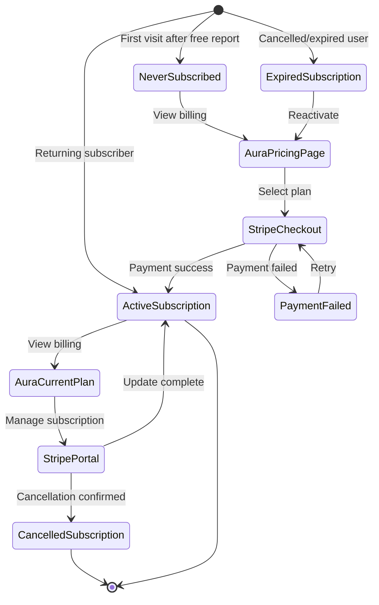

# feat: Aura Billing Page Redesign with Subscription Management

## Overview

Redesign the billing page using the Aura design system to provide a cohesive visual experience for subscription management. This plan addresses the complete billing lifecycle: new user subscription after free report, upgrade/downgrade flows, and cancellation - with the simplest MVP implementation for launch.

## Problem Statement / Motivation

The current billing page (`apps/web/app/home/(user)/billing/_components/billing-page-content.tsx`) uses generic styling that doesn't match the Aura design system used in the report display. Users transitioning from viewing their beautifully-designed Aura report to a standard billing page experience visual discontinuity. Additionally, the subscription management flows (upgrade, downgrade, cancel) need clear UX decisions for MVP launch.

**Key Questions Resolved:**
1. **Design**: Apply Aura design tokens to billing page for visual consistency
2. **Upgrade/Downgrade**: Use Stripe Customer Portal for MVP (fastest to ship)
3. **Cancellation**: Use Stripe Customer Portal for MVP (custom in-app flow is post-MVP)
4. **Simplest Implementation**: Leverage existing Stripe integration, style with Aura tokens

## Proposed Solution

### MVP Strategy: Stripe Customer Portal + Aura-Styled Billing Page

**For MVP launch, use this hybrid approach:**

1. **New Subscribers**: Custom Aura-styled pricing page with Stripe Embedded Checkout
2. **Existing Subscribers**: Aura-styled current plan display + Stripe Customer Portal for management
3. **Upgrades/Downgrades**: Redirect to Stripe Customer Portal (zero custom code)
4. **Cancellation**: Redirect to Stripe Customer Portal (zero custom code)

**Post-MVP enhancements:**
- Custom in-app cancellation flow with retention offers (8-40% churn reduction potential)
- Custom upgrade/downgrade preview with proration display
- In-app payment method management

---

## Aura Design Tokens Reference

```css
/* Colors */
ink: #09090b       /* zinc-950 - primary text, borders, accents */
subtle: #52525b    /* zinc-600 - secondary text */
hairline: #e4e4e7  /* zinc-200 - borders */
paper: #ffffff     /* white - card backgrounds */
canvas: #f4f4f5    /* zinc-100 - page backgrounds, subtle fills */
```

**Core Patterns:**
- **Section Headers**: `border-l-4 border-zinc-950 pl-6 py-1`
- **Cards**: `rounded-xl border border-zinc-200 shadow-sm bg-white`
- **Card Headers**: `bg-zinc-50/50 border-b border-zinc-200 p-6`
- **Monospace Labels**: `text-xs font-mono font-bold uppercase tracking-widest text-zinc-600`
- **Dark Sections**: `bg-zinc-950 text-white rounded-xl border border-zinc-800`
- **Badges**: Border with background (e.g., `bg-emerald-50 text-emerald-700 border-emerald-200`)

---

## Technical Approach

### Architecture

```
apps/web/app/home/(user)/billing/
├── page.tsx                           # Server component (existing)
├── _components/
│   ├── billing-page-content.tsx       # UPDATE: Apply Aura design
│   ├── current-plan-card.tsx          # UPDATE: Aura card styling
│   ├── usage-card.tsx                 # UPDATE: Aura progress bars
│   ├── pricing-table.tsx              # UPDATE: Aura plan cards
│   ├── aura-plan-card.tsx             # NEW: Individual plan card
│   ├── aura-pricing-header.tsx        # NEW: Section header
│   └── subscription-actions.tsx       # NEW: Manage/Cancel buttons
└── _lib/server/
    └── server-actions.ts              # Existing portal session action
```

### User Flow States



---

## Acceptance Criteria

### Functional Requirements

- [ ] Billing page uses Aura design tokens (colors, typography, spacing)
- [ ] New users see pricing table with all three plans (Standard, Pro, Max)
- [ ] Pro plan is visually highlighted as "Popular"
- [ ] Clicking a plan initiates Stripe Embedded Checkout
- [ ] Active subscribers see their current plan with Aura styling
- [ ] Usage stats display with Aura-styled progress bars
- [ ] "Manage Subscription" button opens Stripe Customer Portal
- [ ] Stripe Customer Portal handles upgrade, downgrade, and cancellation
- [ ] Mobile-responsive design (50%+ users on mobile)

### Non-Functional Requirements

- [ ] Page loads in under 2 seconds
- [ ] All interactive elements have 44x44px minimum touch targets
- [ ] Color contrast meets WCAG 2.1 AA (4.5:1 ratio)
- [ ] Keyboard navigation works for plan selection

### Quality Gates

- [ ] `pnpm typecheck` passes
- [ ] `pnpm lint:fix` passes
- [ ] Visual review confirms Aura design fidelity
- [ ] Mobile testing on iOS and Android

---

## Implementation Plan

### Phase 1: Aura Design Components

**Task 1.1: Create Aura Pricing Header**

```tsx
// apps/web/app/home/(user)/billing/_components/aura-pricing-header.tsx

interface AuraPricingHeaderProps {
  title: string;
  subtitle?: string;
}

export function AuraPricingHeader({ title, subtitle }: AuraPricingHeaderProps) {
  return (
    <div className="mb-10 border-l-4 border-zinc-950 pl-6 py-1">
      <h2 className="text-2xl font-semibold tracking-tight text-zinc-950 mb-3">
        {title}
      </h2>
      {subtitle && (
        <p className="text-lg text-zinc-600 font-normal leading-relaxed max-w-4xl">
          {subtitle}
        </p>
      )}
    </div>
  );
}
```

**Task 1.2: Create Aura Plan Card**

```tsx
// apps/web/app/home/(user)/billing/_components/aura-plan-card.tsx

interface AuraPlanCardProps {
  name: string;
  price: number;
  interval: string;
  description: string;
  features: string[];
  isPopular?: boolean;
  isCurrent?: boolean;
  onSelect: () => void;
  disabled?: boolean;
}

export function AuraPlanCard({
  name,
  price,
  interval,
  description,
  features,
  isPopular,
  isCurrent,
  onSelect,
  disabled,
}: AuraPlanCardProps) {
  return (
    <div
      className={cn(
        'border rounded-xl overflow-hidden shadow-sm bg-white relative',
        isPopular ? 'border-zinc-950 ring-2 ring-zinc-950' : 'border-zinc-200',
        isCurrent && 'ring-2 ring-emerald-500 border-emerald-500'
      )}
    >
      {/* Popular Badge */}
      {isPopular && (
        <div className="absolute top-0 right-0 bg-zinc-950 text-white px-3 py-1 text-xs font-mono font-bold uppercase tracking-widest rounded-bl-lg">
          Popular
        </div>
      )}

      {/* Current Plan Badge */}
      {isCurrent && (
        <div className="absolute top-0 right-0 bg-emerald-500 text-white px-3 py-1 text-xs font-mono font-bold uppercase tracking-widest rounded-bl-lg">
          Current
        </div>
      )}

      {/* Card Header */}
      <div className="bg-zinc-50/50 border-b border-zinc-200 p-6">
        <span className="text-xs font-mono font-bold uppercase tracking-widest text-zinc-600">
          {name}
        </span>
        <div className="mt-2 flex items-baseline gap-1">
          <span className="text-4xl font-semibold text-zinc-950">${price}</span>
          <span className="text-zinc-600">/{interval}</span>
        </div>
        <p className="mt-2 text-sm text-zinc-600">{description}</p>
      </div>

      {/* Features List */}
      <div className="p-6 space-y-3">
        {features.map((feature, i) => (
          <div key={i} className="flex items-start gap-3">
            <CheckIcon className="h-5 w-5 text-zinc-950 flex-shrink-0 mt-0.5" />
            <span className="text-sm text-zinc-700">{feature}</span>
          </div>
        ))}
      </div>

      {/* Action Button */}
      <div className="px-6 pb-6">
        <Button
          onClick={onSelect}
          disabled={disabled || isCurrent}
          className={cn(
            'w-full',
            isPopular
              ? 'bg-zinc-950 text-white hover:bg-zinc-800'
              : 'bg-white text-zinc-950 border border-zinc-950 hover:bg-zinc-50'
          )}
        >
          {isCurrent ? 'Current Plan' : 'Select Plan'}
        </Button>
      </div>
    </div>
  );
}
```

**Task 1.3: Create Aura Current Plan Display**

```tsx
// apps/web/app/home/(user)/billing/_components/aura-current-plan-card.tsx

interface AuraCurrentPlanCardProps {
  planName: string;
  price: number;
  interval: string;
  status: string;
  periodEnd: string;
  features: string[];
  onManageSubscription: () => void;
}

export function AuraCurrentPlanCard({
  planName,
  price,
  interval,
  status,
  periodEnd,
  features,
  onManageSubscription,
}: AuraCurrentPlanCardProps) {
  return (
    <section className="border border-zinc-200 rounded-xl overflow-hidden shadow-sm bg-white">
      {/* Card Header */}
      <div className="bg-zinc-50/50 border-b border-zinc-200 p-6 flex items-center justify-between">
        <div className="flex items-center gap-3">
          <CreditCard className="h-5 w-5 text-zinc-950" />
          <h3 className="text-xs font-mono font-bold uppercase tracking-widest text-zinc-600">
            Current Plan
          </h3>
        </div>
        <span className={cn(
          'px-2.5 py-1 rounded text-xs font-mono font-medium uppercase tracking-widest border',
          status === 'active'
            ? 'bg-emerald-50 text-emerald-700 border-emerald-200'
            : 'bg-amber-50 text-amber-700 border-amber-200'
        )}>
          {status}
        </span>
      </div>

      {/* Card Body */}
      <div className="p-8">
        <div className="flex items-baseline gap-2 mb-4">
          <span className="text-3xl font-semibold text-zinc-950">{planName}</span>
          <span className="text-zinc-600">• ${price}/{interval}</span>
        </div>

        <div className="space-y-1 mb-6">
          <span className="text-xs font-mono font-bold uppercase tracking-widest text-zinc-600">
            Next Billing Date
          </span>
          <div className="text-base text-zinc-900">
            {new Date(periodEnd).toLocaleDateString('en-US', {
              month: 'long',
              day: 'numeric',
              year: 'numeric',
            })}
          </div>
        </div>

        <div className="space-y-2 mb-8">
          {features.map((feature, i) => (
            <div key={i} className="flex items-center gap-2 text-sm text-zinc-700">
              <CheckIcon className="h-4 w-4 text-emerald-600" />
              {feature}
            </div>
          ))}
        </div>

        <Button
          onClick={onManageSubscription}
          className="w-full bg-zinc-950 text-white hover:bg-zinc-800"
        >
          Manage Subscription
        </Button>
      </div>
    </section>
  );
}
```

**Task 1.4: Create Aura Usage Card**

```tsx
// apps/web/app/home/(user)/billing/_components/aura-usage-card.tsx

interface AuraUsageCardProps {
  tokensUsed: number;
  tokensLimit: number;
  reportsCount: number;
  periodEnd: string | null;
  planName: string;
}

export function AuraUsageCard({
  tokensUsed,
  tokensLimit,
  reportsCount,
  periodEnd,
  planName,
}: AuraUsageCardProps) {
  const usagePercent = Math.min((tokensUsed / tokensLimit) * 100, 100);
  const formattedTokensUsed = (tokensUsed / 1_000_000).toFixed(1);
  const formattedTokensLimit = (tokensLimit / 1_000_000).toFixed(1);

  return (
    <section className="border border-zinc-200 rounded-xl overflow-hidden shadow-sm bg-white">
      {/* Card Header */}
      <div className="bg-zinc-50/50 border-b border-zinc-200 p-6 flex items-center gap-3">
        <BarChart3 className="h-5 w-5 text-zinc-950" />
        <h3 className="text-xs font-mono font-bold uppercase tracking-widest text-zinc-600">
          Usage This Period
        </h3>
      </div>

      {/* Card Body */}
      <div className="p-8 space-y-6">
        {/* Reports Generated */}
        <div className="space-y-1">
          <span className="text-xs font-mono font-bold uppercase tracking-widest text-zinc-600">
            Reports Generated
          </span>
          <div className="text-3xl font-semibold text-zinc-950">
            {reportsCount}
          </div>
        </div>

        {/* Token Usage */}
        <div className="space-y-3">
          <div className="flex justify-between items-center">
            <span className="text-xs font-mono font-bold uppercase tracking-widest text-zinc-600">
              Token Usage
            </span>
            <span className="text-sm text-zinc-600">
              {formattedTokensUsed}M / {formattedTokensLimit}M
            </span>
          </div>
          <div className="w-full h-2 bg-zinc-100 rounded-full overflow-hidden">
            <div
              className={cn(
                'h-full rounded-full transition-all duration-300',
                usagePercent > 90 ? 'bg-red-500' : usagePercent > 70 ? 'bg-amber-500' : 'bg-zinc-950'
              )}
              style={{ width: `${usagePercent}%` }}
            />
          </div>
        </div>

        {/* Period Reset */}
        {periodEnd && (
          <div className="pt-4 border-t border-zinc-200">
            <span className="text-xs text-zinc-500">
              Resets on {new Date(periodEnd).toLocaleDateString('en-US', {
                month: 'short',
                day: 'numeric',
              })}
            </span>
          </div>
        )}
      </div>
    </section>
  );
}
```

### Phase 2: Update Billing Page Content

**Task 2.1: Update Main Billing Page Content**

```tsx
// apps/web/app/home/(user)/billing/_components/billing-page-content.tsx

'use client';

import { useRef } from 'react';
import type { BillingConfig } from '@kit/billing';
import type { UsageCheckResponse } from '~/lib/usage/schemas';

import { createPersonalAccountBillingPortalSession } from '../_lib/server/server-actions';
import { AuraPricingHeader } from './aura-pricing-header';
import { AuraCurrentPlanCard } from './aura-current-plan-card';
import { AuraUsageCard } from './aura-usage-card';
import { AuraPricingTable } from './aura-pricing-table';

interface BillingPageContentProps {
  subscription: Subscription | null;
  order: Order | null;
  customerId: string | null | undefined;
  usage: UsageCheckResponse | null;
  billingConfig: BillingConfig;
  productPlan?: ProductPlan;
  currentPlanPrice: number;
}

export function BillingPageContent({
  subscription,
  order,
  customerId,
  usage,
  billingConfig,
  productPlan,
  currentPlanPrice,
}: BillingPageContentProps) {
  const formRef = useRef<HTMLFormElement>(null);

  const handleManageSubscription = () => {
    formRef.current?.requestSubmit();
  };

  const hasActiveSubscription =
    subscription && subscription.status !== 'canceled';

  // NEW SUBSCRIBER: Show Aura-styled pricing
  if (!subscription && !order) {
    return (
      <div className="space-y-8 max-w-5xl mx-auto">
        <AuraPricingHeader
          title="Choose Your Plan"
          subtitle="Get started with Sparlo and unlock powerful AI-driven financial analysis for your business."
        />
        <AuraPricingTable
          config={billingConfig}
          customerId={customerId}
        />
      </div>
    );
  }

  // ACTIVE SUBSCRIBER: Show current plan + usage
  return (
    <div className="space-y-10 max-w-5xl mx-auto">
      {/* Hidden form for billing portal session */}
      <form
        ref={formRef}
        action={createPersonalAccountBillingPortalSession}
        className="hidden"
      />

      <AuraPricingHeader
        title="Your Subscription"
        subtitle="Manage your plan, view usage, and update billing settings."
      />

      <div className="grid gap-6 lg:grid-cols-2">
        {/* Current Plan Card */}
        {productPlan && (
          <AuraCurrentPlanCard
            planName={productPlan.product.name}
            price={currentPlanPrice}
            interval={productPlan.plan.interval ?? 'month'}
            status={subscription?.status ?? 'active'}
            periodEnd={subscription?.period_ends_at ?? ''}
            features={productPlan.product.features}
            onManageSubscription={handleManageSubscription}
          />
        )}

        {/* Usage Stats Card */}
        {usage && hasActiveSubscription && (
          <AuraUsageCard
            tokensUsed={usage.tokens_used}
            tokensLimit={usage.tokens_limit}
            reportsCount={usage.reports_count}
            periodEnd={subscription?.period_ends_at ?? null}
            planName={productPlan?.product.name ?? 'Standard'}
          />
        )}
      </div>

      {/* Upgrade Section */}
      {hasActiveSubscription && (
        <div className="pt-8">
          <AuraPricingHeader
            title="Upgrade Your Plan"
            subtitle="Need more capacity? Compare plans and upgrade instantly."
          />
          <AuraPricingTable
            config={billingConfig}
            customerId={customerId}
            currentPlanId={productPlan?.plan.id}
          />
        </div>
      )}
    </div>
  );
}
```

**Task 2.2: Create Aura Pricing Table**

```tsx
// apps/web/app/home/(user)/billing/_components/aura-pricing-table.tsx

'use client';

import { useCallback, useState } from 'react';
import type { BillingConfig } from '@kit/billing';
import { AuraPlanCard } from './aura-plan-card';
import { EmbeddedCheckout } from './embedded-checkout';

interface AuraPricingTableProps {
  config: BillingConfig;
  customerId: string | null | undefined;
  currentPlanId?: string;
}

export function AuraPricingTable({
  config,
  customerId,
  currentPlanId,
}: AuraPricingTableProps) {
  const [selectedPlanId, setSelectedPlanId] = useState<string | null>(null);

  const products = config.products.filter((p) => !p.hidden);

  const handleSelectPlan = useCallback((planId: string) => {
    setSelectedPlanId(planId);
  }, []);

  if (selectedPlanId) {
    return (
      <div className="max-w-2xl mx-auto">
        <button
          onClick={() => setSelectedPlanId(null)}
          className="mb-6 text-sm text-zinc-600 hover:text-zinc-950 flex items-center gap-2"
        >
          <ArrowLeft className="h-4 w-4" />
          Back to plans
        </button>
        <EmbeddedCheckout
          planId={selectedPlanId}
          customerId={customerId}
        />
      </div>
    );
  }

  return (
    <div className="grid gap-6 md:grid-cols-3">
      {products.map((product) => {
        const plan = product.plans[0];
        const lineItem = plan?.lineItems[0];
        const price = lineItem ? lineItem.cost / 100 : 0;
        const isCurrent = currentPlanId === plan?.id;

        return (
          <AuraPlanCard
            key={product.id}
            name={product.name}
            price={price}
            interval={plan?.interval ?? 'month'}
            description={product.description}
            features={product.features}
            isPopular={product.highlighted}
            isCurrent={isCurrent}
            onSelect={() => handleSelectPlan(plan?.id ?? '')}
            disabled={isCurrent}
          />
        );
      })}
    </div>
  );
}
```

### Phase 3: Mobile Optimization

**Task 3.1: Add Responsive Breakpoints**

Update all Aura components with mobile-first responsive classes:

```tsx
// Responsive grid for pricing cards
<div className="grid gap-6 grid-cols-1 md:grid-cols-3">

// Responsive padding
<div className="p-6 sm:p-8">

// Responsive typography
<span className="text-3xl sm:text-4xl font-semibold">

// Responsive button sizing (44px minimum touch target)
<Button className="w-full min-h-[44px]">
```

**Task 3.2: Add Touch-Friendly Interactions**

- Ensure all buttons are minimum 44x44px
- Add hover and focus states for accessibility
- Use `touch-action: manipulation` for smoother taps

---

## Alternative Approaches Considered

### 1. Custom In-App Subscription Management

**Pros:**
- Full control over UX
- Custom retention offers during cancellation (8-40% churn reduction)
- Better brand consistency

**Cons:**
- 2-4 weeks additional development
- Must handle proration calculations
- More maintenance burden

**Decision:** Post-MVP. Use Stripe Customer Portal for launch.

### 2. Stripe Pricing Table Embed

**Pros:**
- Zero code for pricing display
- Automatic updates when plans change

**Cons:**
- Limited styling options (can't fully match Aura)
- Less control over UX
- Iframe limitations

**Decision:** Rejected. Custom Aura-styled cards provide better brand consistency.

### 3. Full Custom Payment Form

**Pros:**
- Complete visual control
- No redirects

**Cons:**
- PCI compliance complexity
- Significant development effort
- Security risk

**Decision:** Rejected. Stripe Embedded Checkout handles PCI securely.

---

## Dependencies & Prerequisites

### Required Before Starting

- [ ] Stripe Customer Portal configured in Dashboard
  - Enable: Update payment method, cancel subscription, view invoices
  - Configure branding to approximate Aura colors
- [ ] Verify Stripe webhook handler covers all needed events
- [ ] Confirm billing.config.ts has correct Stripe price IDs

### Technical Dependencies

- Existing packages: `@kit/billing`, `@kit/billing-gateway`, `@stripe/react-stripe-js`
- Existing components: `Button`, `cn` utility from `@kit/ui`
- Icons: `lucide-react` (CheckIcon, CreditCard, BarChart3, ArrowLeft)

---

## Risk Analysis & Mitigation

| Risk | Likelihood | Impact | Mitigation |
|------|------------|--------|------------|
| Stripe Embedded Checkout styling conflicts with Aura | Medium | Medium | Test thoroughly; accept some styling limitations in checkout iframe |
| Mobile responsiveness issues | Medium | High | Test on real devices; use responsive design patterns |
| Stripe Customer Portal UX confusion | Low | Medium | Add clear messaging before redirect; post-MVP custom flows |
| Upgrade/downgrade proration confusion | Medium | Medium | Stripe handles proration; add explanatory text in portal link |

---

## Success Metrics

1. **Visual Consistency**: Billing page matches Aura design (subjective review)
2. **Conversion Rate**: Baseline vs. post-launch (track with analytics)
3. **Mobile Usability**: <3% bounce rate on mobile billing page
4. **Support Tickets**: No increase in billing-related support requests

---

## File Changes Summary

### New Files

| File | Purpose |
|------|---------|
| `apps/web/app/home/(user)/billing/_components/aura-pricing-header.tsx` | Section header with Aura styling |
| `apps/web/app/home/(user)/billing/_components/aura-plan-card.tsx` | Individual plan card with Aura styling |
| `apps/web/app/home/(user)/billing/_components/aura-current-plan-card.tsx` | Current subscription display |
| `apps/web/app/home/(user)/billing/_components/aura-usage-card.tsx` | Usage stats with progress bars |
| `apps/web/app/home/(user)/billing/_components/aura-pricing-table.tsx` | Container for plan cards |

### Modified Files

| File | Changes |
|------|---------|
| `apps/web/app/home/(user)/billing/_components/billing-page-content.tsx` | Replace with Aura-styled components |

### Unchanged (Leverage Existing)

- `apps/web/app/home/(user)/billing/page.tsx` - Server component unchanged
- `apps/web/app/home/(user)/billing/_lib/server/server-actions.ts` - Portal session action unchanged
- `apps/web/config/billing.config.ts` - Plan configuration unchanged

---

## Post-MVP Roadmap

### Phase 2: Custom Cancellation Flow (Post-Launch)

- In-app cancellation modal with exit survey
- Retention offers based on cancellation reason
- Pause subscription option
- Expected impact: 8-40% churn reduction

### Phase 3: Custom Upgrade/Downgrade Preview

- Show proration preview before changes
- Display what features gained/lost
- Confirmation with clear effective dates

### Phase 4: In-App Payment Management

- Update payment method without leaving app
- View invoice history inline
- Add secondary payment methods

---

## References

### Internal References

- Aura design system: `plans/sparlo-aura-report-redesign.md`
- Current billing page: `apps/web/app/home/(user)/billing/_components/billing-page-content.tsx`
- Billing config: `apps/web/config/billing.config.ts`
- Stripe webhook handler: `packages/billing/stripe/src/services/stripe-webhook-handler.service.ts`

### External References

- [Stripe Customer Portal Configuration](https://dashboard.stripe.com/settings/billing/portal)
- [Stripe Embedded Checkout](https://docs.stripe.com/payments/checkout/embedded-checkout)
- [Stripe Billing Best Practices](https://stripe.com/resources/more/best-practices-for-saas-billing)

### Research Sources

- Best practices research on SaaS billing UX (2025)
- Mobile-first design patterns for billing pages
- Stripe Customer Portal vs custom billing tradeoffs
