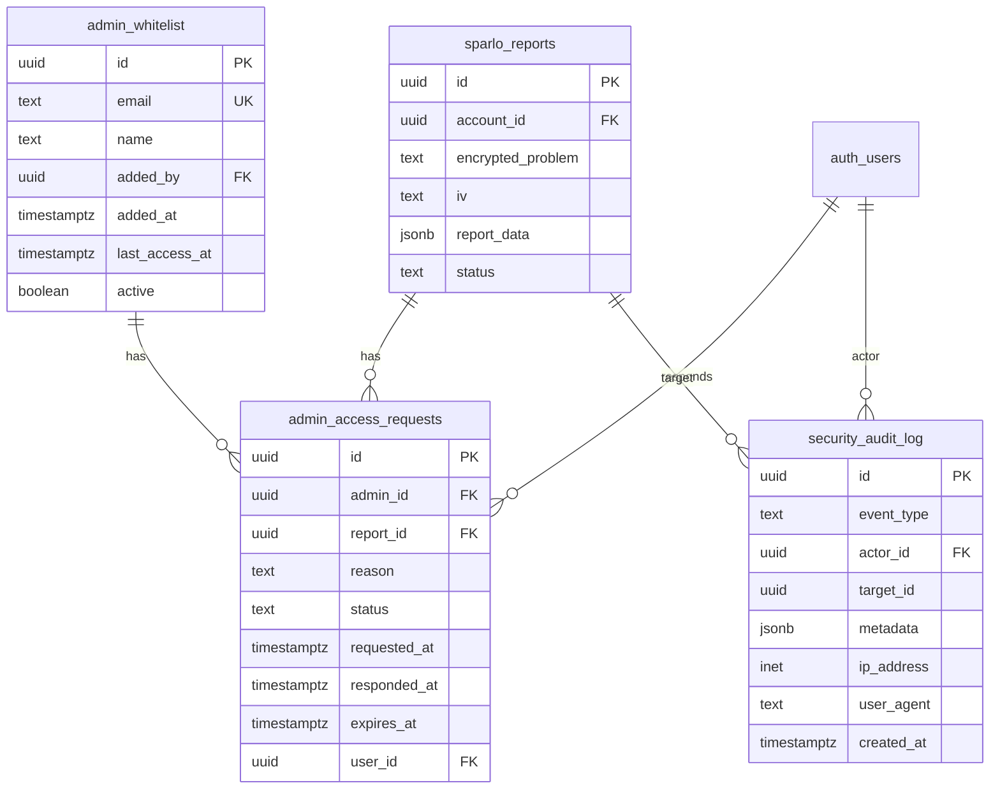

# feat: End-to-End Security for IP Protection

## Overview

Transform Sparlo from a standard SaaS platform to a **zero-knowledge architecture** where user IP (intellectual property) is encrypted end-to-end. Even platform admins cannot access user data, with explicit exceptions for whitelisted admin emails. Include third-party security verification (SOC 2 Type I, TRUSTe seal) to build user trust.

**Current State:**
- User inputs problem → Supabase/Inngest → Solution returned to dashboard
- Admin can see Inngest output in dashboard (security gap)
- No encryption at application layer (relies on infrastructure encryption)

**Target State:**
- User data encrypted before leaving their browser
- Inngest processes encrypted data (using encryption middleware)
- Only user can decrypt their own data
- Whitelisted admins can access data only with explicit user consent
- Third-party verified security (SOC 2 Type I + TRUSTe seal)

---

## Problem Statement

Users inputting proprietary IP need assurance that:
1. **No one can see their data** - not even Sparlo employees
2. **They can verify this claim** - third-party certification
3. **Their data is protected** - even if Sparlo is breached

**Current Vulnerability:**
- Inngest dashboard shows function outputs to logged-in admins
- Report data stored as plaintext JSONB in `sparlo_reports.report_data`
- No application-layer encryption

---

## Proposed Solution

### Architecture: Hybrid Zero-Knowledge with Inngest Encryption

```
┌─────────────────────────────────────────────────────────────────────┐
│                        USER BROWSER                                  │
├─────────────────────────────────────────────────────────────────────┤
│  1. User enters problem                                             │
│  2. Client-side encryption (Web Crypto API + user-derived key)      │
│  3. Send encrypted data to Supabase                                 │
└─────────────────────────────────────────────────────────────────────┘
                              │
                              ▼
┌─────────────────────────────────────────────────────────────────────┐
│                        SUPABASE                                      │
├─────────────────────────────────────────────────────────────────────┤
│  4. Store encrypted problem in sparlo_reports                       │
│  5. Trigger Inngest event with encrypted payload                    │
│  (RLS ensures user can only access their own encrypted data)        │
└─────────────────────────────────────────────────────────────────────┘
                              │
                              ▼
┌─────────────────────────────────────────────────────────────────────┐
│                        INNGEST                                       │
├─────────────────────────────────────────────────────────────────────┤
│  6. Inngest receives encrypted event                                │
│  7. @inngest/middleware-encryption decrypts with server key         │
│  8. Process in memory (AN0-AN5 pipeline)                            │
│  9. Encrypt output before storage                                   │
│  10. Inngest dashboard shows only encrypted blobs                   │
└─────────────────────────────────────────────────────────────────────┘
                              │
                              ▼
┌─────────────────────────────────────────────────────────────────────┐
│                        USER BROWSER                                  │
├─────────────────────────────────────────────────────────────────────┤
│  11. Fetch encrypted report from Supabase                           │
│  12. Client-side decryption with user's key                         │
│  13. Display decrypted report on dashboard                          │
└─────────────────────────────────────────────────────────────────────┘
```

### Key Decisions

| Decision | Choice | Rationale |
|----------|--------|-----------|
| Client-side encryption | Yes | True zero-knowledge for user data |
| Inngest encryption middleware | Yes | Protects data in Inngest dashboard |
| Key derivation | PBKDF2 from user password | User controls their key |
| Key storage | Browser + encrypted cloud sync | Multi-device support |
| Admin access | Consent-based, time-limited | Trust + legal compliance |

---

## Technical Approach

### Phase 1: Inngest Dashboard Lockdown (Week 1-2)

**Goal:** Immediately prevent admins from seeing data in Inngest dashboard.

#### 1.1 Install Inngest Encryption Middleware

```bash
pnpm add @inngest/middleware-encryption
```

#### 1.2 Configure Inngest Client with Encryption

**File:** `apps/web/lib/inngest/client.ts`

```typescript
import { Inngest } from 'inngest';
import { encryptionMiddleware } from '@inngest/middleware-encryption';

export const inngest = new Inngest({
  id: 'sparlo-v2',
  middleware: [
    encryptionMiddleware({
      encryptionKey: process.env.INNGEST_ENCRYPTION_KEY!,
      // Support key rotation
      fallbackDecryptionKeys: [
        process.env.INNGEST_ENCRYPTION_KEY_OLD,
      ].filter(Boolean) as string[],
      // Encrypt the 'data.encrypted' field by default
      eventEncryptionField: 'data.encrypted',
    }),
  ],
});
```

#### 1.3 Generate Strong Encryption Key

```bash
# Generate 256-bit key
openssl rand -base64 32
```

Store in environment variables:
- `INNGEST_ENCRYPTION_KEY` - Current key
- `INNGEST_ENCRYPTION_KEY_OLD` - Previous key (for rotation)

#### 1.4 Update Event Payloads

**File:** `apps/web/app/home/(user)/_lib/server/sparlo-reports-server-actions.ts`

```typescript
await inngest.send({
  name: 'report/generate',
  data: {
    // Non-sensitive metadata (not encrypted)
    reportId: report.id,
    accountId: user.id,

    // Sensitive data (automatically encrypted by middleware)
    encrypted: {
      designChallenge: data.lastMessage,
      conversationId: data.conversationId,
      chatHistory: data.chatHistory,
    },
  },
});
```

#### 1.5 Update Inngest Functions to Use Encrypted Field

**File:** `apps/web/lib/inngest/functions/generate-report.ts`

```typescript
export const generateReport = inngest.createFunction(
  { id: 'generate-report', retries: 2 },
  { event: 'report/generate' },
  async ({ event, step }) => {
    // Middleware automatically decrypts event.data.encrypted
    const { designChallenge, conversationId, chatHistory } = event.data.encrypted;

    // ... rest of function
  }
);
```

---

### Phase 2: Client-Side Encryption (Week 2-4)

**Goal:** Encrypt user data in browser before sending to server.

#### 2.1 Create Encryption Utility Package

**File:** `packages/crypto/src/index.ts`

```typescript
// Key derivation from user password
export async function deriveKey(
  password: string,
  salt: Uint8Array
): Promise<CryptoKey> {
  const encoder = new TextEncoder();
  const keyMaterial = await crypto.subtle.importKey(
    'raw',
    encoder.encode(password),
    'PBKDF2',
    false,
    ['deriveKey']
  );

  return crypto.subtle.deriveKey(
    {
      name: 'PBKDF2',
      salt,
      iterations: 100000,
      hash: 'SHA-256',
    },
    keyMaterial,
    { name: 'AES-GCM', length: 256 },
    true,
    ['encrypt', 'decrypt']
  );
}

// Encrypt data with user's key
export async function encrypt(
  data: string,
  key: CryptoKey
): Promise<{ ciphertext: string; iv: string }> {
  const encoder = new TextEncoder();
  const iv = crypto.getRandomValues(new Uint8Array(12));

  const ciphertext = await crypto.subtle.encrypt(
    { name: 'AES-GCM', iv },
    key,
    encoder.encode(data)
  );

  return {
    ciphertext: btoa(String.fromCharCode(...new Uint8Array(ciphertext))),
    iv: btoa(String.fromCharCode(...iv)),
  };
}

// Decrypt data with user's key
export async function decrypt(
  ciphertext: string,
  iv: string,
  key: CryptoKey
): Promise<string> {
  const decoder = new TextDecoder();

  const decrypted = await crypto.subtle.decrypt(
    { name: 'AES-GCM', iv: Uint8Array.from(atob(iv), c => c.charCodeAt(0)) },
    key,
    Uint8Array.from(atob(ciphertext), c => c.charCodeAt(0))
  );

  return decoder.decode(decrypted);
}
```

#### 2.2 Key Storage Strategy

**File:** `packages/crypto/src/key-storage.ts`

```typescript
const KEY_STORAGE_NAME = 'sparlo_encryption_key';

export async function storeKey(key: CryptoKey): Promise<void> {
  const exported = await crypto.subtle.exportKey('jwk', key);
  localStorage.setItem(KEY_STORAGE_NAME, JSON.stringify(exported));
}

export async function retrieveKey(): Promise<CryptoKey | null> {
  const stored = localStorage.getItem(KEY_STORAGE_NAME);
  if (!stored) return null;

  return crypto.subtle.importKey(
    'jwk',
    JSON.parse(stored),
    { name: 'AES-GCM', length: 256 },
    true,
    ['encrypt', 'decrypt']
  );
}
```

#### 2.3 Encrypt Before Submission

**File:** `apps/web/app/home/(user)/_components/problem-input.tsx`

```typescript
import { encrypt, retrieveKey } from '@sparlo/crypto';

async function handleSubmit(problemText: string) {
  const key = await retrieveKey();
  if (!key) {
    // Prompt user to set up encryption
    return;
  }

  const { ciphertext, iv } = await encrypt(problemText, key);

  await createReport({
    encryptedProblem: ciphertext,
    iv,
    title: generateTitle(problemText), // Title can be unencrypted for search
  });
}
```

#### 2.4 Decrypt on Dashboard

**File:** `apps/web/app/home/(user)/reports/[id]/page.tsx`

```typescript
import { decrypt, retrieveKey } from '@sparlo/crypto';

async function decryptReport(encryptedData: EncryptedReport): Promise<Report> {
  const key = await retrieveKey();
  if (!key) throw new Error('Encryption key not found');

  const decryptedJson = await decrypt(
    encryptedData.ciphertext,
    encryptedData.iv,
    key
  );

  return JSON.parse(decryptedJson);
}
```

---

### Phase 3: Admin Access Controls (Week 3-4)

**Goal:** Whitelisted admins can access data only with user consent.

#### 3.1 Create Admin Whitelist Table

**File:** `apps/web/supabase/migrations/YYYYMMDD_admin_whitelist.sql`

```sql
-- Admin whitelist for data access
CREATE TABLE public.admin_whitelist (
  id UUID PRIMARY KEY DEFAULT gen_random_uuid(),
  email TEXT NOT NULL UNIQUE,
  name TEXT NOT NULL,
  added_by UUID REFERENCES auth.users(id),
  added_at TIMESTAMPTZ DEFAULT NOW(),
  last_access_at TIMESTAMPTZ,
  active BOOLEAN DEFAULT TRUE
);

-- Only super admins can view/modify whitelist
ALTER TABLE admin_whitelist ENABLE ROW LEVEL SECURITY;

CREATE POLICY "super_admin_manage_whitelist" ON admin_whitelist
  FOR ALL TO authenticated
  USING (public.is_super_admin());

-- Access request tracking
CREATE TABLE public.admin_access_requests (
  id UUID PRIMARY KEY DEFAULT gen_random_uuid(),
  admin_id UUID REFERENCES admin_whitelist(id) NOT NULL,
  report_id UUID REFERENCES sparlo_reports(id) NOT NULL,
  reason TEXT NOT NULL,
  status TEXT CHECK (status IN ('pending', 'approved', 'denied', 'expired')) DEFAULT 'pending',
  requested_at TIMESTAMPTZ DEFAULT NOW(),
  responded_at TIMESTAMPTZ,
  expires_at TIMESTAMPTZ,
  user_id UUID REFERENCES auth.users(id) NOT NULL
);

ALTER TABLE admin_access_requests ENABLE ROW LEVEL SECURITY;

-- Users can see requests for their own reports
CREATE POLICY "users_view_own_requests" ON admin_access_requests
  FOR SELECT TO authenticated
  USING (user_id = auth.uid());

-- Users can respond to requests for their own reports
CREATE POLICY "users_respond_own_requests" ON admin_access_requests
  FOR UPDATE TO authenticated
  USING (user_id = auth.uid())
  WITH CHECK (user_id = auth.uid());
```

#### 3.2 Admin Access Request Flow

**File:** `apps/web/lib/admin/access-request.ts`

```typescript
export async function requestAccess(
  reportId: string,
  reason: string
): Promise<AccessRequest> {
  const { data: admin } = await supabase
    .from('admin_whitelist')
    .select('id')
    .eq('email', currentUser.email)
    .single();

  if (!admin) throw new Error('Not a whitelisted admin');

  const { data: request } = await supabase
    .from('admin_access_requests')
    .insert({
      admin_id: admin.id,
      report_id: reportId,
      reason,
      expires_at: new Date(Date.now() + 24 * 60 * 60 * 1000), // 24 hours
    })
    .select()
    .single();

  // Notify user via email/in-app notification
  await notifyUser(request);

  return request;
}
```

#### 3.3 User Consent UI

**File:** `apps/web/app/home/(user)/_components/access-request-notification.tsx`

```typescript
export function AccessRequestNotification({ request }: Props) {
  async function handleResponse(approved: boolean) {
    await supabase
      .from('admin_access_requests')
      .update({
        status: approved ? 'approved' : 'denied',
        responded_at: new Date().toISOString(),
      })
      .eq('id', request.id);
  }

  return (
    <Alert>
      <AlertTitle>Admin Access Request</AlertTitle>
      <AlertDescription>
        {request.admin.name} is requesting access to your report.
        <br />
        Reason: {request.reason}
      </AlertDescription>
      <div className="flex gap-2 mt-4">
        <Button onClick={() => handleResponse(true)} variant="outline">
          Approve (24 hours)
        </Button>
        <Button onClick={() => handleResponse(false)} variant="destructive">
          Deny
        </Button>
      </div>
    </Alert>
  );
}
```

---

### Phase 4: Audit Logging (Week 4-5)

**Goal:** Comprehensive audit trail for all data access.

#### 4.1 Create Audit Log Table

**File:** `apps/web/supabase/migrations/YYYYMMDD_security_audit_log.sql`

```sql
CREATE TABLE public.security_audit_log (
  id UUID PRIMARY KEY DEFAULT gen_random_uuid(),
  event_type TEXT NOT NULL CHECK (event_type IN (
    'report_created', 'report_viewed', 'report_decrypted',
    'admin_access_requested', 'admin_access_granted', 'admin_access_denied',
    'key_generated', 'key_rotated', 'encryption_failed', 'decryption_failed'
  )),
  actor_id UUID REFERENCES auth.users(id),
  target_id UUID, -- Report ID or other entity
  metadata JSONB DEFAULT '{}',
  ip_address INET,
  user_agent TEXT,
  created_at TIMESTAMPTZ DEFAULT NOW()
);

-- Immutable - no updates or deletes
ALTER TABLE security_audit_log ENABLE ROW LEVEL SECURITY;

CREATE POLICY "users_view_own_audit" ON security_audit_log
  FOR SELECT TO authenticated
  USING (
    actor_id = auth.uid() OR
    target_id IN (SELECT id FROM sparlo_reports WHERE account_id = auth.uid())
  );

-- Index for compliance queries
CREATE INDEX idx_audit_log_actor ON security_audit_log(actor_id, created_at DESC);
CREATE INDEX idx_audit_log_target ON security_audit_log(target_id, created_at DESC);
CREATE INDEX idx_audit_log_type ON security_audit_log(event_type, created_at DESC);
```

#### 4.2 Audit Logger Service

**File:** `packages/audit/src/logger.ts`

```typescript
export async function logSecurityEvent(
  eventType: SecurityEventType,
  targetId: string | null,
  metadata: Record<string, unknown> = {}
): Promise<void> {
  await supabaseAdmin
    .from('security_audit_log')
    .insert({
      event_type: eventType,
      actor_id: getCurrentUserId(),
      target_id: targetId,
      metadata,
      ip_address: getClientIP(),
      user_agent: getUserAgent(),
    });
}
```

---

### Phase 5: Third-Party Verification (Week 5-8)

**Goal:** Obtain SOC 2 Type I certification and TRUSTe privacy seal.

#### 5.1 SOC 2 Type I Preparation

| Task | Owner | Timeline |
|------|-------|----------|
| Select compliance automation tool | Engineering | Week 5 |
| Document security policies | Security | Week 5-6 |
| Implement missing controls | Engineering | Week 6-7 |
| Engage SOC 2 auditor | Operations | Week 7 |
| Complete audit | All | Week 8-12 |

**Recommended Tools:**
- Vanta ($10K-$25K/year) - Fastest setup
- Drata ($10K-$20K/year) - Good for startups
- Sprinto ($6K-$15K/year) - Budget option

**Cost Estimate:**
- Automation tool: $10K-$15K/year
- Audit fee: $15K-$25K
- Internal effort: 100-150 hours
- **Total: $25K-$40K**

#### 5.2 TRUSTe Privacy Seal

| Task | Owner | Timeline |
|------|-------|----------|
| Review TrustArc requirements | Legal | Week 5 |
| Update privacy policy | Legal | Week 5-6 |
| Submit application | Operations | Week 6 |
| Complete assessment | All | Week 7-10 |
| Display seal | Engineering | Week 10 |

**Cost Estimate:**
- TRUSTe certification: $5K-$15K/year
- Privacy policy review: $2K-$5K

#### 5.3 Security Page Implementation

**File:** `apps/web/app/(marketing)/security/page.tsx`

```typescript
export default function SecurityPage() {
  return (
    <div>
      <h1>Security at Sparlo</h1>

      <section>
        <h2>End-to-End Encryption</h2>
        <p>Your intellectual property is encrypted before it leaves your browser.</p>
        <ul>
          <li>AES-256-GCM encryption</li>
          <li>PBKDF2 key derivation with 100,000 iterations</li>
          <li>Keys never leave your device</li>
        </ul>
      </section>

      <section>
        <h2>Certifications</h2>
        <div className="flex gap-4">
          <TrusteSepal />
          <SOC2Badge />
        </div>
      </section>

      <section>
        <h2>Zero-Knowledge Architecture</h2>
        <p>Even our team cannot access your data. Only you hold the decryption key.</p>
      </section>
    </div>
  );
}
```

---

## Implementation Phases

### Phase 1: Inngest Lockdown (MVP)
**Timeline:** 1-2 weeks
**Effort:** 20-30 hours
**Impact:** Admins can no longer see data in Inngest dashboard

- [ ] Install `@inngest/middleware-encryption`
- [ ] Configure encryption middleware in `apps/web/lib/inngest/client.ts`
- [ ] Generate and store `INNGEST_ENCRYPTION_KEY`
- [ ] Update event payloads to use `data.encrypted` field
- [ ] Update Inngest functions to read from encrypted field
- [ ] Test encryption/decryption flow
- [ ] Verify Inngest dashboard shows encrypted blobs

### Phase 2: Client-Side Encryption
**Timeline:** 2-3 weeks
**Effort:** 40-60 hours
**Impact:** True zero-knowledge - user data encrypted before leaving browser

- [ ] Create `packages/crypto` package
- [ ] Implement key derivation (`deriveKey`)
- [ ] Implement encryption/decryption functions
- [ ] Implement key storage (localStorage + optional cloud sync)
- [ ] Create encryption setup wizard for new users
- [ ] Update problem submission to encrypt before sending
- [ ] Update dashboard to decrypt reports client-side
- [ ] Handle key loss scenarios (warning, no recovery)
- [ ] Add encryption status indicators in UI

### Phase 3: Admin Access Controls
**Timeline:** 1-2 weeks
**Effort:** 25-35 hours
**Impact:** Whitelisted admins can access data only with user consent

- [ ] Create `admin_whitelist` table
- [ ] Create `admin_access_requests` table
- [ ] Implement access request API
- [ ] Build user consent notification UI
- [ ] Implement time-limited access tokens
- [ ] Add access revocation flow
- [ ] Implement admin access audit logging

### Phase 4: Audit & Compliance
**Timeline:** 2-3 weeks
**Effort:** 30-40 hours
**Impact:** Complete audit trail for compliance

- [ ] Create `security_audit_log` table
- [ ] Implement audit logging service
- [ ] Log all security-relevant events
- [ ] Build audit log viewer for users
- [ ] Create compliance dashboard for admins
- [ ] Document all security controls

### Phase 5: Third-Party Verification
**Timeline:** 4-8 weeks
**Effort:** 100-150 hours (including vendor coordination)
**Impact:** Third-party verified security, trust signals for users

- [ ] Select and onboard compliance automation tool
- [ ] Document security policies
- [ ] Complete control implementation gaps
- [ ] Engage SOC 2 auditor
- [ ] Complete SOC 2 Type I audit
- [ ] Apply for TRUSTe certification
- [ ] Build security page with badges
- [ ] Publish security whitepaper

---

## Acceptance Criteria

### Functional Requirements

- [ ] User problem text is encrypted before leaving browser
- [ ] Encrypted data stored in Supabase `report_data` column
- [ ] Inngest dashboard shows only encrypted blobs (not readable)
- [ ] User can decrypt and view their own reports
- [ ] Admin whitelist configurable via database
- [ ] Whitelisted admin can request access to report
- [ ] User receives notification for access request
- [ ] User can approve/deny access request
- [ ] Approved access expires after configured time (default: 24 hours)
- [ ] All access events logged to audit table

### Non-Functional Requirements

- [ ] Encryption adds < 100ms latency to submission
- [ ] Decryption adds < 50ms latency to report view
- [ ] Key derivation uses PBKDF2 with 100,000 iterations
- [ ] All encryption uses AES-256-GCM
- [ ] Audit logs retained for 7 years (compliance)
- [ ] SOC 2 Type I certification obtained
- [ ] TRUSTe privacy seal displayed on website

### Quality Gates

- [ ] Security architecture review by external consultant
- [ ] Penetration test passed (no critical/high findings)
- [ ] Encryption implementation reviewed by cryptography expert
- [ ] Privacy policy updated and reviewed by legal
- [ ] All unit tests passing for crypto package
- [ ] Integration tests for full encryption flow
- [ ] Load test: 1000 concurrent encryptions

---

## Dependencies & Prerequisites

| Dependency | Type | Status | Notes |
|------------|------|--------|-------|
| Inngest encryption middleware | Library | Available | `@inngest/middleware-encryption` |
| Web Crypto API | Browser API | Available | Supported in all modern browsers |
| Supabase Vault | Feature | Available | For storing encryption keys |
| SOC 2 auditor | Vendor | To be selected | Vanta, Drata, or Sprinto recommended |
| TrustArc | Vendor | To be engaged | For TRUSTe certification |
| Legal review | Internal | Required | Privacy policy updates |

---

## Risk Analysis & Mitigation

| Risk | Likelihood | Impact | Mitigation |
|------|------------|--------|------------|
| User loses encryption key | Medium | High | Clear warnings during setup; optional recovery phrase |
| Performance degradation | Low | Medium | Client-side encryption; efficient algorithms |
| Browser compatibility issues | Low | Medium | Polyfills for older browsers; feature detection |
| SOC 2 audit delays | Medium | Medium | Start early; use automation tools |
| Key compromise | Low | Critical | Key rotation support; monitoring |
| Inngest middleware bugs | Low | High | Thorough testing; fallback to unencrypted for debugging |

---

## Resource Requirements

### Team Allocation

| Role | Effort | Duration |
|------|--------|----------|
| Backend Engineer | 60% | 8 weeks |
| Frontend Engineer | 40% | 6 weeks |
| Security Engineer/Consultant | 20% | 4 weeks |
| DevOps | 10% | 2 weeks |
| Legal | 10% | 2 weeks |
| Product Manager | 10% | 8 weeks |

### Budget

| Item | Cost | Notes |
|------|------|-------|
| Compliance automation (Vanta/Drata) | $12,000/year | Annual subscription |
| SOC 2 Type I audit | $20,000 | One-time |
| TRUSTe certification | $10,000/year | Annual |
| External security review | $5,000 | One-time |
| Penetration test | $8,000 | Before launch |
| **Total Year 1** | **$55,000** | |
| **Annual recurring** | **$22,000** | Tools + certifications |

---

## Future Considerations

### V2 Features

1. **Team Encryption**
   - Shared team keys with key distribution
   - Member removal triggers re-encryption
   - Role-based access within teams

2. **Hardware Key Support**
   - YubiKey integration for key storage
   - Biometric unlock on mobile

3. **Zero-Knowledge Search**
   - Searchable encryption for problem titles
   - Encrypted search indexes

4. **SOC 2 Type II**
   - Upgrade from Type I (6-12 months post-launch)
   - Demonstrates operational effectiveness

### Extensibility

- Plugin architecture for additional encryption providers
- Support for customer-managed keys (BYOK)
- Integration with enterprise key management (AWS KMS, Azure Key Vault)

---

## References & Research

### Internal References

- Inngest integration: `apps/web/lib/inngest/client.ts:1-127`
- Report generation: `apps/web/lib/inngest/functions/generate-report.ts:62-785`
- RLS policies: `apps/web/supabase/migrations/20251216000000_sparlo_reports_v2_enhancements.sql:23-77`
- Super admin: `apps/web/supabase/schemas/14-super-admin.sql`
- Server actions: `apps/web/app/home/(user)/_lib/server/sparlo-reports-server-actions.ts`

### External References

- [Inngest Encryption Middleware](https://www.inngest.com/docs/features/middleware/encryption-middleware)
- [Inngest Security](https://www.inngest.com/docs/learn/security)
- [Supabase Vault](https://supabase.com/docs/guides/database/vault)
- [Supabase RLS](https://supabase.com/docs/guides/database/postgres/row-level-security)
- [Web Crypto API](https://developer.mozilla.org/en-US/docs/Web/API/Web_Crypto_API)
- [SOC 2 for Startups](https://sprinto.com/blog/soc-2-guide-for-startups/)
- [TrustArc Certifications](https://trustarc.com/products/assurance-certifications/)

### Related Work

- Existing SUPER_ADMIN_USER_IDS implementation: `apps/web/app/home/(user)/_lib/server/sparlo-reports-server-actions.ts:16-27`
- Report sharing: `apps/web/supabase/migrations/20251221130938_add_report_shares.sql`

---

## ERD: Security Tables



---

*Plan generated: 2025-12-25*
