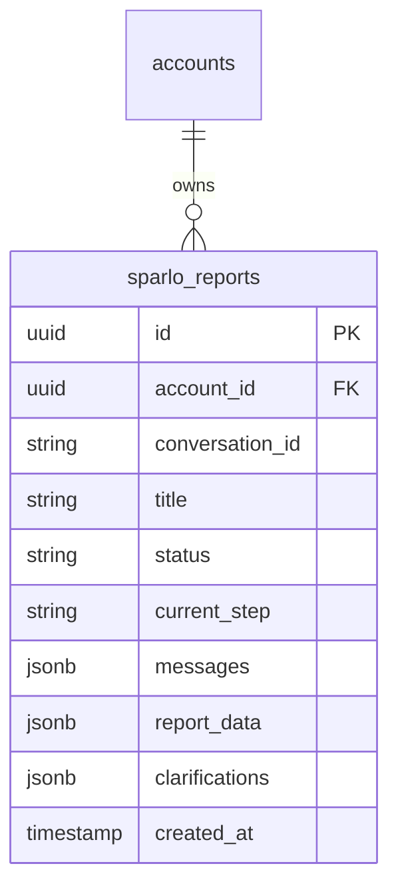

# feat: Implement Hybrid Prompt Flow

## Overview

Implement a new "Hybrid" prompt flow that combines the Core and Discovery flows into a single unified chain. This flow searches the full solution spectrum (simple to paradigm-shifting), evaluates on MERIT (not novelty), hunts in expanded territories (biology, geology, abandoned tech, etc.), documents prior art evidence, and includes honest self-critique.

**Philosophy**: The best solution wins regardless of origin.

## Problem Statement / Motivation

Currently, Sparlo has two separate flows:
- **Core Flow**: Standard analysis focused on proven approaches
- **Discovery Flow**: Hunts for novel solutions in non-obvious domains

Engineers often need BOTH perspectives - they want the best solution regardless of whether it's simple/proven or paradigm-shifting/novel. The Hybrid flow addresses this by:
- Generating solutions across 4 tracks: simpler_path, best_fit, paradigm_shift, frontier_transfer
- Evaluating all concepts on MERIT (feasibility, impact, validation speed)
- Including honest self-critique and prior art documentation

## Proposed Solution

Create a complete Hybrid flow implementation following the Discovery flow patterns with these modifications:
- 7 stages (AN0-M through AN5-M) with unified prompts and schemas
- Input page at `/home/reports/hybrid/new`
- High max tokens (20000) for all stages
- Antifragile report rendering that handles malformed JSON gracefully
- Amber/orange theme to distinguish from Discovery (emerald) and Standard (violet)

## Technical Approach

### Architecture

Follow the existing Discovery flow architecture. The key insight from review: **parameterize where possible, create new files only for genuinely different logic**.

```
apps/web/
├── app/home/(user)/
│   └── reports/
│       └── hybrid/
│           └── new/
│               └── page.tsx              # Input form (amber/orange theme)
├── lib/
│   ├── llm/prompts/
│   │   └── hybrid/                       # NEW: Prompt definitions (content differs)
│   │       ├── index.ts                  # Exports & config
│   │       └── prompts.ts                # All 7 stage prompts
│   └── inngest/
│       └── functions/
│           └── generate-hybrid-report.ts  # NEW: Minimal wrapper calling shared logic
└── _lib/server/
    └── hybrid-reports-server-actions.ts   # NEW: Thin wrapper with mode='hybrid'
```

### Simplification from Review

**Before (over-engineered):**
```typescript
// DON'T DO THIS - unnecessary complexity
maxTokensByPhase: {
  'an0-m': 20000,
  'an1.5-m': 20000,
  // ... 7 nearly identical entries
},
```

**After (simplified):**
```typescript
// DO THIS - simple constants
const MAX_TOKENS = 20000;
const DEFAULT_TEMPERATURE = 0.7;
const CREATIVE_TEMPERATURE = 0.9;  // For AN3-M concept generation
```

### Implementation Phases

#### Phase 1: Prompt Definitions (Core Work)

Create the hybrid prompt files. This is the **genuine new content** - different prompts require different files.

**File:** `apps/web/lib/llm/prompts/hybrid/index.ts`

```typescript
/**
 * Hybrid Mode LLM Prompts
 *
 * Philosophy: The best solution wins regardless of origin.
 * Searches full spectrum from simple to paradigm-shifting.
 */

// Simple constants - no per-phase maps needed when all values are identical
export const HYBRID_MAX_TOKENS = 20000;
export const HYBRID_MODEL = 'claude-opus-4-5-20251101';

export const HYBRID_TEMPERATURES = {
  default: 0.7,
  creative: 0.9,  // AN3-M only
  analytical: 0.5, // AN4-M only
} as const;

export const HYBRID_PHASES = [
  { id: 'an0-m', name: 'Problem Framing', estimatedMinutes: 2 },
  { id: 'an1-m', name: 'Corpus Retrieval', estimatedMinutes: 0.5 },
  { id: 'an1.5-m', name: 'Teaching Selection', estimatedMinutes: 2 },
  { id: 'an1.7-m', name: 'Literature Search', estimatedMinutes: 3 },
  { id: 'an2-m', name: 'Methodology Briefing', estimatedMinutes: 2 },
  { id: 'an3-m', name: 'Concept Generation', estimatedMinutes: 4 },
  { id: 'an4-m', name: 'Evaluation', estimatedMinutes: 3 },
  { id: 'an5-m', name: 'Executive Report', estimatedMinutes: 4 },
] as const;

export type HybridPhaseId = (typeof HYBRID_PHASES)[number]['id'];

export const HYBRID_SOLUTION_TRACKS = [
  'simpler_path',
  'best_fit',
  'paradigm_shift',
  'frontier_transfer',
] as const;

export type HybridSolutionTrack = (typeof HYBRID_SOLUTION_TRACKS)[number];

// Re-export prompts and schemas
export * from './prompts';
export * from './schemas';
```

**File:** `apps/web/lib/llm/prompts/hybrid/schemas.ts`

Complete Zod schemas with antifragile patterns:

```typescript
import { z } from 'zod';

// Shared primitives
const TrackSchema = z.enum(['simpler_path', 'best_fit', 'paradigm_shift', 'frontier_transfer']);

const RiskItemSchema = z.object({
  risk: z.string(),
  likelihood: z.enum(['low', 'medium', 'high']).catch('medium'),
  impact: z.enum(['low', 'medium', 'high']).catch('medium'),
  mitigation: z.string().optional(),
}).passthrough();

const TestGateSchema = z.object({
  name: z.string(),
  description: z.string(),
  success_criteria: z.string(),
  estimated_cost: z.string().optional(),
  estimated_time: z.string().optional(),
}).passthrough();

const PriorArtSchema = z.object({
  source: z.string(),
  relevance: z.string(),
  what_it_proves: z.string().optional(),
}).passthrough();

// AN0-M: Problem Framing
export const AN0_M_OutputSchema = z.object({
  needs_clarification: z.boolean().default(false),
  clarification_question: z.string().optional(),

  problem_analysis: z.object({
    core_challenge: z.string(),
    constraints: z.array(z.string()).catch([]),
    success_metrics: z.array(z.string()).catch([]),
    industry_assumptions: z.array(z.string()).catch([]),
  }).passthrough(),

  landscape_map: z.object({
    current_approaches: z.array(z.string()).catch([]),
    known_limitations: z.array(z.string()).catch([]),
    unexplored_territories: z.array(z.string()).catch([]),
  }).passthrough(),

  discovery_seeds: z.array(z.object({
    domain: z.string(),
    potential_mechanism: z.string(),
    why_relevant: z.string(),
  })).catch([]),
}).passthrough();

export type AN0_M_Output = z.infer<typeof AN0_M_OutputSchema>;

// AN1.5-M: Teaching Selection
export const AN1_5_M_OutputSchema = z.object({
  selected_examples: z.array(z.object({
    domain: z.string(),
    mechanism: z.string(),
    relevance_to_challenge: z.string(),
    teaching_value: z.string(),
  })).catch([]),

  cross_domain_connections: z.array(z.object({
    from_domain: z.string(),
    to_challenge: z.string(),
    transfer_potential: z.string(),
  })).catch([]),
}).passthrough();

export type AN1_5_M_Output = z.infer<typeof AN1_5_M_OutputSchema>;

// AN1.7-M: Literature Search
export const AN1_7_M_OutputSchema = z.object({
  precedent_findings: z.array(z.object({
    source_type: z.string(),
    finding: z.string(),
    implications: z.string(),
    prior_art: PriorArtSchema.optional(),
  })).catch([]),

  gap_analysis: z.array(z.object({
    gap_description: z.string(),
    why_unexplored: z.string(),
    opportunity_signal: z.string(),
  })).catch([]),

  abandoned_approaches: z.array(z.object({
    approach: z.string(),
    why_abandoned: z.string(),
    changed_conditions: z.string().optional(),
  })).catch([]),
}).passthrough();

export type AN1_7_M_Output = z.infer<typeof AN1_7_M_OutputSchema>;

// AN2-M: Methodology Briefing
export const AN2_M_OutputSchema = z.object({
  generation_guidance: z.object({
    must_explore_domains: z.array(z.string()).catch([]),
    mandatory_constraints: z.array(z.string()).catch([]),
    creativity_prompts: z.array(z.string()).catch([]),
  }).passthrough(),

  track_specific_guidance: z.object({
    simpler_path: z.string(),
    best_fit: z.string(),
    paradigm_shift: z.string(),
    frontier_transfer: z.string(),
  }).passthrough(),

  triz_parameters: z.array(z.object({
    parameter_id: z.number(),
    parameter_name: z.string(),
    relevance: z.string(),
  })).catch([]),
}).passthrough();

export type AN2_M_Output = z.infer<typeof AN2_M_OutputSchema>;

// AN3-M: Concept Generation (main creative output)
const ConceptSchema = z.object({
  id: z.string(),
  title: z.string().max(500),
  track: TrackSchema,
  description: z.string(),
  mechanism: z.string(),
  source_domain: z.string().optional(),
  prior_art: z.array(PriorArtSchema).catch([]),
  feasibility_score: z.number().min(1).max(10).catch(5),
  impact_score: z.number().min(1).max(10).catch(5),
  validation_speed: z.enum(['days', 'weeks', 'months', 'years']).catch('months'),
}).passthrough();

export const AN3_M_OutputSchema = z.object({
  concepts: z.array(ConceptSchema).catch([]),

  track_coverage: z.object({
    simpler_path_count: z.number().catch(0),
    best_fit_count: z.number().catch(0),
    paradigm_shift_count: z.number().catch(0),
    frontier_transfer_count: z.number().catch(0),
  }).passthrough(),

  first_principles_concepts: z.array(z.string()).catch([]),
  industry_assumption_challenges: z.array(z.string()).catch([]),
}).passthrough();

export type AN3_M_Output = z.infer<typeof AN3_M_OutputSchema>;

// AN4-M: Evaluation
const ValidationResultSchema = z.object({
  concept_id: z.string(),
  physics_feasibility: z.object({
    score: z.number().min(1).max(10).catch(5),
    analysis: z.string(),
    blockers: z.array(z.string()).catch([]),
  }).passthrough(),
  engineering_feasibility: z.object({
    score: z.number().min(1).max(10).catch(5),
    analysis: z.string(),
    required_capabilities: z.array(z.string()).catch([]),
  }).passthrough(),
  economic_viability: z.object({
    score: z.number().min(1).max(10).catch(5),
    analysis: z.string(),
  }).passthrough(),
  overall_merit_score: z.number().min(1).max(10).catch(5),
  recommendation: z.enum(['pursue', 'investigate', 'defer', 'reject']).catch('investigate'),
}).passthrough();

export const AN4_M_OutputSchema = z.object({
  validation_results: z.array(ValidationResultSchema).catch([]),

  ranking: z.array(z.object({
    concept_id: z.string(),
    rank: z.number(),
    rationale: z.string(),
  })).catch([]),

  self_critique: z.object({
    blind_spots: z.array(z.string()).catch([]),
    uncertainty_areas: z.array(z.string()).catch([]),
    what_could_be_wrong: z.array(z.string()).catch([]),
  }).passthrough(),
}).passthrough();

export type AN4_M_Output = z.infer<typeof AN4_M_OutputSchema>;

// AN5-M: Executive Report
const LeadConceptSchema = z.object({
  id: z.string(),
  title: z.string().max(500),
  track: TrackSchema,
  executive_summary: z.string(),
  why_it_wins: z.string(),
  key_risks: z.array(RiskItemSchema).catch([]),
  how_to_test: z.array(TestGateSchema).catch([]),
  prior_art_summary: z.array(PriorArtSchema).catch([]),
  estimated_timeline: z.string().optional(),
  estimated_investment: z.string().optional(),
}).passthrough();

const OtherConceptSchema = z.object({
  id: z.string(),
  title: z.string(),
  track: TrackSchema,
  one_liner: z.string(),
  when_to_consider: z.string(),
}).passthrough();

export const AN5_M_OutputSchema = z.object({
  decision_architecture: z.object({
    primary: LeadConceptSchema,
    fallback: LeadConceptSchema.optional(),
    parallel_exploration: z.array(OtherConceptSchema).catch([]),
  }).passthrough(),

  other_concepts: z.array(OtherConceptSchema).catch([]),

  self_critique: z.object({
    what_we_might_be_wrong_about: z.array(z.string()).catch([]),
    unexplored_directions: z.array(z.string()).catch([]),
    confidence_level: z.enum(['low', 'medium', 'high']).catch('medium'),
    confidence_rationale: z.string(),
  }).passthrough(),

  executive_summary: z.string(),
  next_steps: z.array(z.string()).catch([]),
}).passthrough();

export type AN5_M_Output = z.infer<typeof AN5_M_OutputSchema>;
```

**File:** `apps/web/lib/llm/prompts/hybrid/prompts.ts`

The actual prompts (user-provided content with proper TypeScript exports):

```typescript
// Contains the 7 stage prompts from user specification
// AN0_M_PROMPT, AN1_5_M_PROMPT, AN1_7_M_PROMPT, AN2_M_PROMPT,
// AN3_M_PROMPT, AN4_M_PROMPT, AN5_M_PROMPT
// (Full content from user's original specification)

export const AN0_M_PROMPT = `You are a senior engineering analyst...` // Full prompt

export const AN0_M_METADATA = {
  id: 'an0-m',
  name: 'Hybrid Problem Framing',
  description: 'Analyze challenge, map landscape, seed discovery',
  temperature: 0.7,
};

// ... repeat for all 7 stages
```

#### Phase 2: Server Actions (Thin Wrapper)

**File:** `apps/web/app/home/(user)/_lib/server/hybrid-reports-server-actions.ts`

Copy from Discovery and change only what differs:

```typescript
'use server';

import { revalidatePath } from 'next/cache';
import { z } from 'zod';
import { enhanceAction } from '@kit/next/actions';
import { getSupabaseServerClient } from '@kit/supabase/server-client';
import { inngest } from '~/lib/inngest/client';
import { USAGE_CONSTANTS } from '~/lib/usage/constants';
import { checkUsageAllowed } from './usage.service';

const AttachmentSchema = z.object({
  filename: z.string(),
  media_type: z.enum([
    'image/jpeg', 'image/png', 'image/gif', 'image/webp', 'application/pdf'
  ]),
  data: z.string(),
});

const StartHybridReportSchema = z.object({
  designChallenge: z.string().min(50).max(10000),
  attachments: z.array(AttachmentSchema).max(5).optional(),
});

// Same rate limits as Discovery
const RATE_LIMIT_WINDOW_MS = 5 * 60 * 1000;
const MAX_REPORTS_PER_WINDOW = 1000;
const DAILY_LIMIT = 1000;

export const startHybridReportGeneration = enhanceAction(
  async (data, user) => {
    const client = getSupabaseServerClient();

    // Check usage limits
    const usage = await checkUsageAllowed(
      user.id,
      USAGE_CONSTANTS.ESTIMATED_TOKENS_PER_REPORT,
    );

    if (!usage.allowed) {
      throw new Error(
        `Usage limit reached (${usage.percentage.toFixed(0)}% used). ` +
        `Upgrade your plan or wait until ${new Date(usage.periodEnd).toLocaleDateString()}.`,
      );
    }

    // Rate limiting (same as Discovery)
    const windowStart = new Date(Date.now() - RATE_LIMIT_WINDOW_MS).toISOString();
    const dayStart = new Date(Date.now() - 24 * 60 * 60 * 1000).toISOString();

    const [recentResult, dailyResult] = await Promise.all([
      client
        .from('sparlo_reports')
        .select('id', { count: 'exact', head: true })
        .eq('account_id', user.id)
        .gte('created_at', windowStart),
      client
        .from('sparlo_reports')
        .select('id', { count: 'exact', head: true })
        .eq('account_id', user.id)
        .gte('created_at', dayStart),
    ]);

    if (recentResult.count && recentResult.count >= MAX_REPORTS_PER_WINDOW) {
      throw new Error('Rate limit exceeded. Please wait 5 minutes between reports.');
    }

    if (dailyResult.count && dailyResult.count >= DAILY_LIMIT) {
      throw new Error(`Daily limit reached (${DAILY_LIMIT} reports/day).`);
    }

    const conversationId = crypto.randomUUID();

    // Create report with mode: 'hybrid'
    const { data: report, error: dbError } = await client
      .from('sparlo_reports')
      .insert({
        account_id: user.id,
        conversation_id: conversationId,
        title: `[Hybrid] ${data.designChallenge.slice(0, 90)}`,
        status: 'processing',
        current_step: 'an0-m',
        messages: [{
          id: crypto.randomUUID(),
          role: 'user',
          content: data.designChallenge,
          timestamp: new Date().toISOString(),
        }],
        report_data: {
          mode: 'hybrid',
          started_at: new Date().toISOString(),
        },
      })
      .select()
      .single();

    if (dbError) {
      throw new Error(`Failed to create hybrid report: ${dbError.message}`);
    }

    // Trigger Inngest workflow
    try {
      await inngest.send({
        name: 'report/generate-hybrid',
        data: {
          reportId: report.id,
          accountId: user.id,
          userId: user.id,
          designChallenge: data.designChallenge,
          conversationId,
          attachments: data.attachments,
        },
      });
    } catch (err) {
      await client
        .from('sparlo_reports')
        .update({ status: 'error', last_message: 'Failed to start workflow' })
        .eq('id', report.id);
      throw new Error('Failed to start hybrid report generation');
    }

    revalidatePath('/home');
    return { success: true, reportId: report.id, conversationId };
  },
  { schema: StartHybridReportSchema, auth: true },
);

const AnswerHybridClarificationSchema = z.object({
  reportId: z.string().uuid(),
  answer: z.string().min(1).max(5000),
});

export const answerHybridClarification = enhanceAction(
  async (data, user) => {
    const client = getSupabaseServerClient();

    const { data: report, error } = await client
      .from('sparlo_reports')
      .select('id, status, clarifications, account_id')
      .eq('id', data.reportId)
      .eq('account_id', user.id)
      .single();

    if (error || !report) {
      throw new Error('Report not found or unauthorized');
    }

    if (report.status !== 'clarifying') {
      throw new Error('Report is not awaiting clarification');
    }

    const clarifications = (report.clarifications as Record<string, unknown>[]) ?? [];
    if (clarifications.length > 0) {
      const last = clarifications[clarifications.length - 1];
      if (last) {
        last.answer = data.answer;
        last.answeredAt = new Date().toISOString();
      }
    }

    await client
      .from('sparlo_reports')
      .update({
        status: 'processing',
        clarifications: JSON.parse(JSON.stringify(clarifications)),
      })
      .eq('id', data.reportId);

    await inngest.send({
      name: 'report/hybrid-clarification-answered',
      data: { reportId: data.reportId, answer: data.answer },
    });

    revalidatePath('/home');
    return { success: true };
  },
  { schema: AnswerHybridClarificationSchema, auth: true },
);
```

#### Phase 3: Inngest Workflow

**File:** `apps/web/lib/inngest/functions/generate-hybrid-report.ts`

Copy structure from `generate-discovery-report.ts`, change:
- Event name: `report/generate-hybrid`
- Import hybrid prompts/schemas
- Phase IDs use `-m` suffix

```typescript
import { inngest } from '../client';
import {
  HYBRID_PHASES,
  HYBRID_MAX_TOKENS,
  HYBRID_TEMPERATURES,
  HYBRID_MODEL,
  // Prompt exports
  AN0_M_PROMPT,
  AN0_M_OutputSchema,
  // ... other prompts
} from '~/lib/llm/prompts/hybrid';

export const generateHybridReport = inngest.createFunction(
  { id: 'generate-hybrid-report', retries: 3 },
  { event: 'report/generate-hybrid' },
  async ({ event, step }) => {
    // Same structure as Discovery workflow
    // Execute phases sequentially with proper error handling
    // Use antifragile schema parsing with .catch() fallbacks
  }
);

export const handleHybridClarification = inngest.createFunction(
  { id: 'handle-hybrid-clarification' },
  { event: 'report/hybrid-clarification-answered' },
  async ({ event, step }) => {
    // Resume workflow from clarification
  }
);
```

#### Phase 4: Input Page

**File:** `apps/web/app/home/(user)/reports/hybrid/new/page.tsx`

Copy from Discovery, change:
- Theme: amber/orange accents instead of emerald/teal
- Title: "Hybrid Report"
- Server action: `startHybridReportGeneration`

```typescript
'use client';

import { useRouter } from 'next/navigation';
import { useTransition } from 'react';
import { startHybridReportGeneration } from '../../_lib/server/hybrid-reports-server-actions';
// ... rest similar to Discovery

// Theme colors
const ACCENT_CLASSES = {
  gradient: 'from-amber-500 to-orange-600',
  text: 'text-amber-600',
  bg: 'bg-amber-500',
  ring: 'ring-amber-500',
};
```

#### Phase 5: Report Display Integration

**File modification:** `apps/web/app/home/(user)/reports/[id]/_components/report-display.tsx`

Add hybrid mode handling:

```typescript
// Add to mode detection
const mode = report.report_data?.mode;

// Add to conditional rendering
{mode === 'hybrid' && <HybridReportDisplay data={report.report_data} />}
```

**New file:** `apps/web/app/home/(user)/reports/[id]/_components/hybrid-report-display.tsx`

```typescript
// Renders the decision architecture with primary/fallback/parallel
// Shows solution track badges (simpler_path, best_fit, etc.)
// Renders self-critique section
// Uses amber/orange theme
```

## Test Plan

### Unit Tests (Minimum 20)

**File:** `apps/web/lib/llm/prompts/hybrid/__tests__/schemas.test.ts`

```typescript
import { describe, it, expect } from 'vitest';
import {
  AN0_M_OutputSchema,
  AN3_M_OutputSchema,
  AN5_M_OutputSchema,
} from '../schemas';

describe('Hybrid Schema Validation', () => {
  describe('AN0_M_OutputSchema', () => {
    it('parses valid output', () => {
      const valid = {
        needs_clarification: false,
        problem_analysis: {
          core_challenge: 'Test challenge',
          constraints: ['c1'],
          success_metrics: ['m1'],
          industry_assumptions: ['a1'],
        },
        landscape_map: {
          current_approaches: [],
          known_limitations: [],
          unexplored_territories: [],
        },
        discovery_seeds: [],
      };
      expect(() => AN0_M_OutputSchema.parse(valid)).not.toThrow();
    });

    it('applies catch() fallbacks for missing arrays', () => {
      const minimal = {
        problem_analysis: { core_challenge: 'Test' },
        landscape_map: {},
      };
      const result = AN0_M_OutputSchema.parse(minimal);
      expect(result.problem_analysis.constraints).toEqual([]);
      expect(result.discovery_seeds).toEqual([]);
    });

    it('allows extra fields with passthrough()', () => {
      const withExtra = {
        problem_analysis: { core_challenge: 'Test', extra_field: 'value' },
        landscape_map: {},
        unexpected_key: 'preserved',
      };
      const result = AN0_M_OutputSchema.parse(withExtra);
      expect(result.unexpected_key).toBe('preserved');
    });

    it('handles clarification request', () => {
      const clarifying = {
        needs_clarification: true,
        clarification_question: 'What temperature range?',
        problem_analysis: { core_challenge: 'TBD' },
        landscape_map: {},
      };
      const result = AN0_M_OutputSchema.parse(clarifying);
      expect(result.needs_clarification).toBe(true);
    });
  });

  describe('AN3_M_OutputSchema', () => {
    it('validates concept with all tracks', () => {
      const concepts = {
        concepts: [
          { id: '1', title: 'Simple', track: 'simpler_path', description: 'd', mechanism: 'm' },
          { id: '2', title: 'Best', track: 'best_fit', description: 'd', mechanism: 'm' },
        ],
        track_coverage: { simpler_path_count: 1, best_fit_count: 1 },
      };
      expect(() => AN3_M_OutputSchema.parse(concepts)).not.toThrow();
    });

    it('clamps feasibility_score to valid range with catch', () => {
      const outOfRange = {
        concepts: [{
          id: '1',
          title: 'Test',
          track: 'best_fit',
          description: 'd',
          mechanism: 'm',
          feasibility_score: 999, // Invalid
        }],
      };
      const result = AN3_M_OutputSchema.parse(outOfRange);
      expect(result.concepts[0].feasibility_score).toBe(5); // catch default
    });
  });

  describe('AN5_M_OutputSchema', () => {
    it('validates complete decision architecture', () => {
      const report = {
        decision_architecture: {
          primary: {
            id: '1',
            title: 'Primary Solution',
            track: 'best_fit',
            executive_summary: 'Summary',
            why_it_wins: 'Reason',
          },
          parallel_exploration: [],
        },
        other_concepts: [],
        self_critique: {
          what_we_might_be_wrong_about: ['assumption 1'],
          unexplored_directions: [],
          confidence_level: 'medium',
          confidence_rationale: 'Based on analysis',
        },
        executive_summary: 'Report summary',
        next_steps: ['Step 1'],
      };
      expect(() => AN5_M_OutputSchema.parse(report)).not.toThrow();
    });

    it('handles missing optional fallback', () => {
      const noFallback = {
        decision_architecture: {
          primary: { id: '1', title: 'P', track: 'best_fit', executive_summary: 's', why_it_wins: 'w' },
        },
        self_critique: { confidence_level: 'high', confidence_rationale: 'r' },
        executive_summary: 'e',
      };
      const result = AN5_M_OutputSchema.parse(noFallback);
      expect(result.decision_architecture.fallback).toBeUndefined();
    });
  });
});
```

**File:** `apps/web/app/home/(user)/_lib/server/__tests__/hybrid-reports-server-actions.test.ts`

```typescript
import { describe, it, expect, vi, beforeEach } from 'vitest';

describe('Hybrid Server Actions', () => {
  it('validates design challenge minimum length');
  it('validates design challenge maximum length');
  it('validates attachment count limit');
  it('validates attachment file types');
  it('checks usage limits before creating report');
  it('applies rate limiting per window');
  it('applies daily rate limiting');
  it('creates report with mode: hybrid');
  it('triggers correct Inngest event');
  it('handles Inngest failure gracefully');
  it('validates clarification answer length');
  it('only allows owner to answer clarification');
  it('only allows clarifying status reports');
});
```

### Integration Tests

**File:** `apps/e2e/tests/hybrid-flow.spec.ts`

```typescript
import { test, expect } from '@playwright/test';

test.describe('Hybrid Report Flow', () => {
  test('creates hybrid report from input page', async ({ page }) => {
    await page.goto('/home/reports/hybrid/new');
    await page.fill('[data-test="design-challenge"]', 'A'.repeat(100));
    await page.click('[data-test="submit-button"]');
    await expect(page.locator('[data-test="processing-screen"]')).toBeVisible();
  });

  test('shows amber/orange theme elements', async ({ page }) => {
    await page.goto('/home/reports/hybrid/new');
    // Verify theme colors
  });

  test('displays all 8 phases in progress', async ({ page }) => {
    // After submission, verify phase list
  });
});
```

## Frontend Components Specification

### Input Page Components

| Component | File | Description |
|-----------|------|-------------|
| `HybridNewReportPage` | `reports/hybrid/new/page.tsx` | Main page with form |
| `ChallengeTextarea` | Reuse from Discovery | Design challenge input |
| `AttachmentUploader` | Reuse from Discovery | File upload with preview |
| `ContextChips` | Reuse from Discovery | Auto-detected context tags |

### Report Display Components

| Component | File | Description |
|-----------|------|-------------|
| `HybridReportDisplay` | `reports/[id]/_components/hybrid-report-display.tsx` | Main report renderer |
| `DecisionArchitecture` | Same file | Primary/fallback/parallel layout |
| `SolutionTrackBadge` | Same file | Colored badge for track type |
| `SelfCritiqueSection` | Same file | Renders blind spots, uncertainties |
| `ConceptCard` | Same file | Individual concept with scores |

### Theme Colors

| Element | Tailwind Classes |
|---------|------------------|
| Primary gradient | `from-amber-500 to-orange-600` |
| Text accent | `text-amber-600` |
| Background accent | `bg-amber-50` |
| Border accent | `border-amber-200` |
| Button | `bg-amber-500 hover:bg-amber-600` |

## Error Handling Strategy

### LLM Response Errors

```typescript
// In Inngest workflow
try {
  const rawResponse = await callClaude(prompt);
  const parsed = schema.safeParse(JSON.parse(rawResponse));

  if (!parsed.success) {
    // Log error but continue with partial data
    console.error('Schema validation failed:', parsed.error);
    // Use .catch() fallbacks from schema
    return schema.parse(JSON.parse(rawResponse));
  }
  return parsed.data;
} catch (parseError) {
  // JSON parse failed - try to extract JSON from response
  const jsonMatch = rawResponse.match(/\{[\s\S]*\}/);
  if (jsonMatch) {
    return schema.parse(JSON.parse(jsonMatch[0]));
  }
  throw new Error('Failed to parse LLM response');
}
```

### Workflow Failures

```typescript
// Inngest handles retries (3 attempts)
// On final failure, update report status
await client
  .from('sparlo_reports')
  .update({
    status: 'error',
    last_message: `Failed at phase ${currentPhase}: ${error.message}`,
    report_data: {
      ...existingData,
      error: { phase: currentPhase, message: error.message, timestamp: new Date() },
    },
  })
  .eq('id', reportId);
```

### User-Facing Errors

| Error Type | User Message |
|------------|--------------|
| Usage limit | "Usage limit reached (X% used). Upgrade or wait until {date}." |
| Rate limit | "Rate limit exceeded. Please wait 5 minutes." |
| Daily limit | "Daily limit reached (X reports/day)." |
| Workflow failure | "Report generation failed at {phase}. Please try again." |
| Clarification timeout | "This report is awaiting your response." |

## Acceptance Criteria

### Functional Requirements
- [ ] User can navigate to `/home/reports/hybrid/new`
- [ ] User can input design challenge (50-10000 chars)
- [ ] User can attach up to 5 files (images or PDFs, max 10MB each)
- [ ] Submitting triggers background Inngest workflow
- [ ] Progress shows 8 phases with real-time updates
- [ ] Completed report renders with decision architecture
- [ ] Report handles malformed JSON gracefully (antifragile)
- [ ] Clarification questions pause workflow and resume on answer
- [ ] Self-critique section visible in final report

### Non-Functional Requirements
- [ ] All stages use 20000 max tokens
- [ ] Total estimated time: ~20 minutes
- [ ] Same rate limiting as Discovery
- [ ] TypeScript types pass `pnpm typecheck`

### Quality Gates
- [ ] `pnpm typecheck` passes
- [ ] `pnpm lint:fix` passes
- [ ] `pnpm format:fix` passes
- [ ] Unit tests pass (minimum 20 tests)
- [ ] Manual test: create hybrid report end-to-end
- [ ] Report displays all 4 solution tracks correctly

## Dependencies & Prerequisites

### Required Before Starting
1. Inngest client configured at `~/lib/inngest/client`
2. `sparlo_reports` table supports `mode` in `report_data` JSON
3. `callClaude` function supports 20K+ tokens with streaming

### Existing Code to Reuse
- `apps/web/app/home/(user)/_components/processing-screen.tsx`
- `apps/web/app/home/(user)/_lib/use-report-progress.ts`
- `apps/web/lib/llm/client.ts`
- Discovery flow files as structural templates

## ERD Diagram

No new tables. Uses existing `sparlo_reports` with `mode: 'hybrid'` in `report_data`.



**report_data for Hybrid:**
```json
{
  "mode": "hybrid",
  "started_at": "2025-01-15T10:00:00Z",
  "an0_m_output": {},
  "an1_5_m_output": {},
  "an1_7_m_output": {},
  "an2_m_output": {},
  "an3_m_output": {},
  "an4_m_output": {},
  "an5_m_output": {}
}
```

## Risk Analysis

| Risk | Likelihood | Impact | Mitigation |
|------|------------|--------|------------|
| Token costs high (~140K/report) | HIGH | MEDIUM | Same quota system as Discovery |
| Stage failures mid-chain | MEDIUM | HIGH | Inngest retries + partial preservation |
| Schema validation failures | MEDIUM | LOW | Antifragile .catch() fallbacks |
| Long execution (20+ min) | HIGH | LOW | Real-time progress updates |

## References

### Internal
- Discovery prompts: `apps/web/lib/llm/prompts/discovery/index.ts`
- Discovery server actions: `apps/web/app/home/(user)/_lib/server/discovery-reports-server-actions.ts`
- Discovery input: `apps/web/app/home/(user)/reports/discovery/new/page.tsx`

### External
- [Anthropic Claude API](https://docs.anthropic.com/en/docs)
- [Inngest Documentation](https://www.inngest.com/docs)
- [Zod Schema Patterns](https://zod.dev)
