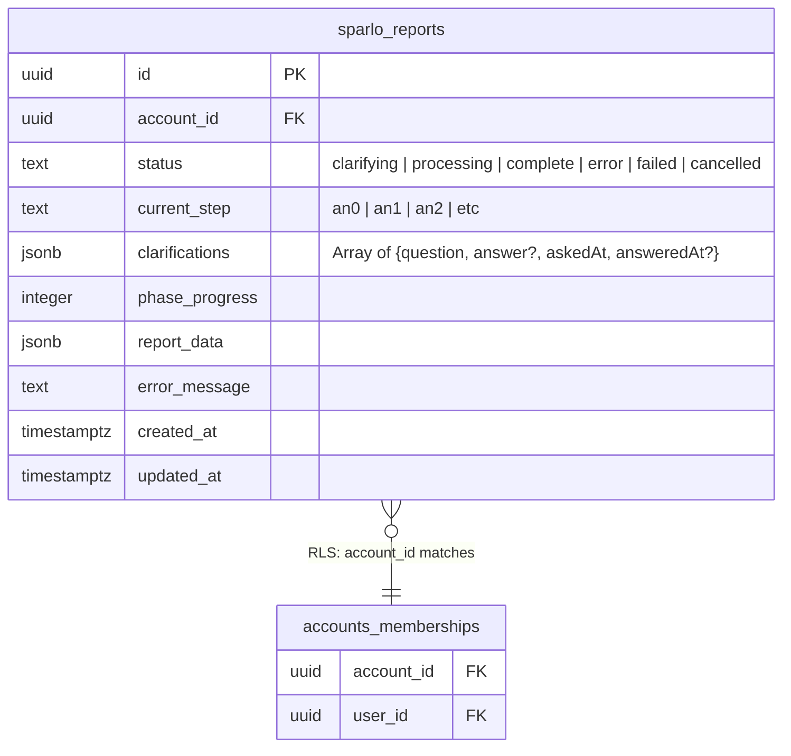

# feat: Add "Needs Clarification" Status to Dashboard with Clickable Link

## Overview

When a report requires user clarification before proceeding, users who navigate away from the processing page currently see only "Processing xxh xxm elapsed" on the dashboard - a non-clickable card that provides no way to return to the clarification page. This feature adds a distinct "Needs Clarification ->" status indicator that users can click to return to the clarification page and submit their response.

## Problem Statement

**Current Behavior:**
1. User submits a problem that may need clarification
2. They see the processing screen with "waiting to see if we need clarification"
3. If clarification IS needed and they leave before seeing it:
   - Dashboard shows "Processing xxh xxm elapsed" (non-clickable)
   - User cannot return to clarification page
   - Report gets stuck because clarification can never be provided
   - Inngest workflow waits (up to 24h timeout) then fails

**User Impact:**
- Reports fail silently due to missed clarification requests
- Users have no visibility into what's blocking their report
- Poor UX leads to confusion and abandoned workflows

## Proposed Solution

### High-Level Approach

Separate the `'clarifying'` status from `'processing'` in the dashboard UI:

1. **Dashboard (`reports-dashboard.tsx`)**: Show clickable "Needs Clarification ->" card when `status === 'clarifying'`
2. **Processing Screen (`processing-screen.tsx`)**: Don't redirect users away when clarification is needed
3. **Navigation**: Link directly to `/home/reports/[id]` which shows the clarification form

### Architecture Diagram

```
┌─────────────────────────────────────────────────────────────────────────┐
│                           USER FLOW                                      │
├─────────────────────────────────────────────────────────────────────────┤
│                                                                          │
│  ┌──────────────┐     ┌─────────────────┐     ┌────────────────────┐   │
│  │   Dashboard   │────▶│  /reports/[id]  │────▶│  Clarification UI  │   │
│  │  (click card) │     │  (processing    │     │  (textarea + submit)│   │
│  │               │     │   screen)       │     │                    │   │
│  └──────────────┘     └─────────────────┘     └────────────────────┘   │
│         ▲                                              │                │
│         │                                              │                │
│         │         ┌───────────────────────────────────┘                │
│         │         ▼                                                     │
│         │    ┌──────────────────┐     ┌─────────────────────────┐     │
│         │    │   POST /clarify   │────▶│   inngest.send()        │     │
│         │    │   (server action) │     │   'report/clarification │     │
│         │    │                   │     │   -answered'            │     │
│         │    └──────────────────┘     └─────────────────────────┘     │
│         │                                              │                │
│         │                                              ▼                │
│         │                              ┌─────────────────────────┐     │
│         └──────────────────────────────│   step.waitForEvent()   │     │
│              (status updates           │   (resumes workflow)    │     │
│               to 'processing')         └─────────────────────────┘     │
│                                                                          │
└─────────────────────────────────────────────────────────────────────────┘
```

### Status State Machine

```
                    ┌─────────────────────────────────────┐
                    │                                     │
                    ▼                                     │
┌──────────┐   ┌────────────┐   ┌────────────┐   ┌───────┴──┐
│ pending  │──▶│ processing │──▶│ clarifying │──▶│processing│──▶ complete
└──────────┘   └────────────┘   └────────────┘   └──────────┘
                    │                  │
                    │                  │ (timeout 24h)
                    ▼                  ▼
                 ┌──────┐          ┌────────┐
                 │failed│          │ failed │
                 └──────┘          └────────┘
```

## Technical Approach

### Files to Modify

| File | Changes |
|------|---------|
| `apps/web/app/home/(user)/_components/reports-dashboard.tsx` | Separate 'clarifying' from 'processing', make card clickable |
| `apps/web/app/home/(user)/_components/processing-screen.tsx` | Don't redirect when status is 'clarifying' |

### 1. reports-dashboard.tsx Changes

**Current Code (lines 158-161):**
```typescript
const isProcessing = (status: ConversationStatus) =>
  status === 'processing' ||
  status === 'clarifying' ||
  status === 'confirm_rerun';
```

**New Code:**
```typescript
const isProcessing = (status: ConversationStatus) =>
  status === 'processing' ||
  status === 'confirm_rerun';

const needsClarification = (status: ConversationStatus) =>
  status === 'clarifying';
```

**Current Card Rendering (lines 227-279) - Non-clickable processing state:**
```typescript
{isProcessing(report.status) && (
  <div className="cursor-default ...">
    <div className="...">
      <span className="text-sm font-medium text-purple-700">
        Processing
      </span>
      <ElapsedTime createdAt={report.created_at} />
    </div>
    {/* cancel button, loading spinner */}
  </div>
)}
```

**New Card Rendering - Add clickable clarification state:**
```typescript
{needsClarification(report.status) && (
  <Link href={`/home/reports/${report.id}`}>
    <div className="cursor-pointer hover:bg-amber-100 transition-colors rounded-lg p-4 border border-amber-200 bg-amber-50">
      <div className="flex items-center justify-between">
        <div className="flex items-center gap-2">
          <AlertCircle className="h-4 w-4 text-amber-600" />
          <span className="text-sm font-medium text-amber-700">
            Needs Clarification
          </span>
        </div>
        <div className="flex items-center gap-1 text-amber-600">
          <span className="text-xs">Answer now</span>
          <ChevronRight className="h-4 w-4" />
        </div>
      </div>
      <p className="mt-2 text-xs text-amber-600">
        We need more information to continue
      </p>
    </div>
  </Link>
)}

{isProcessing(report.status) && (
  <div className="cursor-default ...">
    {/* existing processing UI */}
  </div>
)}
```

### 2. processing-screen.tsx Changes

**Current Code (lines 113-162) - Redirect logic:**
```typescript
// Priority 2: AN0 bypass - redirect to dashboard when no clarification needed
const isStillInAN0 =
  progress.currentStep === null || progress.currentStep.startsWith('an0');
const movedPastAN0 = progress.status === 'processing' && !isStillInAN0;
const noClarificationNeeded =
  movedPastAN0 && progress.clarifications?.length === 0;

if (noClarificationNeeded) {
  hasNavigatedRef.current = true;
  router.push('/home');
}
```

**New Code - Don't redirect when clarification is pending:**
```typescript
// Priority 2: AN0 bypass - redirect to dashboard when no clarification needed
const isStillInAN0 =
  progress.currentStep === null || progress.currentStep.startsWith('an0');
const movedPastAN0 = progress.status === 'processing' && !isStillInAN0;
const hasPendingClarification = progress.clarifications?.some((c) => !c.answer);
const noClarificationNeeded =
  movedPastAN0 && !hasPendingClarification;

if (noClarificationNeeded) {
  hasNavigatedRef.current = true;
  router.push('/home');
}

// If status is 'clarifying', keep user on page to show clarification form
// (clarification UI renders at lines 302-428)
```

## Acceptance Criteria

### Functional Requirements

- [ ] Dashboard shows "Needs Clarification ->" with amber styling when `status === 'clarifying'`
- [ ] "Needs Clarification" card is clickable and links to `/home/reports/[id]`
- [ ] Clicking the card shows the clarification form with the pending question
- [ ] User can submit clarification from the form
- [ ] After submission, status changes to 'processing' and workflow resumes
- [ ] Processing screen does NOT redirect users to dashboard when clarification is pending

### Visual Requirements

- [ ] "Needs Clarification" card uses amber/yellow color scheme (distinct from purple "Processing")
- [ ] Card has hover state indicating clickability
- [ ] Includes icon (AlertCircle or similar) for visual scanning
- [ ] Arrow/chevron indicates it's navigable

### Non-Functional Requirements

- [ ] Real-time updates work: if status changes to 'clarifying' while on dashboard, card updates
- [ ] Authorization: users can only clarify their own reports (RLS enforced)
- [ ] Handles edge case: if user clicks card but status already changed, show appropriate message

## MVP Implementation

### reports-dashboard.tsx

```typescript
// Add import
import Link from 'next/link';
import { AlertCircle, ChevronRight } from 'lucide-react';

// Add helper function (after line 161)
const needsClarification = (status: ConversationStatus) =>
  status === 'clarifying';

// Modify isProcessing to exclude 'clarifying' (line 158-161)
const isProcessing = (status: ConversationStatus) =>
  status === 'processing' ||
  status === 'confirm_rerun';

// Add new card variant (before the isProcessing block, around line 227)
{needsClarification(report.status) && (
  <Link href={`/home/reports/${report.id}`} className="block">
    <div className="cursor-pointer rounded-lg border border-amber-200 bg-amber-50 p-4 transition-colors hover:bg-amber-100">
      <div className="flex items-center justify-between">
        <div className="flex items-center gap-2">
          <AlertCircle className="h-4 w-4 text-amber-600" />
          <span className="text-sm font-medium text-amber-700">
            Needs Clarification
          </span>
        </div>
        <div className="flex items-center gap-1 text-amber-600">
          <span className="text-xs">Answer now</span>
          <ChevronRight className="h-4 w-4" />
        </div>
      </div>
      <p className="mt-2 text-xs text-amber-600">
        We need more information to continue
      </p>
    </div>
  </Link>
)}
```

### processing-screen.tsx

```typescript
// Modify redirect logic (around line 113-120)
const hasPendingClarification = progress.clarifications?.some((c) => !c.answer);
const noClarificationNeeded =
  movedPastAN0 && !hasPendingClarification && progress.clarifications?.length === 0;
```

## ERD Diagram

No database changes required. Existing schema supports this feature:



## References

### Internal References
- Dashboard component: `apps/web/app/home/(user)/_components/reports-dashboard.tsx:158-279`
- Processing screen: `apps/web/app/home/(user)/_components/processing-screen.tsx:113-162, 302-428`
- Clarification API: `apps/web/app/api/reports/[id]/clarify/route.ts:23-129`
- Inngest workflow: `apps/web/lib/inngest/functions/generate-report.ts:228-278`
- Types: `apps/web/app/home/(user)/_lib/types.ts:9-17`
- Progress hook: `apps/web/app/home/(user)/_lib/use-report-progress.ts`

### External References
- [Inngest step.waitForEvent() Documentation](https://www.inngest.com/docs/features/inngest-functions/steps-workflows/wait-for-event)
- [Next.js Link Component](https://nextjs.org/docs/app/api-reference/components/link)
- [Status Indicator UX Best Practices](https://www.koruux.com/blog/ux-best-practices-designing-status-indicators/)

### Related Work
- Existing clarification flow already works when user stays on processing page
- Real-time subscriptions already update dashboard when status changes
- RLS policies already enforce user-to-report access control
