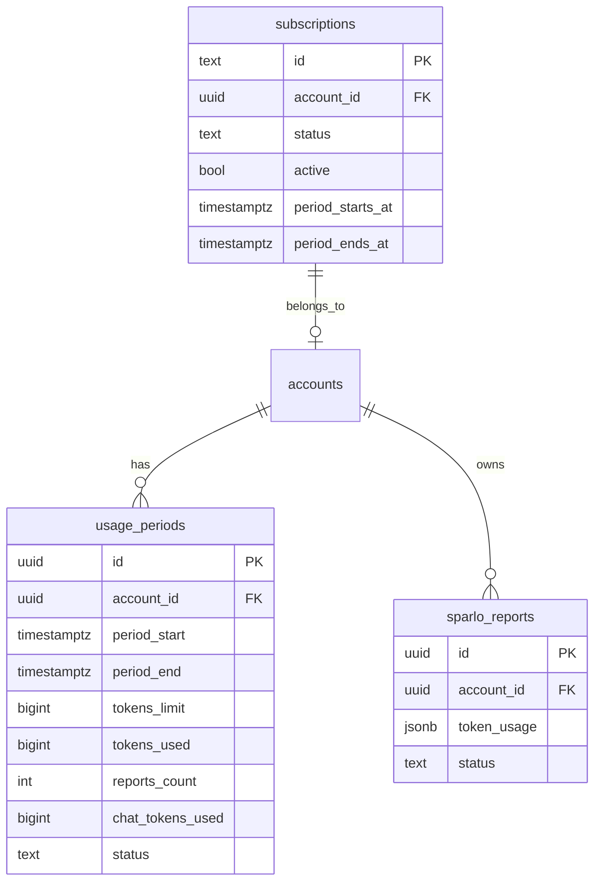

# feat: Token-Based Usage Tracking System

## Overview

Implement a Claude-style token-based usage tracking system with three subscription tiers, monthly billing cycle resets, and a visual usage indicator in the UI.

## Problem Statement

Currently, Sparlo tracks only basic rate limits (reports per 5-minute window) but has no:
- Aggregate token usage tracking per user/account
- Tier-based usage limits tied to subscriptions
- Monthly usage resets aligned with billing cycles
- User-facing usage dashboard/indicator
- Enforcement of usage limits before report generation

Users need visibility into their consumption and predictable limits based on their subscription tier.

## Token Estimation (From Production Data)

Based on current Inngest function configuration and Claude Opus 4.5:

### Per-Report Token Usage

| Phase | Max Output Tokens | Est. Input Tokens | Est. Output Tokens |
|-------|-------------------|-------------------|---------------------|
| AN0 | 8,000 | 3,000 | 4,000 |
| AN1 (Corpus) | N/A | 500 | N/A |
| AN1.5 | 8,000 | 8,000 | 5,000 |
| AN1.7 | 8,000 | 10,000 | 5,000 |
| AN2 | 8,000 | 12,000 | 6,000 |
| AN3 | 24,000 | 15,000 | 15,000 |
| AN4 | 16,000 | 18,000 | 10,000 |
| AN5 | 24,000 | 20,000 | 18,000 |
| **Total** | | **~86,500** | **~63,000** |

**Estimated total per report: ~150,000 tokens** (input + output combined)

Discovery mode is similar but uses different prompts with comparable token counts.

### Chat Usage Estimate

- Average chat message: ~2,000 tokens (input + output)
- Estimated 10-20 chat messages per report: ~30,000 tokens

**Combined report + chat: ~180,000 tokens per "report session"**

## Proposed Tiers

| Tier | Plan Name | Reports/Month | Token Allowance | Monthly Price |
|------|-----------|---------------|-----------------|---------------|
| 1 | Starter | 15 | 3,000,000 | $9.99 |
| 2 | Pro | 50 | 10,000,000 | $19.99 |
| 3 | Enterprise | 150 | 30,000,000 | $29.99 |

**Buffer:** ~20% additional tokens beyond calculated minimum to account for:
- Clarification retries
- Longer user prompts
- Chat follow-up questions

## Technical Approach

### Architecture

```
┌─────────────────────────────────────────────────────────────┐
│                      Frontend                                │
│  ┌───────────────┐  ┌──────────────────────────────────┐   │
│  │ UsageIndicator │  │ Reports Dashboard                │   │
│  │ (Sidebar)      │  │ (Shows remaining reports)        │   │
│  └───────────────┘  └──────────────────────────────────┘   │
└─────────────────────────────────────────────────────────────┘
                              │
                              ▼
┌─────────────────────────────────────────────────────────────┐
│                    Server Actions                            │
│  ┌────────────────────────────────────────────────────────┐ │
│  │ checkUsageLimits() → before each report/chat           │ │
│  │ incrementUsage() → after successful completion         │ │
│  └────────────────────────────────────────────────────────┘ │
└─────────────────────────────────────────────────────────────┘
                              │
                              ▼
┌─────────────────────────────────────────────────────────────┐
│                      Database                                │
│  ┌──────────────┐  ┌──────────────┐  ┌──────────────────┐  │
│  │ usage_periods│  │ sparlo_reports│  │ subscriptions    │  │
│  │ (monthly)    │  │ (token_usage) │  │ (tier/limits)    │  │
│  └──────────────┘  └──────────────┘  └──────────────────┘  │
└─────────────────────────────────────────────────────────────┘
```

### Implementation Phases

#### Phase 1: Database Schema & Token Persistence

**New Migration: `add_usage_tracking.sql`**

```sql
-- Usage periods table (one per billing cycle)
-- Denormalized for fast reads at scale (like Claude's usage tracking)
CREATE TABLE usage_periods (
  id UUID PRIMARY KEY DEFAULT gen_random_uuid(),
  account_id UUID NOT NULL REFERENCES accounts(id) ON DELETE CASCADE,

  -- Period boundaries (aligned with subscription billing)
  period_start TIMESTAMPTZ NOT NULL,
  period_end TIMESTAMPTZ NOT NULL,

  -- Token limits (from subscription tier)
  tokens_limit BIGINT NOT NULL DEFAULT 3000000, -- Tier 1 default

  -- Current usage (denormalized for fast reads)
  tokens_used BIGINT NOT NULL DEFAULT 0,
  reports_count INTEGER NOT NULL DEFAULT 0,
  chat_tokens_used BIGINT NOT NULL DEFAULT 0,

  -- Status
  status TEXT NOT NULL DEFAULT 'active' CHECK (status IN ('active', 'completed')),

  created_at TIMESTAMPTZ DEFAULT NOW(),
  updated_at TIMESTAMPTZ DEFAULT NOW(),

  CONSTRAINT valid_period CHECK (period_end > period_start)
);

-- Indexes for fast lookups
CREATE INDEX idx_usage_periods_account ON usage_periods(account_id, period_start DESC);
CREATE INDEX idx_usage_periods_active ON usage_periods(account_id) WHERE status = 'active';
CREATE INDEX idx_usage_periods_expiration ON usage_periods(period_end) WHERE status = 'active';

-- Unique constraint: only one active period per account (prevents race condition duplicates)
CREATE UNIQUE INDEX idx_usage_periods_unique_active
  ON usage_periods(account_id)
  WHERE status = 'active';

-- Add token_usage column to sparlo_reports
ALTER TABLE sparlo_reports
ADD COLUMN IF NOT EXISTS token_usage JSONB DEFAULT '{"inputTokens":0,"outputTokens":0,"totalTokens":0,"costUsd":0}'::jsonb;

-- RLS policies
ALTER TABLE usage_periods ENABLE ROW LEVEL SECURITY;

-- Users can view their own active usage period
CREATE POLICY "Users can view own active usage period"
  ON usage_periods FOR SELECT
  USING (
    account_id = auth.uid()
    OR public.has_role_on_account(account_id)
  );

-- Function to get or create active usage period (handles race conditions with ON CONFLICT)
CREATE OR REPLACE FUNCTION get_or_create_usage_period(
  p_account_id UUID,
  p_tokens_limit BIGINT DEFAULT 3000000
)
RETURNS usage_periods
LANGUAGE plpgsql
SECURITY DEFINER
SET search_path = public
AS $$
DECLARE
  v_period usage_periods;
  v_period_start TIMESTAMPTZ;
  v_period_end TIMESTAMPTZ;
BEGIN
  -- Try to get existing active period
  SELECT * INTO v_period
  FROM usage_periods
  WHERE account_id = p_account_id AND status = 'active'
  FOR UPDATE SKIP LOCKED  -- Prevent race conditions
  LIMIT 1;

  IF v_period IS NOT NULL THEN
    -- Check if period has expired
    IF v_period.period_end <= NOW() THEN
      -- Mark as completed
      UPDATE usage_periods SET status = 'completed', updated_at = NOW()
      WHERE id = v_period.id;
      v_period := NULL;
    ELSE
      RETURN v_period;
    END IF;
  END IF;

  -- Create new period (start of current month to start of next month)
  v_period_start := DATE_TRUNC('month', NOW());
  v_period_end := DATE_TRUNC('month', NOW()) + INTERVAL '1 month';

  -- Use INSERT with ON CONFLICT to handle race conditions
  INSERT INTO usage_periods (account_id, period_start, period_end, tokens_limit, status)
  VALUES (p_account_id, v_period_start, v_period_end, p_tokens_limit, 'active')
  ON CONFLICT (account_id) WHERE status = 'active'
  DO UPDATE SET updated_at = NOW()  -- No-op update to return the existing row
  RETURNING * INTO v_period;

  RETURN v_period;
END;
$$;

-- Function to increment usage atomically (race-condition safe)
CREATE OR REPLACE FUNCTION increment_usage(
  p_account_id UUID,
  p_tokens BIGINT,
  p_is_report BOOLEAN DEFAULT FALSE,
  p_is_chat BOOLEAN DEFAULT FALSE
)
RETURNS JSONB
LANGUAGE plpgsql
SECURITY DEFINER
SET search_path = public
AS $$
DECLARE
  v_new_total BIGINT;
  v_limit BIGINT;
  v_reports_count INTEGER;
  v_chat_tokens BIGINT;
  v_percentage NUMERIC;
BEGIN
  -- Ensure period exists first (idempotent, handles race conditions)
  PERFORM get_or_create_usage_period(p_account_id, 3000000);

  -- Atomic increment with RETURNING (single statement = no race condition)
  UPDATE usage_periods
  SET
    tokens_used = tokens_used + p_tokens,
    reports_count = reports_count + CASE WHEN p_is_report THEN 1 ELSE 0 END,
    chat_tokens_used = chat_tokens_used + CASE WHEN p_is_chat THEN p_tokens ELSE 0 END,
    updated_at = NOW()
  WHERE account_id = p_account_id AND status = 'active'
  RETURNING
    tokens_used,
    tokens_limit,
    reports_count,
    chat_tokens_used
  INTO v_new_total, v_limit, v_reports_count, v_chat_tokens;

  -- Handle case where no active period (shouldn't happen after get_or_create, but defensive)
  IF NOT FOUND THEN
    RAISE EXCEPTION 'No active usage period for account %', p_account_id;
  END IF;

  v_percentage := ROUND((v_new_total::numeric / v_limit) * 100, 1);

  RETURN jsonb_build_object(
    'tokens_used', v_new_total,
    'tokens_limit', v_limit,
    'reports_count', v_reports_count,
    'chat_tokens_used', v_chat_tokens,
    'percentage', v_percentage
  );
END;
$$;

-- Function to check if usage is allowed
CREATE OR REPLACE FUNCTION check_usage_allowed(
  p_account_id UUID,
  p_estimated_tokens BIGINT DEFAULT 180000 -- ~1 report worth
)
RETURNS JSONB
LANGUAGE plpgsql
SECURITY INVOKER
SET search_path = public
AS $$
DECLARE
  v_period usage_periods;
  v_remaining BIGINT;
  v_percentage NUMERIC;
BEGIN
  SELECT * INTO v_period
  FROM usage_periods
  WHERE account_id = p_account_id AND status = 'active'
  LIMIT 1;

  IF v_period IS NULL THEN
    -- No period yet, allow (will be created on first use)
    RETURN jsonb_build_object(
      'allowed', true,
      'tokens_used', 0,
      'tokens_limit', 3000000,
      'remaining', 3000000,
      'percentage', 0.0,
      'reports_count', 0,
      'chat_tokens_used', 0,
      'period_end', DATE_TRUNC('month', NOW()) + INTERVAL '1 month'
    );
  END IF;

  v_remaining := v_period.tokens_limit - v_period.tokens_used;
  v_percentage := ROUND((v_period.tokens_used::numeric / v_period.tokens_limit) * 100, 1);

  RETURN jsonb_build_object(
    'allowed', v_remaining >= p_estimated_tokens,
    'tokens_used', v_period.tokens_used,
    'tokens_limit', v_period.tokens_limit,
    'remaining', v_remaining,
    'percentage', v_percentage,
    'reports_count', v_period.reports_count,
    'chat_tokens_used', v_period.chat_tokens_used,
    'period_end', v_period.period_end
  );
END;
$$;

GRANT EXECUTE ON FUNCTION get_or_create_usage_period TO authenticated;
GRANT EXECUTE ON FUNCTION increment_usage TO authenticated;
GRANT EXECUTE ON FUNCTION check_usage_allowed TO authenticated;
```

**Files to modify:**
- `apps/web/supabase/migrations/YYYYMMDD_add_usage_tracking.sql` (new)
- `apps/web/lib/database.types.ts` (regenerate after migration)

#### Phase 2: Update Inngest Functions to Persist Token Usage

**File: `apps/web/lib/inngest/functions/generate-report.ts`**

```typescript
// After final step, save token usage
await step.run('save-token-usage', async () => {
  const totalUsage = getTotalUsage();

  // Update report with token usage
  await supabase
    .from('sparlo_reports')
    .update({
      token_usage: {
        inputTokens: totalUsage.inputTokens,
        outputTokens: totalUsage.outputTokens,
        totalTokens: totalUsage.totalTokens,
        costUsd: totalUsage.costUsd,
      },
    })
    .eq('id', reportId);

  // Increment usage period
  await supabase.rpc('increment_usage', {
    p_account_id: accountId,
    p_tokens: totalUsage.totalTokens,
    p_is_report: true,
    p_is_chat: false,
  });
});
```

**Files to modify:**
- `apps/web/lib/inngest/functions/generate-report.ts`
- `apps/web/lib/inngest/functions/generate-discovery-report.ts`

#### Phase 3: Update Billing Configuration

**File: `apps/web/config/billing.config.ts`**

```typescript
import { createBillingSchema } from '@kit/billing';

export default createBillingSchema({
  provider: 'stripe',
  products: [
    {
      id: 'starter',
      name: 'Starter',
      description: '15 AI-powered innovation reports per month',
      currency: 'USD',
      badge: 'Value',
      plans: [
        {
          name: 'Starter Monthly',
          id: 'starter-monthly',
          paymentType: 'recurring',
          interval: 'month',
          lineItems: [
            {
              id: 'price_starter_monthly',
              name: 'Starter Plan',
              cost: 9.99,
              type: 'flat',
            },
          ],
          // Custom metadata for token limits
          metadata: {
            tokensLimit: 3000000,
            reportsLimit: 15,
          },
        },
      ],
      features: [
        '15 AI reports per month',
        '3M tokens included',
        'Standard report generation',
        'Email support',
      ],
    },
    {
      id: 'pro',
      name: 'Pro',
      badge: 'Popular',
      highlighted: true,
      description: '50 AI-powered innovation reports per month',
      currency: 'USD',
      plans: [
        {
          name: 'Pro Monthly',
          id: 'pro-monthly',
          paymentType: 'recurring',
          interval: 'month',
          lineItems: [
            {
              id: 'price_pro_monthly',
              name: 'Pro Plan',
              cost: 19.99,
              type: 'flat',
            },
          ],
          metadata: {
            tokensLimit: 10000000,
            reportsLimit: 50,
          },
        },
      ],
      features: [
        '50 AI reports per month',
        '10M tokens included',
        'Priority processing',
        'Discovery mode access',
        'Priority support',
      ],
    },
    {
      id: 'enterprise',
      name: 'Enterprise',
      description: '150 AI-powered innovation reports per month',
      currency: 'USD',
      plans: [
        {
          name: 'Enterprise Monthly',
          id: 'enterprise-monthly',
          paymentType: 'recurring',
          interval: 'month',
          lineItems: [
            {
              id: 'price_enterprise_monthly',
              name: 'Enterprise Plan',
              cost: 29.99,
              type: 'flat',
            },
          ],
          metadata: {
            tokensLimit: 30000000,
            reportsLimit: 150,
          },
        },
      ],
      features: [
        '150 AI reports per month',
        '30M tokens included',
        'Fastest processing',
        'All features included',
        'Dedicated support',
        'Team accounts',
      ],
    },
  ],
});
```

**Plan limits mapping:**

Plan limits are defined in `apps/web/lib/usage/constants.ts` (see Phase 4) along with other usage constants like thresholds.

#### Phase 4: Server-Side Usage Enforcement

**File: `apps/web/lib/usage/schemas.ts`** (NEW - Zod validation for type safety)

```typescript
import { z } from 'zod';

// Runtime validation for JSONB responses from PostgreSQL
export const UsageCheckResponseSchema = z.object({
  allowed: z.boolean(),
  tokens_used: z.number(),
  tokens_limit: z.number(),
  remaining: z.number(),
  percentage: z.number(),
  reports_count: z.number(),
  chat_tokens_used: z.number(),
  period_end: z.string(),
});

export const IncrementUsageResponseSchema = z.object({
  tokens_used: z.number(),
  tokens_limit: z.number(),
  reports_count: z.number(),
  chat_tokens_used: z.number(),
  percentage: z.number(),
});

export type UsageCheckResponse = z.infer<typeof UsageCheckResponseSchema>;
export type IncrementUsageResponse = z.infer<typeof IncrementUsageResponseSchema>;
```

**File: `apps/web/lib/usage/constants.ts`** (NEW - centralized constants)

```typescript
export const USAGE_CONSTANTS = {
  DEFAULT_TOKEN_LIMIT: 3_000_000,
  ESTIMATED_TOKENS_PER_REPORT: 180_000,
  ESTIMATED_TOKENS_PER_CHAT_MESSAGE: 2_000,
  USAGE_BAR_VISIBLE_THRESHOLD: 25, // Show bar at 25%+ usage (like Claude)
  WARNING_THRESHOLD: 80, // percent
  HARD_LIMIT_THRESHOLD: 100, // percent
} as const;

export const PLAN_TOKEN_LIMITS: Record<string, number> = {
  'starter-monthly': 3_000_000,
  'starter-yearly': 3_000_000,
  'pro-monthly': 10_000_000,
  'pro-yearly': 10_000_000,
  'enterprise-monthly': 30_000_000,
  'enterprise-yearly': 30_000_000,
} as const;

export const PLAN_REPORT_LIMITS: Record<string, number> = {
  'starter-monthly': 15,
  'starter-yearly': 15,
  'pro-monthly': 50,
  'pro-yearly': 50,
  'enterprise-monthly': 150,
  'enterprise-yearly': 150,
} as const;
```

**File: `apps/web/app/home/(user)/_lib/server/usage.service.ts`**

```typescript
import 'server-only';

import { z } from 'zod';

import { getSupabaseServerClient } from '@kit/supabase/server-client';

import {
  UsageCheckResponseSchema,
  IncrementUsageResponseSchema,
} from '~/lib/usage/schemas';
import {
  USAGE_CONSTANTS,
  PLAN_TOKEN_LIMITS,
} from '~/lib/usage/constants';

export interface UsageStatus {
  allowed: boolean;
  tokensUsed: number;
  tokensLimit: number;
  remaining: number;
  percentage: number;
  reportsCount: number;
  chatTokensUsed: number;
  periodEnd: string;
  showUsageBar: boolean; // True when >= 25% used
  isWarning: boolean; // True when >= 80% used
  isAtLimit: boolean; // True when can't fit another report
}

export async function checkUsageAllowed(
  accountId: string,
  estimatedTokens: number = USAGE_CONSTANTS.ESTIMATED_TOKENS_PER_REPORT
): Promise<UsageStatus> {
  const client = getSupabaseServerClient();

  const { data, error } = await client.rpc('check_usage_allowed', {
    p_account_id: accountId,
    p_estimated_tokens: estimatedTokens,
  });

  if (error) {
    console.error('[Usage] Failed to check usage:', error);
    throw new Error('Failed to check usage limits');
  }

  // Validate JSONB response at runtime (Kieran's fix: type safety)
  const validated = UsageCheckResponseSchema.safeParse(data);

  if (!validated.success) {
    console.error('[Usage] Invalid response shape:', validated.error);
    throw new Error('Invalid usage data from database');
  }

  const { data: usage } = validated;

  return {
    allowed: usage.allowed,
    tokensUsed: usage.tokens_used,
    tokensLimit: usage.tokens_limit,
    remaining: usage.remaining,
    percentage: usage.percentage,
    reportsCount: usage.reports_count,
    chatTokensUsed: usage.chat_tokens_used,
    periodEnd: usage.period_end,
    showUsageBar: usage.percentage >= USAGE_CONSTANTS.USAGE_BAR_VISIBLE_THRESHOLD,
    isWarning: usage.percentage >= USAGE_CONSTANTS.WARNING_THRESHOLD,
    isAtLimit: !usage.allowed,
  };
}

export async function getTokenLimitForAccount(accountId: string): Promise<number> {
  const client = getSupabaseServerClient();

  try {
    // Direct database query (no non-existent API reference)
    const { data: subscription, error } = await client
      .from('subscriptions')
      .select(`
        active,
        subscription_items (variant_id)
      `)
      .eq('account_id', accountId)
      .eq('active', true)
      .maybeSingle();

    if (error) {
      console.error('[Usage] Failed to fetch subscription:', error);
      return USAGE_CONSTANTS.DEFAULT_TOKEN_LIMIT;
    }

    if (!subscription) {
      return USAGE_CONSTANTS.DEFAULT_TOKEN_LIMIT;
    }

    const items = subscription.subscription_items as Array<{ variant_id: string }> | null;
    const variantId = items?.[0]?.variant_id;

    if (variantId && variantId in PLAN_TOKEN_LIMITS) {
      return PLAN_TOKEN_LIMITS[variantId];
    }

    return USAGE_CONSTANTS.DEFAULT_TOKEN_LIMIT;
  } catch (err) {
    console.error('[Usage] Unexpected error:', err);
    return USAGE_CONSTANTS.DEFAULT_TOKEN_LIMIT;
  }
}

export async function incrementUsage(
  accountId: string,
  tokens: number,
  options: { isReport?: boolean; isChat?: boolean } = {}
): Promise<void> {
  const client = getSupabaseServerClient();

  const { data, error } = await client.rpc('increment_usage', {
    p_account_id: accountId,
    p_tokens: tokens,
    p_is_report: options.isReport ?? false,
    p_is_chat: options.isChat ?? false,
  });

  if (error) {
    console.error('[Usage] Failed to increment usage:', error);
    throw new Error('Failed to record usage');
  }

  // Validate response
  const validated = IncrementUsageResponseSchema.safeParse(data);
  if (!validated.success) {
    console.error('[Usage] Invalid increment response:', validated.error);
    // Don't throw - usage was recorded, just couldn't parse response
  }

  console.log('[Usage] Incremented:', {
    accountId,
    tokens,
    newTotal: validated.success ? validated.data.tokens_used : 'unknown',
  });
}

export async function ensureUsagePeriod(accountId: string): Promise<void> {
  const client = getSupabaseServerClient();
  const tokenLimit = await getTokenLimitForAccount(accountId);

  await client.rpc('get_or_create_usage_period', {
    p_account_id: accountId,
    p_tokens_limit: tokenLimit,
  });
}
```

**Update server actions to check limits:**

**File: `apps/web/app/home/(user)/_lib/server/sparlo-reports-server-actions.ts`**

```typescript
import { checkUsageAllowed } from './usage.service';

export const startReportGeneration = enhanceAction(
  async (data, user) => {
    const client = getSupabaseServerClient();

    // Check usage limits FIRST
    const usage = await checkUsageAllowed(user.id, 180000);

    if (!usage.allowed) {
      throw new Error(
        `Usage limit reached (${usage.percentage}% used). ` +
        `Please upgrade your plan or wait until ${new Date(usage.periodEnd).toLocaleDateString()}.`
      );
    }

    if (usage.softLimitWarning) {
      console.log(`[Usage Warning] User ${user.id} at ${usage.percentage}% usage`);
    }

    // ... rest of report creation logic
  },
  { schema: StartReportSchema, auth: true }
);
```

#### Phase 5: Usage Indicator UI Component

**File: `apps/web/app/home/(user)/_components/usage-indicator.tsx`**

```tsx
'use client';

import { cn } from '@kit/ui/utils';
import { Progress } from '@kit/ui/shadcn/progress';
import {
  Tooltip,
  TooltipContent,
  TooltipProvider,
  TooltipTrigger,
} from '@kit/ui/shadcn/tooltip';

interface UsageIndicatorProps {
  tokensUsed: number;
  tokensLimit: number;
  reportsCount: number;
  periodEnd: string;
}

export function UsageIndicator({
  tokensUsed,
  tokensLimit,
  reportsCount,
  periodEnd,
}: UsageIndicatorProps) {
  const percentage = Math.min((tokensUsed / tokensLimit) * 100, 100);
  const isNearLimit = percentage >= 80;
  const isAtLimit = percentage >= 100;

  const formatTokens = (tokens: number) => {
    if (tokens >= 1_000_000) {
      return `${(tokens / 1_000_000).toFixed(1)}M`;
    }
    if (tokens >= 1_000) {
      return `${(tokens / 1_000).toFixed(0)}K`;
    }
    return tokens.toString();
  };

  const daysRemaining = Math.ceil(
    (new Date(periodEnd).getTime() - Date.now()) / (1000 * 60 * 60 * 24)
  );

  return (
    <TooltipProvider>
      <Tooltip>
        <TooltipTrigger asChild>
          <div className="w-full space-y-1.5 cursor-help">
            <div className="flex items-center justify-between text-xs">
              <span className="text-muted-foreground">Usage</span>
              <span
                className={cn(
                  'font-medium',
                  isAtLimit && 'text-destructive',
                  isNearLimit && !isAtLimit && 'text-warning'
                )}
              >
                {percentage.toFixed(0)}%
              </span>
            </div>
            <Progress
              value={percentage}
              className={cn(
                'h-1.5',
                isAtLimit && '[&>div]:bg-destructive',
                isNearLimit && !isAtLimit && '[&>div]:bg-warning'
              )}
            />
          </div>
        </TooltipTrigger>
        <TooltipContent side="bottom" className="w-64">
          <div className="space-y-2">
            <div className="flex justify-between">
              <span className="text-muted-foreground">Tokens used:</span>
              <span className="font-medium">
                {formatTokens(tokensUsed)} / {formatTokens(tokensLimit)}
              </span>
            </div>
            <div className="flex justify-between">
              <span className="text-muted-foreground">Reports created:</span>
              <span className="font-medium">{reportsCount}</span>
            </div>
            <div className="flex justify-between">
              <span className="text-muted-foreground">Resets in:</span>
              <span className="font-medium">{daysRemaining} days</span>
            </div>
            {isNearLimit && (
              <div className="pt-2 border-t text-xs text-muted-foreground">
                {isAtLimit
                  ? 'Upgrade your plan to continue generating reports.'
                  : 'Running low on tokens. Consider upgrading.'}
              </div>
            )}
          </div>
        </TooltipContent>
      </Tooltip>
    </TooltipProvider>
  );
}
```

**File: `apps/web/app/home/(user)/_lib/server/usage.loader.ts`**

```typescript
import 'server-only';

import { getSupabaseServerClient } from '@kit/supabase/server-client';

import { UsageCheckResponseSchema } from '~/lib/usage/schemas';
import { USAGE_CONSTANTS } from '~/lib/usage/constants';

export interface UsageData {
  tokensUsed: number;
  tokensLimit: number;
  reportsCount: number;
  periodEnd: string;
  percentage: number;
  showUsageBar: boolean;
}

export async function loadUserUsage(accountId: string): Promise<UsageData | null> {
  const client = getSupabaseServerClient();

  const { data, error } = await client.rpc('check_usage_allowed', {
    p_account_id: accountId,
    p_estimated_tokens: 0, // Just checking current usage
  });

  if (error) {
    console.error('[Usage] Failed to load usage:', error);
    return null; // Return null, let caller decide how to handle
  }

  // Validate JSONB response at runtime
  const validated = UsageCheckResponseSchema.safeParse(data);

  if (!validated.success) {
    console.error('[Usage] Invalid response shape:', validated.error);
    return null;
  }

  const { data: usage } = validated;
  const percentage = usage.percentage;

  return {
    tokensUsed: usage.tokens_used,
    tokensLimit: usage.tokens_limit,
    reportsCount: usage.reports_count,
    periodEnd: usage.period_end,
    percentage,
    showUsageBar: percentage >= USAGE_CONSTANTS.USAGE_BAR_VISIBLE_THRESHOLD,
  };
}
```

#### Phase 6: Integrate into Navigation

**File: `apps/web/app/home/(user)/_components/navigation/nav-header.tsx`**

Add usage indicator to the header, before the user avatar. Only show when usage >= 25% (like Claude):

```tsx
import { UsageIndicator } from '../usage-indicator';
import { loadUserUsage } from '../../_lib/server/usage.loader';

// In the component:
const usage = await loadUserUsage(workspace.account.id);

// In the JSX, before the avatar dropdown:
// Only render when usage >= 25% (showUsageBar = true)
{usage?.showUsageBar && (
  <div className="hidden md:block w-32 mr-4">
    <UsageIndicator
      tokensUsed={usage.tokensUsed}
      tokensLimit={usage.tokensLimit}
      reportsCount={usage.reportsCount}
      periodEnd={usage.periodEnd}
    />
  </div>
)}
```

**Note:** The usage bar is hidden when < 25% used. This matches Claude's behavior where the usage indicator only appears once you've used a meaningful portion of your allowance, keeping the UI clean for new users.

#### Phase 7: Handle Plan Upgrades (Proration)

**File: `apps/web/lib/usage/handle-plan-change.ts`**

```typescript
import 'server-only';

import { getSupabaseServerAdminClient } from '@kit/supabase/server-admin-client';
import { PLAN_TOKEN_LIMITS } from './plan-limits';

export async function handlePlanUpgrade(
  accountId: string,
  oldPlanId: string,
  newPlanId: string
) {
  const client = getSupabaseServerAdminClient();

  const oldLimit = PLAN_TOKEN_LIMITS[oldPlanId] || 3_000_000;
  const newLimit = PLAN_TOKEN_LIMITS[newPlanId] || 3_000_000;

  // If upgrading, immediately grant the new higher limit
  if (newLimit > oldLimit) {
    const { error } = await client
      .from('usage_periods')
      .update({ tokens_limit: newLimit })
      .eq('account_id', accountId)
      .eq('status', 'active');

    if (error) {
      console.error('Failed to update usage limit:', error);
      throw error;
    }
  }

  // If downgrading, the new limit takes effect next billing cycle
  // (Current period keeps the higher limit until it ends)
}
```

## Acceptance Criteria

### Functional Requirements

- [ ] Usage bar appears only when usage >= 25% (like Claude)
- [ ] Users can see their token usage as a progress bar in the navigation
- [ ] Tooltip shows detailed usage (tokens, reports, days remaining)
- [ ] Users are blocked from generating reports when at 100% usage
- [ ] Warning shown at 80% usage threshold
- [ ] Usage resets at the start of each billing cycle (monthly)
- [ ] Upgrading mid-cycle immediately grants higher token limit
- [ ] Downgrading takes effect at next billing cycle

### Non-Functional Requirements

- [ ] Usage check adds <100ms to report generation latency
- [ ] Database queries use indexes for fast lookup
- [ ] RLS policies secure usage data per account
- [ ] No N+1 queries in usage display

### Quality Gates

- [ ] All database migrations apply cleanly
- [ ] TypeScript types regenerated after migration
- [ ] `pnpm typecheck` passes
- [ ] `pnpm lint:fix` passes
- [ ] Manual testing of usage flow completed

## Files to Create/Modify

### New Files

| File | Purpose |
|------|---------|
| `apps/web/supabase/migrations/YYYYMMDD_add_usage_tracking.sql` | Database schema |
| `apps/web/lib/usage/schemas.ts` | Zod schemas for runtime validation of JSONB responses |
| `apps/web/lib/usage/constants.ts` | Centralized usage constants and plan limits |
| `apps/web/app/home/(user)/_lib/server/usage.service.ts` | Usage check service |
| `apps/web/app/home/(user)/_lib/server/usage.loader.ts` | RSC loader for usage |
| `apps/web/app/home/(user)/_components/usage-indicator.tsx` | Usage bar component |
| `apps/web/lib/usage/handle-plan-change.ts` | Plan upgrade handler |

### Modified Files

| File | Changes |
|------|---------|
| `apps/web/config/billing.config.ts` | Add tier metadata |
| `apps/web/lib/inngest/functions/generate-report.ts` | Persist token usage |
| `apps/web/lib/inngest/functions/generate-discovery-report.ts` | Persist token usage |
| `apps/web/app/home/(user)/_lib/server/sparlo-reports-server-actions.ts` | Add usage check |
| `apps/web/app/home/(user)/_lib/server/discovery-reports-server-actions.ts` | Add usage check |
| `apps/web/app/home/(user)/_components/navigation/nav-header.tsx` | Add usage indicator |
| `apps/web/lib/database.types.ts` | Regenerate after migration |

## ERD Diagram



## Success Metrics

1. **Usage Visibility**: 100% of users can see their usage in nav
2. **Limit Enforcement**: 0 reports generated beyond tier limit
3. **Performance**: Usage check <100ms p95 latency
4. **Data Accuracy**: Token counts match Anthropic billing within 5%

## References

### Internal References

- `apps/web/lib/inngest/functions/generate-report.ts:104-127` - Current token tracking
- `apps/web/lib/llm/client.ts:36-55` - Claude pricing and cost calculation
- `apps/web/supabase/migrations/20251218000000_distributed_rate_limits.sql` - Rate limit pattern
- `apps/web/config/billing.sample.config.ts` - Billing configuration pattern

### External References

- [Claude API Pricing](https://docs.anthropic.com/en/docs/about-claude/pricing)
- [Stripe Metered Billing](https://docs.stripe.com/billing/subscriptions/usage-based)
- [Makerkit Billing Docs](https://makerkit.dev/docs/billing)

---

**Estimated Effort:** Medium-Large (3-5 days)
**Priority:** High
**Dependencies:** None (uses existing billing infrastructure)
