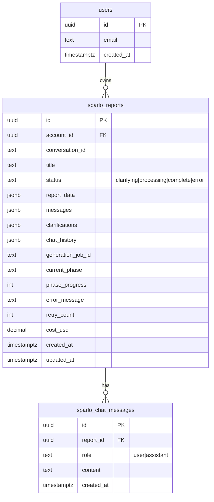

# ✨ Sparlo: Complete Rebuild Plan

## Executive Summary

Rebuild Sparlo as a production-ready design challenge analysis application. **This is NOT a traditional LLM chat app** - the intentional 10-15 minute processing time is a feature, not a bug. The system performs deep TRIZ methodology analysis that requires multiple specialized LLM passes to produce thorough, valuable reports.

**Design Philosophy:**
- Users submit a design challenge, then wait while the system does deep work
- The wait is expected and valuable - like ordering a custom research report
- Progress indicators show the system is working, not that responses are "streaming"
- The output is a structured report, not a chat conversation

**Key Problems with Current Implementation:**
- Backend uses in-memory state (lost on restart, can't scale)
- No real-time progress updates (users don't know what's happening)
- Polling every 2-3 seconds (wasteful)
- No auth between frontend/backend (anyone with API key can access any conversation)
- No retry logic (failures mean starting over)

**Rebuild Strategy:**
- Keep: Prompts (2,500+ lines of TRIZ methodology), database schema, phase-based UI
- Replace: State management, progress updates, background job processing

---

## Architecture Overview

```
┌─────────────────────────────────────────────────────────────────┐
│                     Next.js 15 App Router                       │
│  ┌──────────────┐  ┌───────────────┐  ┌────────────────────┐   │
│  │   Sidebar    │  │   Main View   │  │    Report/Chat     │   │
│  │  (History)   │  │  (Phases)     │  │    Display         │   │
│  └──────────────┘  └───────────────┘  └────────────────────┘   │
└─────────────────────────┬───────────────────────────────────────┘
                          │
                          ▼
┌─────────────────────────────────────────────────────────────────┐
│                    Supabase (Backend-as-a-Service)              │
│  ┌──────────────┐  ┌───────────────┐  ┌────────────────────┐   │
│  │  Auth/Users  │  │  PostgreSQL   │  │   Realtime         │   │
│  │  (Clerk alt) │  │  + RLS        │  │   (Progress)       │   │
│  └──────────────┘  └───────────────┘  └────────────────────┘   │
└─────────────────────────┬───────────────────────────────────────┘
                          │
                          ▼
┌─────────────────────────────────────────────────────────────────┐
│                    Inngest (Durable Workflows)                  │
│  ┌──────────────────────────────────────────────────────────┐  │
│  │  LLM Chain Execution (AN0 → AN1 → AN2 → AN3 → AN4 → AN5) │  │
│  │  - Automatic retries                                      │  │
│  │  - Step-level persistence                                 │  │
│  │  - Progress events                                        │  │
│  └──────────────────────────────────────────────────────────┘  │
└─────────────────────────┬───────────────────────────────────────┘
                          │
                          ▼
┌─────────────────────────────────────────────────────────────────┐
│                    Claude Opus 4.5 API                          │
│  - Streaming responses where applicable                         │
│  - Prompt caching for cost savings                              │
│  - Structured output with Zod schemas                           │
└─────────────────────────────────────────────────────────────────┘
```

---

## Tech Stack Decision

| Component | Choice | Rationale |
|-----------|--------|-----------|
| **Frontend** | Next.js 15 App Router | Already in use, excellent streaming support |
| **Auth** | Supabase Auth | Already in use, simpler than adding Clerk |
| **Database** | Supabase PostgreSQL | Already in use, RLS for security |
| **Real-time** | Supabase Realtime | Built-in, no additional infrastructure |
| **Background Jobs** | Inngest | Perfect for 10-15 min LLM workflows, visual debugging |
| **LLM** | Claude Opus 4.5 | Already in use, keep existing prompts |
| **UI** | Existing Shadcn/Tailwind | Already in use, keep components |

**Key Change: Eliminate Python Backend**

The Python backend's only purpose was running the LLM chain. By moving this to Inngest functions (TypeScript), we:
- Eliminate a separate deployment
- Use Supabase for all state management
- Get durable execution with automatic retries
- Get visual debugging and observability
- Keep the same Claude API calls (just in TypeScript)

---

## Database Schema (Updated)

```sql
-- Keep existing sparlo_reports, but add new fields
ALTER TABLE sparlo_reports ADD COLUMN IF NOT EXISTS
  clarifications JSONB DEFAULT '[]', -- Q&A during clarification phase
  generation_job_id TEXT,             -- Inngest job ID for tracking
  current_phase TEXT,                 -- 'an0', 'an1', etc.
  phase_progress INTEGER DEFAULT 0,   -- 0-100 within current phase
  error_message TEXT,                 -- Last error if any
  retry_count INTEGER DEFAULT 0,      -- Number of retries attempted
  cost_usd DECIMAL(10,4);             -- Total cost for this report

-- Add indexes for common queries
CREATE INDEX IF NOT EXISTS idx_reports_status ON sparlo_reports(status);
CREATE INDEX IF NOT EXISTS idx_reports_job_id ON sparlo_reports(generation_job_id);

-- Chat messages table (separate from chat_history for better querying)
CREATE TABLE IF NOT EXISTS sparlo_chat_messages (
  id UUID PRIMARY KEY DEFAULT gen_random_uuid(),
  report_id UUID NOT NULL REFERENCES sparlo_reports(id) ON DELETE CASCADE,
  role TEXT NOT NULL CHECK (role IN ('user', 'assistant')),
  content TEXT NOT NULL,
  created_at TIMESTAMPTZ DEFAULT NOW()
);

-- RLS policies
ALTER TABLE sparlo_chat_messages ENABLE ROW LEVEL SECURITY;

CREATE POLICY "Users can access their own chat messages"
ON sparlo_chat_messages FOR ALL
USING (
  report_id IN (
    SELECT id FROM sparlo_reports WHERE account_id = auth.uid()
  )
);
```

---

## Phase 1: Foundation (Core Infrastructure)

### 1.1 Set Up Inngest

**File: `apps/web/lib/inngest/client.ts`**
```typescript
import { Inngest } from 'inngest'

export const inngest = new Inngest({
  id: 'sparlo',
  eventKey: process.env.INNGEST_EVENT_KEY,
})
```

**File: `apps/web/app/api/inngest/route.ts`**
```typescript
import { serve } from 'inngest/next'
import { inngest } from '@/lib/inngest/client'
import { generateReport } from '@/lib/inngest/functions'

export const { GET, POST, PUT } = serve({
  client: inngest,
  functions: [generateReport],
})
```

### 1.2 Port Prompts to TypeScript

**File: `apps/web/lib/llm/prompts/index.ts`**

Copy the 2,500+ lines of prompts from `sparlo-backend/prompts.py` to TypeScript constants. Structure:

```typescript
export const PROMPTS = {
  AN0_PROBLEM_FRAMING: `...`,
  AN1_RETRIEVAL: `...`,
  AN2_PATTERN_SYNTHESIS: `...`,
  AN3_CONCEPT_GENERATION: `...`,
  AN4_EVALUATION: `...`,
  AN5_REPORT_GENERATION: `...`,
}
```

### 1.3 Create LLM Chain Functions

**File: `apps/web/lib/inngest/functions/generate-report.ts`**

```typescript
import { inngest } from '../client'
import { anthropic } from '@ai-sdk/anthropic'
import { generateObject, generateText } from 'ai'
import { PROMPTS } from '@/lib/llm/prompts'
import { createClient } from '@/lib/supabase/server'

export const generateReport = inngest.createFunction(
  {
    id: 'generate-report',
    retries: 3,
    onFailure: async ({ error, event }) => {
      // Update report status to 'error' with message
      const supabase = createClient()
      await supabase
        .from('sparlo_reports')
        .update({
          status: 'error',
          error_message: error.message
        })
        .eq('id', event.data.reportId)
    },
  },
  { event: 'report/generate' },
  async ({ event, step }) => {
    const { reportId, userId, designChallenge } = event.data
    const supabase = createClient()

    // Helper to update progress
    const updateProgress = async (phase: string, progress: number) => {
      await supabase
        .from('sparlo_reports')
        .update({ current_phase: phase, phase_progress: progress })
        .eq('id', reportId)
    }

    // AN0: Problem Framing
    const an0Result = await step.run('an0-problem-framing', async () => {
      await updateProgress('an0', 0)

      const result = await generateObject({
        model: anthropic('claude-opus-4-5-20251101'),
        schema: AN0Schema, // Zod schema for structured output
        system: PROMPTS.AN0_PROBLEM_FRAMING,
        prompt: designChallenge,
      })

      await updateProgress('an0', 100)
      return result.object
    })

    // Check if clarification needed
    if (an0Result.needsClarification) {
      await step.run('request-clarification', async () => {
        await supabase
          .from('sparlo_reports')
          .update({
            status: 'clarifying',
            clarifications: [{ question: an0Result.clarificationQuestion, answer: null }]
          })
          .eq('id', reportId)
      })

      // Wait for user to answer clarification
      const clarificationAnswer = await step.waitForEvent('wait-for-clarification', {
        event: 'report/clarification-answered',
        timeout: '24h',
        if: `async.data.reportId == '${reportId}'`,
      })

      if (!clarificationAnswer) {
        throw new Error('Clarification timeout')
      }

      // Re-run AN0 with clarification
      // ... (omitted for brevity)
    }

    // AN1-AN5: Continue chain
    // Similar structure for each phase...

    // AN5: Final Report
    const finalReport = await step.run('an5-report-generation', async () => {
      await updateProgress('an5', 0)

      const result = await generateText({
        model: anthropic('claude-opus-4-5-20251101'),
        system: PROMPTS.AN5_REPORT_GENERATION,
        prompt: JSON.stringify({
          problemFrame: an0Result,
          // ... other AN results
        }),
      })

      await updateProgress('an5', 100)
      return result.text
    })

    // Save final report
    await step.run('save-report', async () => {
      await supabase
        .from('sparlo_reports')
        .update({
          status: 'complete',
          report_data: { markdown: finalReport, /* other data */ },
        })
        .eq('id', reportId)
    })

    return { reportId, success: true }
  }
)
```

### 1.4 Update Real-Time Progress

**File: `apps/web/app/home/(user)/_hooks/use-report-progress.ts`**

```typescript
'use client'

import { useEffect, useState } from 'react'
import { createClient } from '@/lib/supabase/client'

export function useReportProgress(reportId: string | null) {
  const [progress, setProgress] = useState<{
    status: string
    phase: string | null
    phaseProgress: number
  } | null>(null)

  useEffect(() => {
    if (!reportId) return

    const supabase = createClient()

    // Subscribe to real-time changes
    const channel = supabase
      .channel(`report-${reportId}`)
      .on(
        'postgres_changes',
        {
          event: 'UPDATE',
          schema: 'public',
          table: 'sparlo_reports',
          filter: `id=eq.${reportId}`,
        },
        (payload) => {
          setProgress({
            status: payload.new.status,
            phase: payload.new.current_phase,
            phaseProgress: payload.new.phase_progress,
          })
        }
      )
      .subscribe()

    // Fetch initial state
    supabase
      .from('sparlo_reports')
      .select('status, current_phase, phase_progress')
      .eq('id', reportId)
      .single()
      .then(({ data }) => {
        if (data) {
          setProgress({
            status: data.status,
            phase: data.current_phase,
            phaseProgress: data.phase_progress,
          })
        }
      })

    return () => {
      supabase.removeChannel(channel)
    }
  }, [reportId])

  return progress
}
```

---

## Phase 2: UI Rebuild

### 2.1 New Report Input Screen

**File: `apps/web/app/home/(user)/_components/new-report-input.tsx`**

```typescript
'use client'

import { useState } from 'react'
import { Button } from '@kit/ui/button'
import { Textarea } from '@kit/ui/textarea'
import { createReport } from '../_lib/server/sparlo-reports-server-actions'

const SUGGESTIONS = [
  'Describe the core problem or challenge you are facing',
  'What constraints or limitations exist?',
  'What would success look like?',
  'Who are the stakeholders affected?',
  'What solutions have you already tried?',
]

export function NewReportInput() {
  const [input, setInput] = useState('')
  const [isSubmitting, setIsSubmitting] = useState(false)

  const handleSubmit = async () => {
    if (!input.trim() || input.length < 50) return

    setIsSubmitting(true)
    try {
      const report = await createReport({ designChallenge: input })
      // Redirect handled by server action
    } catch (error) {
      // Handle error
    } finally {
      setIsSubmitting(false)
    }
  }

  return (
    <div className="flex flex-col h-full max-w-3xl mx-auto p-6">
      <h1 className="text-2xl font-bold mb-4">New Design Challenge</h1>

      <div className="mb-4 p-4 bg-muted rounded-lg">
        <p className="text-sm text-muted-foreground mb-2">
          For best results, include:
        </p>
        <ul className="text-sm text-muted-foreground space-y-1">
          {SUGGESTIONS.map((suggestion, i) => (
            <li key={i}>• {suggestion}</li>
          ))}
        </ul>
      </div>

      <Textarea
        value={input}
        onChange={(e) => setInput(e.target.value)}
        placeholder="Describe your design challenge in detail..."
        className="flex-1 min-h-[300px] text-lg"
        disabled={isSubmitting}
      />

      <div className="flex justify-between items-center mt-4">
        <span className="text-sm text-muted-foreground">
          {input.length} characters {input.length < 50 && '(minimum 50)'}
        </span>
        <Button
          onClick={handleSubmit}
          disabled={isSubmitting || input.length < 50}
        >
          {isSubmitting ? 'Starting...' : 'Analyze Challenge'}
        </Button>
      </div>
    </div>
  )
}
```

### 2.2 Processing/Waiting Screen (The "Deep Work" Experience)

**Design Intent:** This is the key differentiator from ChatGPT. Users understand they're waiting for a thorough analysis, not a quick response. The UI should communicate:
1. Something valuable is being created
2. The system is actively working (not frozen)
3. How far along the process is
4. What each step is accomplishing

**File: `apps/web/app/home/(user)/_components/processing-screen.tsx`**

```typescript
'use client'

import { useState, useEffect } from 'react'
import { useReportProgress } from '../_hooks/use-report-progress'
import { Progress } from '@kit/ui/progress'

const PHASES = [
  {
    id: 'an0',
    name: 'Problem Framing',
    description: 'Understanding your challenge and extracting core contradictions',
    duration: '1-2 min'
  },
  {
    id: 'an1',
    name: 'Knowledge Retrieval',
    description: 'Searching engineering failures, feasibility bounds, and transfer cases',
    duration: '2-3 min'
  },
  {
    id: 'an2',
    name: 'Pattern Synthesis',
    description: 'Identifying cross-domain mechanisms and TRIZ principles',
    duration: '2-3 min'
  },
  {
    id: 'an3',
    name: 'Concept Generation',
    description: 'Creating 8-12 solution concepts from multiple paradigms',
    duration: '2-3 min'
  },
  {
    id: 'an4',
    name: 'Evaluation & Ranking',
    description: 'Scoring concepts against your constraints and KPIs',
    duration: '1-2 min'
  },
  {
    id: 'an5',
    name: 'Report Writing',
    description: 'Compiling findings into a comprehensive analysis report',
    duration: '2-3 min'
  },
]

export function ProcessingScreen({ reportId }: { reportId: string }) {
  const progress = useReportProgress(reportId)
  const [elapsedSeconds, setElapsedSeconds] = useState(0)

  // Timer for elapsed time
  useEffect(() => {
    const interval = setInterval(() => {
      setElapsedSeconds(s => s + 1)
    }, 1000)
    return () => clearInterval(interval)
  }, [])

  const formatTime = (seconds: number) => {
    const mins = Math.floor(seconds / 60)
    const secs = seconds % 60
    return `${mins}:${secs.toString().padStart(2, '0')}`
  }

  const currentPhaseIndex = PHASES.findIndex(p => p.id === progress?.phase)
  const overallProgress = currentPhaseIndex >= 0
    ? ((currentPhaseIndex * 100) + (progress?.phaseProgress || 0)) / PHASES.length
    : 0

  return (
    <div className="flex flex-col items-center justify-center h-full p-8">
      <div className="w-full max-w-lg">
        {/* Header */}
        <div className="text-center mb-8">
          <h2 className="text-2xl font-semibold mb-2">
            Analyzing Your Design Challenge
          </h2>
          <p className="text-muted-foreground">
            Our AI is performing a thorough TRIZ-based analysis.
            This typically takes 10-15 minutes.
          </p>
        </div>

        {/* Time Display */}
        <div className="flex justify-center gap-8 mb-8">
          <div className="text-center">
            <p className="text-3xl font-mono font-bold">{formatTime(elapsedSeconds)}</p>
            <p className="text-sm text-muted-foreground">Elapsed</p>
          </div>
          <div className="text-center">
            <p className="text-3xl font-mono font-bold text-muted-foreground">~15:00</p>
            <p className="text-sm text-muted-foreground">Estimated Total</p>
          </div>
        </div>

        {/* Overall Progress */}
        <Progress value={overallProgress} className="mb-8 h-2" />

        {/* Phase List */}
        <div className="space-y-3">
          {PHASES.map((phase, i) => {
            const isCurrent = phase.id === progress?.phase
            const isComplete = i < currentPhaseIndex

            return (
              <div
                key={phase.id}
                className={`flex items-start gap-4 p-4 rounded-lg transition-colors ${
                  isCurrent ? 'bg-primary/10 border border-primary/20' :
                  isComplete ? 'bg-green-50 dark:bg-green-950/20' : ''
                }`}
              >
                <div className={`w-8 h-8 rounded-full flex items-center justify-center flex-shrink-0 ${
                  isComplete ? 'bg-green-500 text-white' :
                  isCurrent ? 'bg-primary text-primary-foreground' :
                  'bg-muted text-muted-foreground'
                }`}>
                  {isComplete ? '✓' : isCurrent ? (
                    <span className="animate-pulse">●</span>
                  ) : i + 1}
                </div>
                <div className="flex-1">
                  <div className="flex justify-between items-start">
                    <p className={`font-medium ${isCurrent ? 'text-primary' : ''}`}>
                      {phase.name}
                    </p>
                    <span className="text-xs text-muted-foreground">
                      {phase.duration}
                    </span>
                  </div>
                  <p className="text-sm text-muted-foreground mt-1">
                    {phase.description}
                  </p>
                </div>
              </div>
            )
          })}
        </div>

        {/* Reassurance Message */}
        <p className="text-center text-sm text-muted-foreground mt-8">
          You can close this tab - your report will continue generating.
          We'll notify you when it's ready.
        </p>
      </div>
    </div>
  )
}
```

### 2.3 Report Display with Chat

**File: `apps/web/app/home/(user)/_components/report-display.tsx`**

```typescript
'use client'

import { useState } from 'react'
import ReactMarkdown from 'react-markdown'
import { useChat } from 'ai/react'
import { Button } from '@kit/ui/button'
import { Input } from '@kit/ui/input'
import { TableOfContents } from './table-of-contents'

interface ReportDisplayProps {
  report: {
    id: string
    title: string
    report_data: { markdown: string }
    chat_history: Array<{ role: string; content: string }>
  }
}

export function ReportDisplay({ report }: ReportDisplayProps) {
  const [chatOpen, setChatOpen] = useState(false)

  const { messages, input, handleInputChange, handleSubmit, isLoading } = useChat({
    api: '/api/chat',
    body: { reportId: report.id },
    initialMessages: report.chat_history.map((m, i) => ({
      id: String(i),
      role: m.role as 'user' | 'assistant',
      content: m.content,
    })),
  })

  return (
    <div className="flex h-full">
      {/* Table of Contents Sidebar */}
      <aside className="w-64 border-r p-4 overflow-y-auto hidden lg:block">
        <TableOfContents markdown={report.report_data.markdown} />
      </aside>

      {/* Main Report */}
      <main className="flex-1 overflow-y-auto p-8">
        <article className="prose prose-lg max-w-none">
          <ReactMarkdown>{report.report_data.markdown}</ReactMarkdown>
        </article>
      </main>

      {/* Chat Panel */}
      <aside className={`w-96 border-l flex flex-col ${chatOpen ? '' : 'hidden'}`}>
        <div className="p-4 border-b flex justify-between items-center">
          <h3 className="font-semibold">Ask about this report</h3>
          <Button variant="ghost" size="sm" onClick={() => setChatOpen(false)}>
            ✕
          </Button>
        </div>

        <div className="flex-1 overflow-y-auto p-4 space-y-4">
          {messages.map((m) => (
            <div
              key={m.id}
              className={`p-3 rounded-lg ${
                m.role === 'user' ? 'bg-primary/10 ml-4' : 'bg-muted mr-4'
              }`}
            >
              {m.content}
            </div>
          ))}
        </div>

        <form onSubmit={handleSubmit} className="p-4 border-t">
          <div className="flex gap-2">
            <Input
              value={input}
              onChange={handleInputChange}
              placeholder="Ask a question..."
              disabled={isLoading}
            />
            <Button type="submit" disabled={isLoading}>
              Send
            </Button>
          </div>
        </form>
      </aside>

      {/* Chat Toggle Button */}
      {!chatOpen && (
        <Button
          className="fixed bottom-6 right-6"
          onClick={() => setChatOpen(true)}
        >
          Chat about Report
        </Button>
      )}
    </div>
  )
}
```

---

## Phase 3: API Routes

### 3.1 Start Report Generation

**File: `apps/web/app/home/(user)/_lib/server/sparlo-reports-server-actions.ts`**

```typescript
'use server'

import { redirect } from 'next/navigation'
import { createClient } from '@/lib/supabase/server'
import { inngest } from '@/lib/inngest/client'

export async function createReport({ designChallenge }: { designChallenge: string }) {
  const supabase = await createClient()

  const { data: { user } } = await supabase.auth.getUser()
  if (!user) throw new Error('Not authenticated')

  // Check rate limit (max 5 reports per day)
  const { count } = await supabase
    .from('sparlo_reports')
    .select('*', { count: 'exact', head: true })
    .eq('account_id', user.id)
    .gte('created_at', new Date(Date.now() - 24 * 60 * 60 * 1000).toISOString())

  if (count && count >= 5) {
    throw new Error('Rate limit exceeded. Maximum 5 reports per day.')
  }

  // Create report record
  const { data: report, error } = await supabase
    .from('sparlo_reports')
    .insert({
      account_id: user.id,
      conversation_id: crypto.randomUUID(),
      title: designChallenge.slice(0, 100),
      status: 'processing',
      messages: [{ role: 'user', content: designChallenge }],
    })
    .select()
    .single()

  if (error) throw error

  // Trigger Inngest function
  await inngest.send({
    name: 'report/generate',
    data: {
      reportId: report.id,
      userId: user.id,
      designChallenge,
    },
  })

  redirect(`/home/report/${report.id}`)
}

export async function submitClarification({
  reportId,
  answer
}: {
  reportId: string
  answer: string
}) {
  const supabase = await createClient()

  const { data: { user } } = await supabase.auth.getUser()
  if (!user) throw new Error('Not authenticated')

  // Verify ownership
  const { data: report } = await supabase
    .from('sparlo_reports')
    .select('account_id, clarifications')
    .eq('id', reportId)
    .single()

  if (!report || report.account_id !== user.id) {
    throw new Error('Report not found')
  }

  // Update clarifications with answer
  const clarifications = report.clarifications || []
  const lastIndex = clarifications.length - 1
  if (lastIndex >= 0) {
    clarifications[lastIndex].answer = answer
  }

  await supabase
    .from('sparlo_reports')
    .update({ clarifications })
    .eq('id', reportId)

  // Send event to resume Inngest function
  await inngest.send({
    name: 'report/clarification-answered',
    data: { reportId, answer },
  })
}
```

### 3.2 Chat API Route

**File: `apps/web/app/api/chat/route.ts`**

```typescript
import { anthropic } from '@ai-sdk/anthropic'
import { streamText } from 'ai'
import { createClient } from '@/lib/supabase/server'

export async function POST(req: Request) {
  const { messages, reportId } = await req.json()

  const supabase = await createClient()

  // Verify user owns report
  const { data: { user } } = await supabase.auth.getUser()
  if (!user) {
    return new Response('Unauthorized', { status: 401 })
  }

  const { data: report } = await supabase
    .from('sparlo_reports')
    .select('account_id, report_data')
    .eq('id', reportId)
    .single()

  if (!report || report.account_id !== user.id) {
    return new Response('Report not found', { status: 404 })
  }

  // Stream response with report context
  const result = streamText({
    model: anthropic('claude-sonnet-4-5-20250514'), // Use Sonnet for chat (cheaper)
    system: `You are helping the user understand their design challenge report.

Here is the full report for context:

${report.report_data?.markdown || 'Report not available'}

Answer questions about this report helpfully and concisely.`,
    messages,
    async onFinish({ text }) {
      // Save chat message to database
      await supabase.from('sparlo_chat_messages').insert([
        { report_id: reportId, role: 'user', content: messages[messages.length - 1].content },
        { report_id: reportId, role: 'assistant', content: text },
      ])
    },
  })

  return result.toDataStreamResponse()
}
```

---

## Phase 4: Migration & Cleanup

### 4.1 Data Migration

```sql
-- Migrate existing reports to new schema
UPDATE sparlo_reports
SET
  current_phase = CASE
    WHEN status = 'complete' THEN 'an5'
    WHEN status = 'processing' THEN 'an0'
    ELSE NULL
  END,
  phase_progress = CASE
    WHEN status = 'complete' THEN 100
    ELSE 0
  END
WHERE current_phase IS NULL;
```

### 4.2 Remove Python Backend

After verifying the new system works:
1. Archive `sparlo-backend` repository
2. Remove Railway backend service
3. Update environment variables
4. Update CLAUDE.md documentation

### 4.3 Environment Variables

```env
# Remove
SPARLO_API_URL=...
SPARLO_API_KEY=...

# Add
INNGEST_EVENT_KEY=...
INNGEST_SIGNING_KEY=...
ANTHROPIC_API_KEY=...
```

---

## Implementation Checklist

### Phase 1: Foundation
- [ ] Install Inngest (`pnpm add inngest`)
- [ ] Create `lib/inngest/client.ts`
- [ ] Create `app/api/inngest/route.ts`
- [ ] Port prompts from Python to TypeScript (`lib/llm/prompts/`)
- [ ] Create Zod schemas for each AN phase output
- [ ] Implement `generate-report` Inngest function
- [ ] Add database columns (migration)
- [ ] Test single report generation end-to-end

### Phase 2: UI Rebuild
- [ ] Create `use-report-progress` hook with Supabase Realtime
- [ ] Update `new-report-input.tsx` component
- [ ] Create `processing-screen.tsx` with phase indicators
- [ ] Update `report-display.tsx` with chat integration
- [ ] Create `table-of-contents.tsx` component
- [ ] Update sidebar to show report statuses

### Phase 3: API Routes
- [ ] Update `createReport` server action to trigger Inngest
- [ ] Create `submitClarification` server action
- [ ] Create `/api/chat/route.ts` for report chat
- [ ] Add rate limiting (5 reports/day)
- [ ] Add proper error handling

### Phase 4: Polish
- [ ] Add error recovery UI
- [ ] Add "Cancel Generation" button
- [ ] Add email notification when report ready (optional)
- [ ] Test multi-tab behavior
- [ ] Test reconnection after network drop
- [ ] Performance optimization (lazy loading, caching)

### Phase 5: Migration & Cleanup
- [ ] Run data migration for existing reports
- [ ] Archive Python backend
- [ ] Update deployment configs
- [ ] Update documentation

---

## Critical Decisions Made

### 0. This is NOT a Traditional LLM Chat App
**Decision:** Embrace the long processing time as a feature
- The 10-15 minute wait is **intentional** - producing thorough TRIZ analysis
- UI communicates "deep work in progress" not "waiting for response"
- No streaming of partial responses during generation - each AN phase completes fully
- The output is a **report** (document), not a chat response
- Post-report chat is a separate feature for discussing the completed analysis

### 1. Long-Running Process Management
**Decision:** Use Inngest durable workflows
- Each AN phase is a discrete step (not streaming, but batch completion)
- Automatic retries on failure
- Progress stored in database (phase-level, not token-level)
- User can close browser, generation continues in background
- Optional: Email/push notification when complete

### 2. Clarification Loop
**Decision:** Maximum 3 clarification questions
- AN0 can ask up to 3 questions to ensure quality input
- User can skip remaining questions (proceed with what they provided)
- Uses `step.waitForEvent` to pause workflow
- 24-hour timeout before abandoning

### 3. Concurrent Generation Limits
**Decision:** 1 concurrent report per user
- Check for `status = 'processing'` before starting new
- Show clear error if already generating
- Users can view progress of in-flight report

### 4. Real-Time Progress Updates
**Decision:** Supabase Realtime (not SSE/WebSocket custom)
- Database updates trigger UI updates at phase transitions
- Updates are infrequent (6 phases over 10-15 min = ~every 2 min)
- No need for sub-second streaming updates
- Automatic reconnection handled by Supabase

### 5. Post-Report Chat
**Decision:** Full report included in system prompt
- Separate feature from report generation
- Use Claude Sonnet 4.5 for chat (cheaper, faster)
- Chat history persisted per report
- User can return months later and chat about old reports

### 6. Rate Limiting
**Decision:** 5 reports per day per user
- Each report costs ~$3-5 in LLM calls
- Checked in server action before creating report
- Clear error message when limit hit

---

## Cost Estimates

| Component | Cost per Report | Notes |
|-----------|-----------------|-------|
| Claude Opus 4.5 (AN0-AN5) | ~$3-5 | Depends on input/output length |
| Claude Sonnet (Chat) | ~$0.05/conversation | Much cheaper for Q&A |
| Inngest | Free tier | 25,000 runs/month |
| Supabase | Free tier | Generous limits |

**Monthly Cost at Scale (1,000 reports):**
- LLM costs: $3,000-5,000
- Infrastructure: ~$50 (if exceeding free tiers)

---

## References

### Internal Files to Keep
- `sparlo-backend/prompts.py` - Port to TypeScript
- `sparlo-backend/prompts_v10.py` - Latest prompt version
- `apps/web/supabase/migrations/*` - Keep schema
- `apps/web/app/home/(user)/_components/*` - Refactor existing components

### External Documentation
- [Inngest Next.js Guide](https://www.inngest.com/docs/getting-started/nextjs-quick-start)
- [Supabase Realtime](https://supabase.com/docs/guides/realtime)
- [Vercel AI SDK](https://sdk.vercel.ai/docs)
- [Anthropic API](https://docs.anthropic.com)

---

## ERD Diagram



---

🤖 Generated with [Claude Code](https://claude.com/claude-code)
