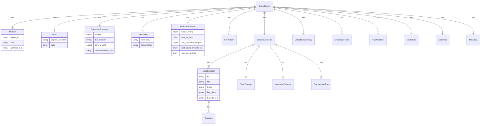

# feat: Revamp Reports Page with SparloReport Interface and React Components

## Overview

Revamp the reports page by creating a TypeScript interface `SparloReport` and corresponding React components that render structured report data from AN5 LLM output. The implementation matches the visual design in the provided HTML template, using Tailwind CSS and the project's existing design system.

**North Star**: This is the core product experience worth $149/mo. Every component must feel premium, polished, and professionally designed.

## Problem Statement / Motivation

The current reports page needs a comprehensive revamp to display structured analysis reports generated by the AN5 LLM. The reports contain 10+ sections with complex nested data structures (solution concepts with gates, nested constraints, comparison tables) that need type-safe rendering with consistent visual design.

**Key Drivers:**
- AN5 LLM outputs JSON that needs runtime validation via Zod with graceful error handling
- Report structure is complex with discriminated unions (concept tracks, confidence levels)
- Visual fidelity to the HTML template is critical for premium user experience
- Components must be safe (no XSS), type-safe, and deliver a polished feel

## Proposed Solution

Create a comprehensive type-safe report rendering system:

1. **Zod Schema** (`sparlo-report.schema.ts`) - Single source of truth with string constraints and date validation
2. **TypeScript Types** - Derived from Zod schema using `z.infer`
3. **Section Components** - 10 React Server Components matching HTML template sections
4. **ReportRenderer** - Composition component with error boundary
5. **Shared Components** - Premium badges, cards, gates (consolidated where sensible)
6. **Error Handling** - Graceful Zod validation failures with premium error UI

## Technical Considerations

### Architecture

```
apps/web/app/home/(user)/reports/[id]/
├── page.tsx                         # Server component, fetches + validates report
├── _lib/
│   └── schema/
│       └── sparlo-report.schema.ts  # Zod schema + type exports
├── _components/
│   └── report/
│       ├── report-renderer.tsx      # Main composition component with error boundary
│       ├── report-error.tsx         # Premium error UI for validation failures
│       ├── sections/                # 10 section components (Server Components)
│       │   ├── brief.tsx
│       │   ├── executive-summary.tsx
│       │   ├── constraints.tsx
│       │   ├── problem-analysis.tsx
│       │   ├── key-patterns.tsx
│       │   ├── solution-concepts.tsx
│       │   ├── validation-summary.tsx
│       │   ├── challenge-frame.tsx
│       │   ├── risks-watchouts.tsx
│       │   └── next-steps.tsx
│       └── shared/
│           ├── badges.tsx           # Consolidated: Confidence, Viability, Track badges
│           ├── test-gate.tsx        # Test gate component (has real logic)
│           └── section-header.tsx   # Section header component
```

**Key Simplifications (without compromising premium feel):**
- Removed barrel export (`index.ts`) - direct imports are cleaner
- Consolidated 3 badge files → 1 (`badges.tsx`) - same premium styling, less files
- Removed navbar/sidebar (YAGNI) - add when user testing shows need
- Kept all 10 section components - each deserves dedicated attention for premium feel

### Tech Stack Alignment

- **Next.js 16** with App Router (React 19)
- **TypeScript 5.9.3** - Strict mode, implicit inference preferred
- **Tailwind CSS 4** - Uses existing `report-*.css` theme files
- **Zod** - Schema validation for LLM JSON output
- **Server Components** by default, client components only for interactivity

### Performance Implications

- Server-side rendering for initial paint
- Zod validation runs server-side before render
- No client-side JavaScript for static report viewing
- Existing report CSS files provide optimized styles

### Key Design Decisions

1. **Single Zod Schema File** - All validation in one file with proper string/date constraints
2. **Section Props Pattern** - Each section receives only its data, not full report
3. **Discriminated Unions** - For content types, concept tracks, confidence levels
4. **Semantic HTML** - Proper heading hierarchy (h2 for sections, h3 for subsections)
5. **Server Components** - All section components are Server Components (no `use client`)
6. **Safe Rendering** - No `dangerouslySetInnerHTML` - use React elements for text formatting
7. **Graceful Errors** - `safeParse` with premium error UI, never crash the page

## Acceptance Criteria

### Functional Requirements

- [ ] Zod schema validates all fields from EXAMPLE_REPORT with proper constraints
- [ ] All 10 section components render correctly with premium styling
- [ ] ReportRenderer composes sections in correct order
- [ ] Components match visual design in HTML template (premium $149/mo feel)
- [ ] Responsive layout: single column mobile, multi-column desktop
- [ ] TypeScript compilation passes with strict mode
- [ ] Validation errors display graceful, premium error UI (not crashes)

### Security Requirements

- [ ] No `dangerouslySetInnerHTML` usage - React elements only
- [ ] All string inputs properly escaped via React's default behavior
- [ ] No regex-based string manipulation on LLM output

### Non-Functional Requirements

- [ ] WCAG 2.1 AA accessibility compliance
- [ ] Semantic heading hierarchy for screen readers

### Quality Gates

- [ ] All components have TypeScript types (no `any`)
- [ ] Zod schema uses `.min(1)` for required strings, `.datetime()` for dates
- [ ] Components work with EXAMPLE_REPORT data
- [ ] ESLint and TypeScript pass without errors

## Success Metrics

- Report renders correctly from EXAMPLE_REPORT JSON
- All visual elements match HTML template
- Type safety from Zod schema through to component props
- No runtime type errors during rendering

## Dependencies & Prerequisites

### Internal Dependencies

- Existing report CSS files: `apps/web/styles/report-*.css`
- Shadcn UI components from `@kit/ui`
- Database schema for report storage (existing)

### External References

- Provided HTML template (canonical visual reference)
- Provided Zod schema v12 (starting point, may need refinement)
- EXAMPLE_REPORT constant (test data)

## Risk Analysis & Mitigation

| Risk | Likelihood | Impact | Mitigation |
|------|------------|--------|------------|
| Schema mismatch with AN5 output | Medium | High | Test with real AN5 output early |
| Responsive design complexity | Medium | Medium | Start with mobile-first approach |
| Large report performance | Low | Medium | Use Server Components, avoid client JS |
| Tailwind v4 compatibility | Low | Low | Reference existing report CSS patterns |

## Implementation Plan

### Phase 1: Schema & Types

**Files to create:**

#### `apps/web/app/home/(user)/reports/[id]/_lib/schema/sparlo-report.schema.ts`

```typescript
import { z } from 'zod';

// ============================================================================
// PRIMITIVE SCHEMAS
// ============================================================================

export const ConfidenceLevel = z.enum(['HIGH', 'MEDIUM', 'LOW']);
export const ViabilityVerdict = z.enum(['GREEN', 'YELLOW', 'RED']);
export const ConceptTrack = z.enum(['simpler_path', 'best_fit', 'spark']);
export const CapitalRequirement = z.enum(['None', 'Low', 'Medium', 'High']);
export const GateStatus = z.enum(['PASS', 'CONDITIONAL', 'FAIL']);
export const LikelihoodColor = z.enum(['amber', 'red', 'gray']);

// ============================================================================
// SECTION SCHEMAS
// Note: All strings use .min(1) to prevent empty strings from LLM
// Dates use .datetime() for ISO 8601 validation
// ============================================================================

export const BriefSchema = z.object({
  original_problem: z.string().min(1),
  tags: z.array(z.string().min(1)).optional(),
});

export const RecommendedPathStepSchema = z.object({
  step_number: z.number().int().positive(),
  content: z.string().min(1),
});

export const ExecutiveSummarySchema = z.object({
  viability: ViabilityVerdict,
  viability_label: z.string().min(1).optional(),
  the_problem: z.string().min(1),
  core_insight: z.object({
    headline: z.string().min(1),
    explanation: z.string().min(1),
  }),
  recommended_path: z.array(RecommendedPathStepSchema).min(1),
});

export const ConstraintFromInputSchema = z.object({
  constraint: z.string().min(1),
  highlighted_terms: z.array(z.string().min(1)).optional(),
  technical_values: z.array(z.string().min(1)).optional(),
  note: z.string().min(1).optional(),
});

export const AssumptionSchema = z.object({
  assumption: z.string().min(1),
  technical_values: z.array(z.string().min(1)).optional(),
});

export const ConstraintsSchema = z.object({
  from_input: z.array(ConstraintFromInputSchema),
  assumptions: z.array(AssumptionSchema),
});

export const TechnicalNoteSchema = z.object({
  equation: z.string().min(1).optional(),
  explanation: z.string().min(1),
});

export const RootCauseHypothesisSchema = z.object({
  id: z.number().int().positive(),
  name: z.string().min(1),
  confidence: ConfidenceLevel,
  explanation: z.string().min(1),
});

export const SuccessMetricSchema = z.object({
  metric: z.string().min(1),
  target: z.string().min(1),
});

export const FirstPrinciplesInsightSchema = z.object({
  headline: z.string().min(1),
  explanation: z.string().min(1),
});

export const ProblemAnalysisSchema = z.object({
  whats_wrong: z.object({
    prose: z.string().min(1),
    technical_note: TechnicalNoteSchema.optional(),
  }),
  why_its_hard: z.object({
    prose: z.string().min(1),
    factors: z.array(z.string().min(1)).min(1),
    additional_prose: z.string().min(1).optional(),
  }),
  first_principles_insight: FirstPrinciplesInsightSchema,
  root_cause_hypotheses: z.array(RootCauseHypothesisSchema),
  success_metrics: z.array(SuccessMetricSchema).min(1),
});

export const KeyPatternSchema = z.object({
  id: z.string().min(1),
  name: z.string().min(1),
  description: z.string().min(1),
  source_industry: z.string().min(1),
  why_it_matters: z.string().min(1),
  patent_refs: z.array(z.string().min(1)).optional(),
});

export const RiskItemSchema = z.object({
  risk: z.string().min(1),
  mitigation: z.string().min(1),
});

export const TestGateSchema = z.object({
  gate_id: z.string().min(1),
  name: z.string().min(1),
  effort: z.string().min(1),
  method: z.string().min(1),
  go_criteria: z.string().min(1),
  no_go_criteria: z.string().min(1),
});

export const LeadConceptSchema = z.object({
  id: z.string().min(1),
  title: z.string().min(1),
  track: ConceptTrack,
  track_label: z.string().min(1),
  bottom_line: z.string().min(1),
  what_it_is: z.string().min(1),
  why_it_works: z.string().min(1),
  patterns_referenced: z.array(z.string().min(1)).optional(),
  confidence: ConfidenceLevel,
  confidence_rationale: z.string().min(1),
  what_would_change_this: z.string().min(1),
  key_risks: z.array(RiskItemSchema),
  how_to_test: z.array(TestGateSchema).min(1),
});

export const OtherConceptSchema = z.object({
  id: z.string().min(1),
  title: z.string().min(1),
  track: ConceptTrack,
  track_label: z.string().min(1),
  bottom_line: z.string().min(1),
  what_it_is: z.string().min(1),
  confidence: ConfidenceLevel,
  confidence_rationale: z.string().min(1),
  critical_validation: z.string().min(1),
});

export const InnovationConceptSchema = z.object({
  id: z.string().min(1),
  title: z.string().min(1),
  why_interesting: z.string().min(1),
  why_uncertain: z.string().min(1),
  confidence: ConfidenceLevel,
  when_to_pursue: z.string().min(1),
  critical_validation: z.string().min(1),
});

export const ComparisonRowSchema = z.object({
  id: z.string().min(1),
  title: z.string().min(1),
  key_metric_achievable: z.string().min(1),
  confidence: ConfidenceLevel,
  capital_required: CapitalRequirement,
  timeline: z.string().min(1),
  key_risk: z.string().min(1),
});

export const SolutionConceptsSchema = z.object({
  lead_concepts: z.array(LeadConceptSchema).min(1),
  other_concepts: z.array(OtherConceptSchema),
  innovation_concept: InnovationConceptSchema.optional(),
  comparison_table: z.array(ComparisonRowSchema).min(1),
  comparison_insight: z.string().min(1),
});

export const LiteraturePrecedentSchema = z.object({
  approach: z.string().min(1),
  precedent_level: ConfidenceLevel,
  source: z.string().min(1).optional(),
});

export const ValidationSummarySchema = z.object({
  failure_modes_checked: z.array(z.object({
    mode: z.string().min(1),
    how_addressed: z.string().min(1),
  })),
  parameter_bounds_validated: z.array(z.object({
    bound: z.string().min(1),
    value: z.string().min(1).optional(),
  })),
  literature_precedent: z.array(LiteraturePrecedentSchema),
});

export const ChallengeFrameSchema = z.object({
  question: z.string().min(1),
  implication: z.string().min(1),
  action_or_test: z.object({
    label: z.string().min(1),
    content: z.string().min(1),
  }),
});

export const RiskWatchoutSchema = z.object({
  name: z.string().min(1),
  likelihood_label: z.string().min(1),
  likelihood_color: LikelihoodColor.optional(),
  description: z.string().min(1),
  mitigation: z.string().min(1),
  trigger: z.string().min(1),
});

export const NextStepSchema = z.object({
  step_number: z.number().int().positive(),
  timeframe: z.string().min(1),
  action: z.string().min(1),
  details: z.string().min(1),
});

export const DecisionPointSchema = z.object({
  title: z.string().min(1),
  description: z.string().min(1),
  cta_label: z.string().min(1).optional(),
});

export const AppendixConceptSchema = z.object({
  id: z.string().min(1),
  title: z.string().min(1),
  track: ConceptTrack,
  gate_status: GateStatus,
  overall_score: z.number().int().min(1).max(100),
  one_liner: z.string().min(1),
});

export const AppendixSchema = z.object({
  all_concepts: z.array(AppendixConceptSchema),
  constraints_respected: z.array(z.string().min(1)),
  assumptions_made: z.array(z.string().min(1)),
  methodology_notes: z.string().min(1).optional(),
});

export const MetadataSchema = z.object({
  report_id: z.string().min(1),
  analysis_id: z.string().min(1),
  generated_at: z.string().datetime(), // ISO 8601 validation
  phases_completed: z.array(z.string().min(1)),
  total_concepts_generated: z.number().int().positive(),
  concepts_passing_validation: z.number().int().nonnegative(),
  primary_recommendation_confidence: ConfidenceLevel,
});

// ============================================================================
// FLEXIBLE CONTENT SCHEMA
// For LLM-generated content that doesn't fit predefined sections
// ============================================================================

export const AdditionalSectionSchema = z.object({
  id: z.string().min(1),
  title: z.string().min(1),
  content: z.string().min(1), // Markdown content
  icon: z.string().optional(), // Optional emoji or icon hint
});

export const AdditionalContentSchema = z.object({
  sections: z.array(AdditionalSectionSchema),
}).optional();

// ============================================================================
// COMPLETE REPORT SCHEMA
// ============================================================================

export const SparloReportSchema = z.object({
  header: z.object({
    report_id: z.string().min(1),
    title: z.string().min(1),
    generated_at: z.string().datetime(), // ISO 8601 validation
  }),
  brief: BriefSchema,
  executive_summary: ExecutiveSummarySchema,
  constraints: ConstraintsSchema,
  problem_analysis: ProblemAnalysisSchema,
  key_patterns: z.array(KeyPatternSchema),
  solution_concepts: SolutionConceptsSchema,
  validation_summary: ValidationSummarySchema,
  challenge_the_frame: z.array(ChallengeFrameSchema),
  risks_and_watchouts: z.array(RiskWatchoutSchema),
  next_steps: z.object({
    steps: z.array(NextStepSchema),
    decision_point: DecisionPointSchema.optional(),
  }),
  appendix: AppendixSchema,
  metadata: MetadataSchema,
  // Flexible content for LLM-generated sections that don't fit predefined structure
  additional_content: AdditionalContentSchema,
});

// ============================================================================
// TYPE EXPORTS
// ============================================================================

export type SparloReport = z.infer<typeof SparloReportSchema>;
export type Brief = z.infer<typeof BriefSchema>;
export type ExecutiveSummary = z.infer<typeof ExecutiveSummarySchema>;
export type Constraints = z.infer<typeof ConstraintsSchema>;
export type ProblemAnalysis = z.infer<typeof ProblemAnalysisSchema>;
export type KeyPattern = z.infer<typeof KeyPatternSchema>;
export type SolutionConcepts = z.infer<typeof SolutionConceptsSchema>;
export type LeadConcept = z.infer<typeof LeadConceptSchema>;
export type OtherConcept = z.infer<typeof OtherConceptSchema>;
export type InnovationConcept = z.infer<typeof InnovationConceptSchema>;
export type TestGate = z.infer<typeof TestGateSchema>;
export type ValidationSummary = z.infer<typeof ValidationSummarySchema>;
export type ChallengeFrame = z.infer<typeof ChallengeFrameSchema>;
export type RiskWatchout = z.infer<typeof RiskWatchoutSchema>;
export type NextStep = z.infer<typeof NextStepSchema>;
export type Appendix = z.infer<typeof AppendixSchema>;
export type Metadata = z.infer<typeof MetadataSchema>;
export type ConfidenceLevelType = z.infer<typeof ConfidenceLevel>;
export type ViabilityVerdictType = z.infer<typeof ViabilityVerdict>;
export type ConceptTrackType = z.infer<typeof ConceptTrack>;
export type LikelihoodColorType = z.infer<typeof LikelihoodColor>;
export type AdditionalSection = z.infer<typeof AdditionalSectionSchema>;
```

### Phase 2: Shared Components

**Files to create:**

#### `apps/web/app/home/(user)/reports/[id]/_components/report/shared/badges.tsx`

Consolidated badge components - same premium styling, single file for maintainability.

```typescript
import { cn } from '@kit/ui/utils';
import type {
  ConfidenceLevelType,
  ViabilityVerdictType,
  ConceptTrackType,
  LikelihoodColorType,
} from '../../../_lib/schema/sparlo-report.schema';

// ============================================================================
// CONFIDENCE BADGE
// ============================================================================

interface ConfidenceBadgeProps {
  level: ConfidenceLevelType;
  className?: string;
}

const confidenceStyles = {
  HIGH: 'bg-emerald-50 text-emerald-700 border-emerald-100',
  MEDIUM: 'bg-amber-50 text-amber-700 border-amber-100',
  LOW: 'bg-red-50 text-red-700 border-red-100',
} as const satisfies Record<ConfidenceLevelType, string>;

export function ConfidenceBadge({ level, className }: ConfidenceBadgeProps) {
  return (
    <span
      className={cn(
        'text-[10px] font-bold px-2 py-0.5 rounded uppercase tracking-wide border',
        confidenceStyles[level],
        className
      )}
    >
      {level}
    </span>
  );
}

// ============================================================================
// VIABILITY BADGE
// ============================================================================

interface ViabilityBadgeProps {
  viability: ViabilityVerdictType;
  label?: string;
}

const viabilityStyles = {
  GREEN: {
    container: 'bg-emerald-50 border-emerald-100',
    dot: 'bg-emerald-500',
    text: 'text-emerald-700',
  },
  YELLOW: {
    container: 'bg-amber-50 border-amber-100',
    dot: 'bg-amber-500',
    text: 'text-amber-700',
  },
  RED: {
    container: 'bg-red-50 border-red-100',
    dot: 'bg-red-500',
    text: 'text-red-700',
  },
} as const satisfies Record<ViabilityVerdictType, { container: string; dot: string; text: string }>;

export function ViabilityBadge({ viability, label }: ViabilityBadgeProps) {
  const style = viabilityStyles[viability];

  return (
    <div className={cn('flex items-center gap-2 px-2.5 py-1 rounded-full border', style.container)}>
      <span className={cn('w-1.5 h-1.5 rounded-full', style.dot)} />
      <span className={cn('text-[10px] font-bold tracking-wide uppercase', style.text)}>
        {label || `Viability: ${viability.toLowerCase()}`}
      </span>
    </div>
  );
}

// ============================================================================
// TRACK BADGE
// ============================================================================

interface TrackBadgeProps {
  track: ConceptTrackType;
  label: string;
}

const trackStyles = {
  best_fit: 'bg-emerald-50 text-emerald-700 border-emerald-100',
  simpler_path: 'bg-white text-zinc-600 border-zinc-200',
  spark: 'bg-purple-100 text-purple-700 border-purple-200',
} as const satisfies Record<ConceptTrackType, string>;

export function TrackBadge({ track, label }: TrackBadgeProps) {
  return (
    <span
      className={cn(
        'inline-flex items-center gap-1.5 px-2 py-0.5 rounded text-[10px] font-semibold border uppercase tracking-wide',
        trackStyles[track]
      )}
    >
      {label}
    </span>
  );
}

// ============================================================================
// LIKELIHOOD BADGE (for risks)
// ============================================================================

interface LikelihoodBadgeProps {
  color?: LikelihoodColorType;
  label: string;
}

const likelihoodStyles = {
  amber: 'bg-amber-50 text-amber-700 border-amber-100',
  red: 'bg-red-50 text-red-700 border-red-100',
  gray: 'bg-zinc-50 text-zinc-600 border-zinc-200',
} as const satisfies Record<LikelihoodColorType, string>;

export function LikelihoodBadge({ color = 'gray', label }: LikelihoodBadgeProps) {
  return (
    <span
      className={cn(
        'text-[10px] font-bold px-2 py-0.5 rounded uppercase tracking-wide border',
        likelihoodStyles[color]
      )}
    >
      {label}
    </span>
  );
}
```

#### `apps/web/app/home/(user)/reports/[id]/_components/report/shared/test-gate.tsx`

```typescript
import type { TestGate as TestGateType } from '../../_lib/schema/sparlo-report.schema';

interface TestGateProps {
  gate: TestGateType;
}

export function TestGate({ gate }: TestGateProps) {
  return (
    <div className="space-y-2">
      <div className="flex items-center gap-2">
        <span className="text-[10px] font-mono font-bold text-zinc-500 bg-white border border-zinc-200 px-1.5 py-0.5 rounded">
          {gate.gate_id}
        </span>
        <span className="text-xs font-semibold text-zinc-900">
          {gate.effort}: {gate.name}
        </span>
      </div>
      <p className="text-xs text-zinc-600 pl-2 border-l-2 border-zinc-200 ml-1">
        {gate.method}
      </p>
      <div className="flex flex-col gap-1 pl-3">
        <div className="text-[10px]">
          <span className="font-semibold text-emerald-600">GO:</span>{' '}
          <span className="text-zinc-600">{gate.go_criteria}</span>
        </div>
        <div className="text-[10px]">
          <span className="font-semibold text-red-600">NO-GO:</span>{' '}
          <span className="text-zinc-600">{gate.no_go_criteria}</span>
        </div>
      </div>
    </div>
  );
}
```

#### `apps/web/app/home/(user)/reports/[id]/_components/report/shared/section-header.tsx`

```typescript
interface SectionHeaderProps {
  id: string;
  title: string;
  children?: React.ReactNode;
}

export function SectionHeader({ id, title, children }: SectionHeaderProps) {
  return (
    <div id={id} className="flex items-center justify-between border-b border-zinc-100 pb-4">
      <h2 className="text-3xl font-semibold text-zinc-900 tracking-tight">{title}</h2>
      {children}
    </div>
  );
}
```

### Phase 3: Section Components

**Files to create:**

#### `apps/web/app/home/(user)/reports/[id]/_components/report/sections/brief.tsx`

```typescript
import type { Brief as BriefType } from '../../../_lib/schema/sparlo-report.schema';

interface BriefProps {
  data: BriefType;
}

export function Brief({ data }: BriefProps) {
  return (
    <section id="brief" className="bg-zinc-50 rounded-lg border border-zinc-100 p-6 md:p-8">
      <div className="flex flex-col gap-6">
        <div className="flex items-start justify-between">
          <div className="flex items-center gap-2 text-zinc-900">
            <svg
              xmlns="http://www.w3.org/2000/svg"
              width="18"
              height="18"
              viewBox="0 0 24 24"
              fill="none"
              stroke="currentColor"
              strokeWidth="1.5"
              strokeLinecap="round"
              strokeLinejoin="round"
            >
              <polyline points="4 17 10 11 4 5" />
              <line x1="12" x2="20" y1="19" y2="19" />
            </svg>
            <h3 className="text-sm font-semibold tracking-tight">Brief</h3>
          </div>
        </div>

        <p className="text-sm leading-7 text-zinc-700 font-medium">
          {data.original_problem}
        </p>

        {data.tags && data.tags.length > 0 && (
          <div className="flex flex-wrap gap-2">
            {data.tags.map((tag) => (
              <span
                key={tag}
                className="bg-zinc-100 text-zinc-600 px-2 py-0.5 rounded text-xs font-medium border border-zinc-200"
              >
                {tag}
              </span>
            ))}
          </div>
        )}
      </div>
    </section>
  );
}
```

#### `apps/web/app/home/(user)/reports/[id]/_components/report/sections/executive-summary.tsx`

```typescript
import type { ExecutiveSummary as ExecutiveSummaryType } from '../../../_lib/schema/sparlo-report.schema';
import { ViabilityBadge } from '../shared/viability-badge';
import { SectionHeader } from '../shared/section-header';

interface ExecutiveSummaryProps {
  data: ExecutiveSummaryType;
}

export function ExecutiveSummary({ data }: ExecutiveSummaryProps) {
  return (
    <section id="executive-summary" className="space-y-8">
      <SectionHeader id="executive-summary-header" title="Executive Summary">
        <ViabilityBadge viability={data.viability} label={data.viability_label} />
      </SectionHeader>

      <div className="grid grid-cols-1 md:grid-cols-2 gap-8">
        {/* The Problem - Dark Box */}
        <div className="col-span-1 md:col-span-2 flex gap-4 text-slate-950 bg-stone-950/95 border-red-100 border rounded-lg p-5 items-start">
          <div className="space-y-1">
            <p className="leading-relaxed text-base text-gray-50">
              {data.the_problem}
            </p>
          </div>
        </div>

        {/* Core Insight */}
        <div className="space-y-4">
          <h3 className="uppercase text-sm font-semibold text-zinc-400 tracking-wider">
            The Core Insight
          </h3>
          <p className="leading-relaxed text-base font-medium text-zinc-900">
            {data.core_insight.headline}
          </p>
          <p className="leading-relaxed text-base text-zinc-600">
            {data.core_insight.explanation}
          </p>
        </div>

        {/* Recommended Path */}
        <div className="space-y-4">
          <h3 className="uppercase text-sm font-semibold text-zinc-400 tracking-wider">
            Recommended Path
          </h3>
          <div className="space-y-3">
            {data.recommended_path.map((step) => (
              <div key={step.step_number} className="flex gap-3">
                <span className="shrink-0 flex items-center justify-center w-5 h-5 rounded-full bg-zinc-100 text-[10px] font-mono font-medium text-zinc-500 border border-zinc-200">
                  {step.step_number}
                </span>
                <p className="leading-relaxed text-sm text-zinc-600">
                  {step.content}
                </p>
              </div>
            ))}
          </div>
        </div>
      </div>
    </section>
  );
}
```

#### `apps/web/app/home/(user)/reports/[id]/_components/report/sections/constraints.tsx`

**SECURITY NOTE**: This component uses React elements for text formatting instead of `dangerouslySetInnerHTML` to prevent XSS vulnerabilities from LLM output.

```typescript
import type { Constraints as ConstraintsType } from '../../../_lib/schema/sparlo-report.schema';
import { SectionHeader } from '../shared/section-header';

interface ConstraintsProps {
  data: ConstraintsType;
}

/**
 * Renders text with highlighted terms as React elements (XSS-safe).
 * Highlighted terms get bold styling, technical values get mono styling.
 */
function ConstraintText({
  text,
  highlightedTerms,
  technicalValues,
}: {
  text: string;
  highlightedTerms?: string[];
  technicalValues?: string[];
}) {
  // For simplicity, render the text as-is with optional styling badges
  // The LLM can format the text inline if needed
  return (
    <>
      <span>{text}</span>
      {technicalValues && technicalValues.length > 0 && (
        <span className="ml-2 inline-flex gap-1">
          {technicalValues.map((value, i) => (
            <code
              key={i}
              className="font-mono text-xs bg-zinc-100 px-1 py-0.5 rounded text-zinc-700"
            >
              {value}
            </code>
          ))}
        </span>
      )}
    </>
  );
}

export function Constraints({ data }: ConstraintsProps) {
  return (
    <section id="constraints" className="space-y-8">
      <SectionHeader id="constraints-header" title="Constraints & Assumptions" />

      <div className="grid md:grid-cols-2 gap-12">
        {/* From Input */}
        <div>
          <div className="flex items-center gap-2 mb-4">
            <svg
              xmlns="http://www.w3.org/2000/svg"
              width="14"
              height="14"
              viewBox="0 0 24 24"
              fill="none"
              stroke="currentColor"
              strokeWidth="1.5"
              strokeLinecap="round"
              strokeLinejoin="round"
              className="text-zinc-400"
            >
              <path d="M21 15a2 2 0 0 1-2 2H7l-4 4V5a2 2 0 0 1 2-2h14a2 2 0 0 1 2 2z" />
            </svg>
            <h3 className="text-xs font-semibold text-zinc-400 uppercase tracking-wider">
              From Your Input
            </h3>
          </div>
          <ul className="space-y-3">
            {data.from_input.map((item, index) => (
              <li
                key={index}
                className="flex gap-3 text-sm text-zinc-600 leading-relaxed group"
              >
                <span className="w-1.5 h-1.5 rounded-full bg-zinc-300 mt-2 shrink-0 group-hover:bg-zinc-900 transition-colors" />
                <span>
                  <ConstraintText
                    text={item.constraint}
                    highlightedTerms={item.highlighted_terms}
                    technicalValues={item.technical_values}
                  />
                  {item.note && (
                    <span className="italic text-zinc-400"> — {item.note}</span>
                  )}
                </span>
              </li>
            ))}
          </ul>
        </div>

        {/* Assumptions */}
        <div className="bg-zinc-50/80 border-zinc-100/50 border rounded-lg p-5">
          <div className="flex items-center gap-2 mb-4">
            <svg
              xmlns="http://www.w3.org/2000/svg"
              width="14"
              height="14"
              viewBox="0 0 24 24"
              fill="none"
              stroke="currentColor"
              strokeWidth="1.5"
              strokeLinecap="round"
              strokeLinejoin="round"
              className="text-orange-400"
            >
              <path d="M10.29 3.86L1.82 18a2 2 0 0 0 1.71 3h16.94a2 2 0 0 0 1.71-3L13.71 3.86a2 2 0 0 0-3.42 0z" />
              <line x1="12" y1="9" x2="12" y2="13" />
              <line x1="12" y1="17" x2="12.01" y2="17" />
            </svg>
            <h3 className="text-xs font-semibold text-orange-600/80 uppercase tracking-wider">
              Assumptions Made
            </h3>
          </div>
          <ul className="space-y-3">
            {data.assumptions.map((item, index) => (
              <li key={index} className="flex gap-3 text-sm text-zinc-600 leading-relaxed">
                <div className="shrink-0 mt-1.5 w-1 h-1 rounded-full bg-orange-300" />
                <ConstraintText
                  text={item.assumption}
                  technicalValues={item.technical_values}
                />
              </li>
            ))}
          </ul>
        </div>
      </div>
    </section>
  );
}
```

#### `apps/web/app/home/(user)/reports/[id]/_components/report/sections/problem-analysis.tsx`

```typescript
import type { ProblemAnalysis as ProblemAnalysisType } from '../../../_lib/schema/sparlo-report.schema';
import { SectionHeader } from '../shared/section-header';
import { ConfidenceBadge } from '../shared/badges';

interface ProblemAnalysisProps {
  data: ProblemAnalysisType;
}

export function ProblemAnalysis({ data }: ProblemAnalysisProps) {
  return (
    <section id="problem-analysis" className="space-y-8">
      <SectionHeader id="problem-analysis-header" title="Problem Analysis" />

      <div className="grid md:grid-cols-2 gap-8">
        {/* What's Wrong */}
        <div className="space-y-4">
          <h3 className="uppercase text-sm font-semibold text-zinc-400 tracking-wider">
            What's Wrong
          </h3>
          <p className="leading-relaxed text-base text-zinc-700">
            {data.whats_wrong.prose}
          </p>
          {data.whats_wrong.technical_note && (
            <div className="bg-zinc-50 border border-zinc-100 rounded-lg p-4 space-y-2">
              {data.whats_wrong.technical_note.equation && (
                <code className="block font-mono text-sm text-zinc-800">
                  {data.whats_wrong.technical_note.equation}
                </code>
              )}
              <p className="text-sm text-zinc-600">
                {data.whats_wrong.technical_note.explanation}
              </p>
            </div>
          )}
        </div>

        {/* Why It's Hard */}
        <div className="space-y-4">
          <h3 className="uppercase text-sm font-semibold text-zinc-400 tracking-wider">
            Why It's Hard
          </h3>
          <p className="leading-relaxed text-base text-zinc-700">
            {data.why_its_hard.prose}
          </p>
          <ul className="space-y-2">
            {data.why_its_hard.factors.map((factor, index) => (
              <li key={index} className="flex gap-2 text-sm text-zinc-600">
                <span className="text-zinc-400">•</span>
                <span>{factor}</span>
              </li>
            ))}
          </ul>
          {data.why_its_hard.additional_prose && (
            <p className="text-sm text-zinc-500 italic">
              {data.why_its_hard.additional_prose}
            </p>
          )}
        </div>
      </div>

      {/* First Principles Insight */}
      <div className="bg-gradient-to-br from-zinc-50 to-zinc-100/50 border border-zinc-200 rounded-xl p-6 space-y-3">
        <h3 className="uppercase text-xs font-bold text-zinc-500 tracking-wider">
          First Principles Insight
        </h3>
        <p className="text-lg font-semibold text-zinc-900">
          {data.first_principles_insight.headline}
        </p>
        <p className="text-base text-zinc-600 leading-relaxed">
          {data.first_principles_insight.explanation}
        </p>
      </div>

      {/* Root Cause Hypotheses */}
      <div className="space-y-4">
        <h3 className="uppercase text-sm font-semibold text-zinc-400 tracking-wider">
          Root Cause Hypotheses
        </h3>
        <div className="grid gap-4">
          {data.root_cause_hypotheses.map((hypothesis) => (
            <div
              key={hypothesis.id}
              className="flex gap-4 p-4 border border-zinc-100 rounded-lg hover:border-zinc-200 transition-colors"
            >
              <span className="shrink-0 flex items-center justify-center w-8 h-8 rounded-full bg-zinc-100 text-sm font-bold text-zinc-600">
                {hypothesis.id}
              </span>
              <div className="flex-1 space-y-2">
                <div className="flex items-center gap-2">
                  <span className="font-semibold text-zinc-900">{hypothesis.name}</span>
                  <ConfidenceBadge level={hypothesis.confidence} />
                </div>
                <p className="text-sm text-zinc-600 leading-relaxed">
                  {hypothesis.explanation}
                </p>
              </div>
            </div>
          ))}
        </div>
      </div>

      {/* Success Metrics */}
      <div className="space-y-4">
        <h3 className="uppercase text-sm font-semibold text-zinc-400 tracking-wider">
          Success Metrics
        </h3>
        <div className="grid md:grid-cols-2 gap-4">
          {data.success_metrics.map((metric, index) => (
            <div key={index} className="flex items-start gap-3 p-3 bg-emerald-50/50 border border-emerald-100 rounded-lg">
              <div className="shrink-0 w-2 h-2 mt-2 rounded-full bg-emerald-400" />
              <div>
                <p className="font-medium text-zinc-900">{metric.metric}</p>
                <p className="text-sm text-emerald-700">{metric.target}</p>
              </div>
            </div>
          ))}
        </div>
      </div>
    </section>
  );
}
```

#### `apps/web/app/home/(user)/reports/[id]/_components/report/sections/key-patterns.tsx`

```typescript
import type { KeyPattern } from '../../../_lib/schema/sparlo-report.schema';
import { SectionHeader } from '../shared/section-header';

interface KeyPatternsProps {
  data: KeyPattern[];
}

export function KeyPatterns({ data }: KeyPatternsProps) {
  if (data.length === 0) return null;

  return (
    <section id="key-patterns" className="space-y-8">
      <SectionHeader id="key-patterns-header" title="Key Patterns" />

      <div className="grid gap-6">
        {data.map((pattern) => (
          <div
            key={pattern.id}
            className="border border-zinc-100 rounded-xl p-6 hover:border-zinc-200 transition-colors space-y-4"
          >
            <div className="flex items-start justify-between gap-4">
              <div>
                <span className="text-xs font-mono text-zinc-400 uppercase tracking-wider">
                  {pattern.id}
                </span>
                <h3 className="text-lg font-semibold text-zinc-900 mt-1">
                  {pattern.name}
                </h3>
              </div>
              <span className="shrink-0 text-xs font-medium text-zinc-500 bg-zinc-100 px-2 py-1 rounded">
                {pattern.source_industry}
              </span>
            </div>

            <p className="text-base text-zinc-600 leading-relaxed">
              {pattern.description}
            </p>

            <div className="bg-zinc-50 rounded-lg p-4 space-y-2">
              <h4 className="text-xs font-semibold text-zinc-500 uppercase tracking-wider">
                Why It Matters
              </h4>
              <p className="text-sm text-zinc-700">
                {pattern.why_it_matters}
              </p>
            </div>

            {pattern.patent_refs && pattern.patent_refs.length > 0 && (
              <div className="flex flex-wrap gap-2">
                {pattern.patent_refs.map((ref, i) => (
                  <span
                    key={i}
                    className="text-xs font-mono text-zinc-500 bg-zinc-100 px-2 py-1 rounded"
                  >
                    {ref}
                  </span>
                ))}
              </div>
            )}
          </div>
        ))}
      </div>
    </section>
  );
}
```

#### `apps/web/app/home/(user)/reports/[id]/_components/report/sections/solution-concepts.tsx`

```typescript
import type {
  SolutionConcepts as SolutionConceptsType,
  LeadConcept,
  OtherConcept,
  InnovationConcept,
} from '../../../_lib/schema/sparlo-report.schema';
import { SectionHeader } from '../shared/section-header';
import { ConfidenceBadge, TrackBadge } from '../shared/badges';
import { TestGate } from '../shared/test-gate';

interface SolutionConceptsProps {
  data: SolutionConceptsType;
}

function LeadConceptCard({ concept }: { concept: LeadConcept }) {
  return (
    <div className="border-2 border-emerald-100 bg-emerald-50/30 rounded-xl p-6 space-y-6">
      <div className="flex items-start justify-between gap-4">
        <div className="space-y-2">
          <div className="flex items-center gap-2">
            <TrackBadge track={concept.track} label={concept.track_label} />
            <ConfidenceBadge level={concept.confidence} />
          </div>
          <h3 className="text-xl font-semibold text-zinc-900">{concept.title}</h3>
        </div>
        <span className="text-xs font-mono text-zinc-400">{concept.id}</span>
      </div>

      <p className="text-base font-medium text-zinc-800 bg-white/50 rounded-lg p-4 border border-emerald-100">
        {concept.bottom_line}
      </p>

      <div className="grid md:grid-cols-2 gap-6">
        <div className="space-y-2">
          <h4 className="text-xs font-semibold text-zinc-500 uppercase tracking-wider">What It Is</h4>
          <p className="text-sm text-zinc-600 leading-relaxed">{concept.what_it_is}</p>
        </div>
        <div className="space-y-2">
          <h4 className="text-xs font-semibold text-zinc-500 uppercase tracking-wider">Why It Works</h4>
          <p className="text-sm text-zinc-600 leading-relaxed">{concept.why_it_works}</p>
        </div>
      </div>

      <div className="space-y-2">
        <h4 className="text-xs font-semibold text-zinc-500 uppercase tracking-wider">Confidence Rationale</h4>
        <p className="text-sm text-zinc-600">{concept.confidence_rationale}</p>
        <p className="text-sm text-zinc-500 italic">
          <span className="font-medium">What would change this:</span> {concept.what_would_change_this}
        </p>
      </div>

      {concept.key_risks.length > 0 && (
        <div className="space-y-3">
          <h4 className="text-xs font-semibold text-zinc-500 uppercase tracking-wider">Key Risks</h4>
          <div className="grid gap-2">
            {concept.key_risks.map((risk, i) => (
              <div key={i} className="flex gap-3 p-3 bg-white rounded-lg border border-zinc-100">
                <span className="shrink-0 w-1.5 h-1.5 mt-2 rounded-full bg-red-400" />
                <div className="flex-1">
                  <p className="text-sm text-zinc-700">{risk.risk}</p>
                  <p className="text-xs text-zinc-500 mt-1">Mitigation: {risk.mitigation}</p>
                </div>
              </div>
            ))}
          </div>
        </div>
      )}

      <div className="space-y-4">
        <h4 className="text-xs font-semibold text-zinc-500 uppercase tracking-wider">How to Test</h4>
        <div className="grid gap-4">
          {concept.how_to_test.map((gate) => (
            <TestGate key={gate.gate_id} gate={gate} />
          ))}
        </div>
      </div>
    </div>
  );
}

function OtherConceptCard({ concept }: { concept: OtherConcept }) {
  return (
    <div className="border border-zinc-200 rounded-xl p-5 space-y-4 hover:border-zinc-300 transition-colors">
      <div className="flex items-start justify-between gap-4">
        <div className="space-y-2">
          <div className="flex items-center gap-2">
            <TrackBadge track={concept.track} label={concept.track_label} />
            <ConfidenceBadge level={concept.confidence} />
          </div>
          <h3 className="text-lg font-semibold text-zinc-900">{concept.title}</h3>
        </div>
        <span className="text-xs font-mono text-zinc-400">{concept.id}</span>
      </div>

      <p className="text-sm font-medium text-zinc-700">{concept.bottom_line}</p>
      <p className="text-sm text-zinc-600">{concept.what_it_is}</p>

      <div className="bg-zinc-50 rounded-lg p-3 space-y-1">
        <p className="text-xs text-zinc-500">{concept.confidence_rationale}</p>
        <p className="text-xs font-medium text-amber-700">
          Critical validation: {concept.critical_validation}
        </p>
      </div>
    </div>
  );
}

function InnovationConceptCard({ concept }: { concept: InnovationConcept }) {
  return (
    <div className="border-2 border-purple-100 bg-purple-50/30 rounded-xl p-5 space-y-4">
      <div className="flex items-center gap-2">
        <span className="text-xs font-bold text-purple-700 bg-purple-100 px-2 py-1 rounded uppercase tracking-wider">
          Innovation Spark
        </span>
        <ConfidenceBadge level={concept.confidence} />
      </div>

      <h3 className="text-lg font-semibold text-zinc-900">{concept.title}</h3>

      <div className="grid md:grid-cols-2 gap-4">
        <div className="space-y-1">
          <h4 className="text-xs font-semibold text-purple-600 uppercase">Why Interesting</h4>
          <p className="text-sm text-zinc-600">{concept.why_interesting}</p>
        </div>
        <div className="space-y-1">
          <h4 className="text-xs font-semibold text-purple-600 uppercase">Why Uncertain</h4>
          <p className="text-sm text-zinc-600">{concept.why_uncertain}</p>
        </div>
      </div>

      <div className="space-y-2 bg-white/50 rounded-lg p-3">
        <p className="text-xs text-zinc-500">
          <span className="font-medium">When to pursue:</span> {concept.when_to_pursue}
        </p>
        <p className="text-xs font-medium text-purple-700">
          Critical validation: {concept.critical_validation}
        </p>
      </div>
    </div>
  );
}

export function SolutionConcepts({ data }: SolutionConceptsProps) {
  return (
    <section id="solution-concepts" className="space-y-8">
      <SectionHeader id="solution-concepts-header" title="Solution Concepts" />

      {/* Lead Concepts */}
      <div className="space-y-6">
        <h3 className="uppercase text-sm font-semibold text-emerald-600 tracking-wider">
          Lead Concepts
        </h3>
        {data.lead_concepts.map((concept) => (
          <LeadConceptCard key={concept.id} concept={concept} />
        ))}
      </div>

      {/* Other Concepts */}
      {data.other_concepts.length > 0 && (
        <div className="space-y-4">
          <h3 className="uppercase text-sm font-semibold text-zinc-400 tracking-wider">
            Other Concepts
          </h3>
          <div className="grid md:grid-cols-2 gap-4">
            {data.other_concepts.map((concept) => (
              <OtherConceptCard key={concept.id} concept={concept} />
            ))}
          </div>
        </div>
      )}

      {/* Innovation Concept */}
      {data.innovation_concept && (
        <div className="space-y-4">
          <InnovationConceptCard concept={data.innovation_concept} />
        </div>
      )}

      {/* Comparison Table */}
      <div className="space-y-4">
        <h3 className="uppercase text-sm font-semibold text-zinc-400 tracking-wider">
          Concept Comparison
        </h3>
        <div className="overflow-x-auto">
          <table className="w-full text-sm">
            <thead>
              <tr className="border-b border-zinc-200">
                <th className="text-left py-3 px-4 font-semibold text-zinc-500">Concept</th>
                <th className="text-left py-3 px-4 font-semibold text-zinc-500">Key Metric</th>
                <th className="text-left py-3 px-4 font-semibold text-zinc-500">Confidence</th>
                <th className="text-left py-3 px-4 font-semibold text-zinc-500">Capital</th>
                <th className="text-left py-3 px-4 font-semibold text-zinc-500">Timeline</th>
                <th className="text-left py-3 px-4 font-semibold text-zinc-500">Key Risk</th>
              </tr>
            </thead>
            <tbody>
              {data.comparison_table.map((row) => (
                <tr key={row.id} className="border-b border-zinc-100 hover:bg-zinc-50">
                  <td className="py-3 px-4 font-medium text-zinc-900">{row.title}</td>
                  <td className="py-3 px-4 text-zinc-600">{row.key_metric_achievable}</td>
                  <td className="py-3 px-4"><ConfidenceBadge level={row.confidence} /></td>
                  <td className="py-3 px-4 text-zinc-600">{row.capital_required}</td>
                  <td className="py-3 px-4 text-zinc-600">{row.timeline}</td>
                  <td className="py-3 px-4 text-zinc-500 text-xs">{row.key_risk}</td>
                </tr>
              ))}
            </tbody>
          </table>
        </div>
        <p className="text-sm text-zinc-600 italic">{data.comparison_insight}</p>
      </div>
    </section>
  );
}
```

#### `apps/web/app/home/(user)/reports/[id]/_components/report/sections/validation-summary.tsx`

```typescript
import type { ValidationSummary as ValidationSummaryType } from '../../../_lib/schema/sparlo-report.schema';
import { SectionHeader } from '../shared/section-header';
import { ConfidenceBadge } from '../shared/badges';

interface ValidationSummaryProps {
  data: ValidationSummaryType;
}

export function ValidationSummary({ data }: ValidationSummaryProps) {
  return (
    <section id="validation-summary" className="space-y-8">
      <SectionHeader id="validation-summary-header" title="Validation Summary" />

      <div className="grid md:grid-cols-3 gap-6">
        {/* Failure Modes */}
        <div className="space-y-4">
          <h3 className="uppercase text-xs font-semibold text-zinc-500 tracking-wider">
            Failure Modes Checked
          </h3>
          <div className="space-y-3">
            {data.failure_modes_checked.map((item, index) => (
              <div key={index} className="p-3 bg-zinc-50 rounded-lg space-y-1">
                <p className="text-sm font-medium text-zinc-800">{item.mode}</p>
                <p className="text-xs text-zinc-500">{item.how_addressed}</p>
              </div>
            ))}
          </div>
        </div>

        {/* Parameter Bounds */}
        <div className="space-y-4">
          <h3 className="uppercase text-xs font-semibold text-zinc-500 tracking-wider">
            Parameter Bounds Validated
          </h3>
          <div className="space-y-3">
            {data.parameter_bounds_validated.map((item, index) => (
              <div key={index} className="flex items-center justify-between p-3 bg-zinc-50 rounded-lg">
                <span className="text-sm text-zinc-700">{item.bound}</span>
                {item.value && (
                  <code className="text-xs font-mono text-zinc-500 bg-white px-2 py-0.5 rounded">
                    {item.value}
                  </code>
                )}
              </div>
            ))}
          </div>
        </div>

        {/* Literature Precedent */}
        <div className="space-y-4">
          <h3 className="uppercase text-xs font-semibold text-zinc-500 tracking-wider">
            Literature Precedent
          </h3>
          <div className="space-y-3">
            {data.literature_precedent.map((item, index) => (
              <div key={index} className="p-3 bg-zinc-50 rounded-lg space-y-2">
                <div className="flex items-center justify-between">
                  <span className="text-sm font-medium text-zinc-800">{item.approach}</span>
                  <ConfidenceBadge level={item.precedent_level} />
                </div>
                {item.source && (
                  <p className="text-xs text-zinc-500">{item.source}</p>
                )}
              </div>
            ))}
          </div>
        </div>
      </div>
    </section>
  );
}
```

#### `apps/web/app/home/(user)/reports/[id]/_components/report/sections/challenge-frame.tsx`

```typescript
import type { ChallengeFrame as ChallengeFrameType } from '../../../_lib/schema/sparlo-report.schema';
import { SectionHeader } from '../shared/section-header';

interface ChallengeFrameProps {
  data: ChallengeFrameType[];
}

export function ChallengeFrame({ data }: ChallengeFrameProps) {
  if (data.length === 0) return null;

  return (
    <section id="challenge-frame" className="space-y-8">
      <SectionHeader id="challenge-frame-header" title="Challenge the Frame" />

      <div className="grid gap-6">
        {data.map((item, index) => (
          <div
            key={index}
            className="border border-amber-200 bg-amber-50/30 rounded-xl p-6 space-y-4"
          >
            <div className="flex items-start gap-3">
              <span className="shrink-0 text-amber-500 text-xl">?</span>
              <h3 className="text-lg font-semibold text-zinc-900">{item.question}</h3>
            </div>

            <p className="text-base text-zinc-600 leading-relaxed pl-8">
              {item.implication}
            </p>

            <div className="ml-8 bg-white rounded-lg p-4 border border-amber-100">
              <span className="text-xs font-bold text-amber-600 uppercase tracking-wider">
                {item.action_or_test.label}
              </span>
              <p className="text-sm text-zinc-700 mt-1">
                {item.action_or_test.content}
              </p>
            </div>
          </div>
        ))}
      </div>
    </section>
  );
}
```

#### `apps/web/app/home/(user)/reports/[id]/_components/report/sections/risks-watchouts.tsx`

```typescript
import type { RiskWatchout } from '../../../_lib/schema/sparlo-report.schema';
import { SectionHeader } from '../shared/section-header';
import { LikelihoodBadge } from '../shared/badges';

interface RisksWatchoutsProps {
  data: RiskWatchout[];
}

export function RisksWatchouts({ data }: RisksWatchoutsProps) {
  if (data.length === 0) return null;

  return (
    <section id="risks-watchouts" className="space-y-8">
      <SectionHeader id="risks-watchouts-header" title="Risks & Watchouts" />

      <div className="grid gap-4">
        {data.map((risk, index) => (
          <div
            key={index}
            className="border border-zinc-200 rounded-xl p-5 space-y-4 hover:border-zinc-300 transition-colors"
          >
            <div className="flex items-start justify-between gap-4">
              <h3 className="text-lg font-semibold text-zinc-900">{risk.name}</h3>
              <LikelihoodBadge color={risk.likelihood_color} label={risk.likelihood_label} />
            </div>

            <p className="text-base text-zinc-600 leading-relaxed">
              {risk.description}
            </p>

            <div className="grid md:grid-cols-2 gap-4">
              <div className="bg-emerald-50/50 border border-emerald-100 rounded-lg p-3 space-y-1">
                <h4 className="text-xs font-semibold text-emerald-700 uppercase tracking-wider">
                  Mitigation
                </h4>
                <p className="text-sm text-zinc-600">{risk.mitigation}</p>
              </div>
              <div className="bg-red-50/50 border border-red-100 rounded-lg p-3 space-y-1">
                <h4 className="text-xs font-semibold text-red-700 uppercase tracking-wider">
                  Trigger
                </h4>
                <p className="text-sm text-zinc-600">{risk.trigger}</p>
              </div>
            </div>
          </div>
        ))}
      </div>
    </section>
  );
}
```

#### `apps/web/app/home/(user)/reports/[id]/_components/report/sections/next-steps.tsx`

```typescript
import type { NextStep, DecisionPoint } from '../../../_lib/schema/sparlo-report.schema';
import { SectionHeader } from '../shared/section-header';

interface NextStepsProps {
  data: {
    steps: NextStep[];
    decision_point?: DecisionPoint;
  };
}

export function NextSteps({ data }: NextStepsProps) {
  return (
    <section id="next-steps" className="space-y-8">
      <SectionHeader id="next-steps-header" title="Next Steps" />

      <div className="space-y-4">
        {data.steps.map((step) => (
          <div
            key={step.step_number}
            className="flex gap-4 p-4 border border-zinc-100 rounded-xl hover:border-zinc-200 transition-colors"
          >
            <div className="shrink-0 flex flex-col items-center gap-1">
              <span className="flex items-center justify-center w-10 h-10 rounded-full bg-zinc-900 text-white text-sm font-bold">
                {step.step_number}
              </span>
              <span className="text-xs font-medium text-zinc-400">{step.timeframe}</span>
            </div>
            <div className="flex-1 space-y-2">
              <h3 className="text-base font-semibold text-zinc-900">{step.action}</h3>
              <p className="text-sm text-zinc-600 leading-relaxed">{step.details}</p>
            </div>
          </div>
        ))}
      </div>

      {data.decision_point && (
        <div className="bg-gradient-to-br from-zinc-900 to-zinc-800 text-white rounded-xl p-6 space-y-4">
          <h3 className="text-lg font-semibold">{data.decision_point.title}</h3>
          <p className="text-zinc-300 leading-relaxed">{data.decision_point.description}</p>
          {data.decision_point.cta_label && (
            <button className="px-4 py-2 bg-white text-zinc-900 rounded-lg font-medium text-sm hover:bg-zinc-100 transition-colors">
              {data.decision_point.cta_label}
            </button>
          )}
        </div>
      )}
    </section>
  );
}
```

#### `apps/web/app/home/(user)/reports/[id]/_components/report/sections/additional-content.tsx`

Renders any LLM-generated content that doesn't fit predefined sections. Uses markdown for flexible formatting.

```typescript
import type { AdditionalSection } from '../../../_lib/schema/sparlo-report.schema';
import { SectionHeader } from '../shared/section-header';

interface AdditionalContentProps {
  data?: {
    sections: AdditionalSection[];
  };
}

/**
 * Renders markdown-like content safely using React elements.
 * Supports: paragraphs, bold (**text**), italic (*text*), code (`text`), lists (- item)
 * No dangerouslySetInnerHTML - all content is escaped by React.
 */
function MarkdownContent({ content }: { content: string }) {
  // Split into paragraphs
  const paragraphs = content.split(/\n\n+/);

  return (
    <div className="space-y-4">
      {paragraphs.map((paragraph, pIndex) => {
        // Check if it's a list (lines starting with - or *)
        const lines = paragraph.split('\n');
        const isList = lines.every((line) => /^[-*]\s/.test(line.trim()) || line.trim() === '');

        if (isList) {
          const listItems = lines
            .filter((line) => /^[-*]\s/.test(line.trim()))
            .map((line) => line.replace(/^[-*]\s/, '').trim());

          return (
            <ul key={pIndex} className="space-y-2 ml-4">
              {listItems.map((item, iIndex) => (
                <li key={iIndex} className="flex gap-2 text-sm text-zinc-600">
                  <span className="text-zinc-400 shrink-0">•</span>
                  <span>{renderInlineFormatting(item)}</span>
                </li>
              ))}
            </ul>
          );
        }

        // Regular paragraph
        return (
          <p key={pIndex} className="text-base text-zinc-600 leading-relaxed">
            {renderInlineFormatting(paragraph)}
          </p>
        );
      })}
    </div>
  );
}

/**
 * Renders inline formatting: **bold**, *italic*, `code`
 * Returns React elements, not HTML strings (XSS-safe)
 */
function renderInlineFormatting(text: string): React.ReactNode {
  const parts: React.ReactNode[] = [];
  let remaining = text;
  let key = 0;

  while (remaining.length > 0) {
    // Bold: **text**
    const boldMatch = remaining.match(/\*\*(.+?)\*\*/);
    // Italic: *text* (but not **)
    const italicMatch = remaining.match(/(?<!\*)\*([^*]+)\*(?!\*)/);
    // Code: `text`
    const codeMatch = remaining.match(/`([^`]+)`/);

    // Find the earliest match
    const matches = [
      boldMatch ? { match: boldMatch, type: 'bold', index: boldMatch.index! } : null,
      italicMatch ? { match: italicMatch, type: 'italic', index: italicMatch.index! } : null,
      codeMatch ? { match: codeMatch, type: 'code', index: codeMatch.index! } : null,
    ].filter(Boolean).sort((a, b) => a!.index - b!.index);

    if (matches.length === 0) {
      // No more formatting, add remaining text
      parts.push(remaining);
      break;
    }

    const first = matches[0]!;

    // Add text before the match
    if (first.index > 0) {
      parts.push(remaining.slice(0, first.index));
    }

    // Add the formatted element
    const content = first.match[1];
    if (first.type === 'bold') {
      parts.push(<strong key={key++} className="font-semibold text-zinc-800">{content}</strong>);
    } else if (first.type === 'italic') {
      parts.push(<em key={key++} className="italic">{content}</em>);
    } else if (first.type === 'code') {
      parts.push(
        <code key={key++} className="font-mono text-sm bg-zinc-100 px-1.5 py-0.5 rounded text-zinc-700">
          {content}
        </code>
      );
    }

    // Continue with remaining text
    remaining = remaining.slice(first.index + first.match[0].length);
  }

  return parts.length === 1 ? parts[0] : parts;
}

export function AdditionalContent({ data }: AdditionalContentProps) {
  // Don't render anything if no additional content
  if (!data || !data.sections || data.sections.length === 0) {
    return null;
  }

  return (
    <>
      {data.sections.map((section) => (
        <section key={section.id} id={`additional-${section.id}`} className="space-y-6">
          <SectionHeader
            id={`additional-${section.id}-header`}
            title={section.icon ? `${section.icon} ${section.title}` : section.title}
          />
          <div className="bg-gradient-to-br from-zinc-50/50 to-white border border-zinc-100 rounded-xl p-6">
            <MarkdownContent content={section.content} />
          </div>
        </section>
      ))}
    </>
  );
}
```

### Phase 4: Error Handling & ReportRenderer

#### `apps/web/app/home/(user)/reports/[id]/_components/report/report-error.tsx`

Premium error UI for validation failures - maintains the $149/mo feel even when things go wrong.

```typescript
import type { ZodError } from 'zod';
import type { SparloReport } from '../../../_lib/schema/sparlo-report.schema';

interface ReportErrorProps {
  error: ZodError<SparloReport>;
  reportId: string;
}

export function ReportError({ error, reportId }: ReportErrorProps) {
  const formattedErrors = error.format();
  const errorCount = error.errors.length;

  return (
    <div className="max-w-4xl mx-auto py-16 px-6">
      <div className="bg-gradient-to-br from-red-50 to-orange-50 border border-red-200 rounded-2xl p-8 space-y-6">
        {/* Header */}
        <div className="flex items-start gap-4">
          <div className="shrink-0 w-12 h-12 flex items-center justify-center rounded-full bg-red-100">
            <svg
              xmlns="http://www.w3.org/2000/svg"
              width="24"
              height="24"
              viewBox="0 0 24 24"
              fill="none"
              stroke="currentColor"
              strokeWidth="2"
              strokeLinecap="round"
              strokeLinejoin="round"
              className="text-red-600"
            >
              <circle cx="12" cy="12" r="10" />
              <line x1="12" y1="8" x2="12" y2="12" />
              <line x1="12" y1="16" x2="12.01" y2="16" />
            </svg>
          </div>
          <div>
            <h2 className="text-2xl font-semibold text-zinc-900">
              Report Data Issue
            </h2>
            <p className="text-base text-zinc-600 mt-1">
              We encountered {errorCount} validation {errorCount === 1 ? 'issue' : 'issues'} with this report.
            </p>
          </div>
        </div>

        {/* Message */}
        <div className="bg-white/80 rounded-xl p-5 space-y-3">
          <p className="text-sm text-zinc-700 leading-relaxed">
            The report data from our analysis engine doesn't match the expected format.
            This is usually a temporary issue that resolves when the report is regenerated.
          </p>
          <p className="text-sm text-zinc-500">
            Report ID: <code className="font-mono bg-zinc-100 px-1.5 py-0.5 rounded">{reportId}</code>
          </p>
        </div>

        {/* Actions */}
        <div className="flex flex-wrap gap-3">
          <a
            href="/home/reports"
            className="inline-flex items-center px-4 py-2 bg-zinc-900 text-white rounded-lg font-medium text-sm hover:bg-zinc-800 transition-colors"
          >
            Back to Reports
          </a>
          <button
            onClick={() => window.location.reload()}
            className="inline-flex items-center px-4 py-2 bg-white border border-zinc-200 text-zinc-700 rounded-lg font-medium text-sm hover:bg-zinc-50 transition-colors"
          >
            Try Again
          </button>
        </div>

        {/* Technical Details (collapsed by default) */}
        <details className="group">
          <summary className="cursor-pointer text-xs font-medium text-zinc-500 hover:text-zinc-700 transition-colors">
            Show technical details
          </summary>
          <div className="mt-3 p-4 bg-zinc-900 rounded-lg overflow-auto max-h-64">
            <pre className="text-xs text-zinc-300 font-mono whitespace-pre-wrap">
              {JSON.stringify(formattedErrors, null, 2)}
            </pre>
          </div>
        </details>
      </div>
    </div>
  );
}
```

**Note**: This component uses `onClick` for the "Try Again" button, so it needs `'use client'` directive at the top.

#### `apps/web/app/home/(user)/reports/[id]/_components/report/report-renderer.tsx`

All section components are Server Components - no `'use client'` needed.

```typescript
import type { SparloReport } from '../../../_lib/schema/sparlo-report.schema';
import { Brief } from './sections/brief';
import { ExecutiveSummary } from './sections/executive-summary';
import { Constraints } from './sections/constraints';
import { ProblemAnalysis } from './sections/problem-analysis';
import { KeyPatterns } from './sections/key-patterns';
import { SolutionConcepts } from './sections/solution-concepts';
import { ValidationSummary } from './sections/validation-summary';
import { ChallengeFrame } from './sections/challenge-frame';
import { RisksWatchouts } from './sections/risks-watchouts';
import { NextSteps } from './sections/next-steps';
import { AdditionalContent } from './sections/additional-content';

interface ReportRendererProps {
  report: SparloReport;
}

/**
 * Main report composition component.
 * All child components are Server Components - no 'use client' needed.
 *
 * AdditionalContent renders at the end for any LLM-generated sections
 * that don't fit the predefined structure.
 */
export function ReportRenderer({ report }: ReportRendererProps) {
  return (
    <main className="flex-1 min-w-0 space-y-16">
      <Brief data={report.brief} />
      <ExecutiveSummary data={report.executive_summary} />
      <Constraints data={report.constraints} />
      <ProblemAnalysis data={report.problem_analysis} />
      <KeyPatterns data={report.key_patterns} />
      <SolutionConcepts data={report.solution_concepts} />
      <ValidationSummary data={report.validation_summary} />
      <ChallengeFrame data={report.challenge_the_frame} />
      <RisksWatchouts data={report.risks_and_watchouts} />
      <NextSteps data={report.next_steps} />

      {/* Flexible content for LLM creativity - renders any additional sections */}
      <AdditionalContent data={report.additional_content} />
    </main>
  );
}
```

### Phase 5: Integration

#### `apps/web/app/home/(user)/reports/[id]/page.tsx`

Uses `safeParse` instead of `parse` to handle validation failures gracefully - never crashes the page.

```typescript
import 'server-only';

import { getSupabaseServerClient } from '@kit/supabase/server-client';
import { SparloReportSchema } from './_lib/schema/sparlo-report.schema';
import { ReportRenderer } from './_components/report/report-renderer';
import { ReportError } from './_components/report/report-error';

interface ReportPageProps {
  params: Promise<{ id: string }>;
}

async function loadReport(id: string) {
  const client = getSupabaseServerClient();
  const { data, error } = await client
    .from('reports')
    .select('data')
    .eq('id', id)
    .single();

  if (error || !data) {
    throw new Error('Report not found');
  }

  // Use safeParse for graceful error handling (never crashes the page)
  const result = SparloReportSchema.safeParse(data.data);

  if (!result.success) {
    console.error('Report validation failed:', {
      reportId: id,
      errors: result.error.format(),
    });
    return { success: false as const, error: result.error, reportId: id };
  }

  return { success: true as const, data: result.data };
}

export default async function ReportPage({ params }: ReportPageProps) {
  const { id } = await params;
  const result = await loadReport(id);

  // Handle validation errors with premium error UI
  if (!result.success) {
    return <ReportError error={result.error} reportId={result.reportId} />;
  }

  const report = result.data;

  return (
    <div className="max-w-7xl mx-auto py-12 px-6 md:px-8">
      <ReportRenderer report={report} />
    </div>
  );
}
```

## File Summary

### Files to Create

| File | Purpose | Component Type |
|------|---------|----------------|
| `_lib/schema/sparlo-report.schema.ts` | Zod schema and type exports | N/A |
| `_components/report/shared/badges.tsx` | Consolidated badge components (Confidence, Viability, Track, Likelihood) | Server |
| `_components/report/shared/test-gate.tsx` | Test gate component with GO/NO-GO | Server |
| `_components/report/shared/section-header.tsx` | Section header component | Server |
| `_components/report/sections/brief.tsx` | Brief section component | Server |
| `_components/report/sections/executive-summary.tsx` | Executive summary section | Server |
| `_components/report/sections/constraints.tsx` | Constraints & assumptions section | Server |
| `_components/report/sections/problem-analysis.tsx` | Problem analysis section | Server |
| `_components/report/sections/key-patterns.tsx` | Key patterns section | Server |
| `_components/report/sections/solution-concepts.tsx` | Solution concepts section (most complex) | Server |
| `_components/report/sections/validation-summary.tsx` | Validation summary section | Server |
| `_components/report/sections/challenge-frame.tsx` | Challenge the frame section | Server |
| `_components/report/sections/risks-watchouts.tsx` | Risks & watchouts section | Server |
| `_components/report/sections/next-steps.tsx` | Next steps section | Server |
| `_components/report/sections/additional-content.tsx` | Flexible LLM-generated content (markdown) | Server |
| `_components/report/report-renderer.tsx` | Main composition component | Server |
| `_components/report/report-error.tsx` | Premium validation error UI | **Client** (`'use client'`) |

**Total: 17 files**

**Removed (YAGNI):**
- `report-navbar.tsx` - Add when user testing shows navigation need
- `report-sidebar.tsx` - Add when user testing shows navigation need
- `index.ts` barrel export - Direct imports are cleaner
- Separate badge files - Consolidated into single `badges.tsx`

### Files to Modify

| File | Changes |
|------|---------|
| `apps/web/app/home/(user)/reports/[id]/page.tsx` | Update to use new components |

## ERD Diagram



## References

### Internal References
- Existing report page: `apps/web/app/home/(user)/reports/[id]/page.tsx`
- Report CSS files: `apps/web/styles/report-*.css`
- Schema patterns: `apps/web/app/home/[account]/billing/_lib/schema/team-billing.schema.ts`
- Shadcn components: `packages/ui/src/shadcn/`

### External References
- [Zod Documentation](https://zod.dev/)
- [Tailwind Typography Plugin](https://github.com/tailwindlabs/tailwindcss-typography)
- [React Design Patterns](https://refine.dev/blog/react-design-patterns/)

### Related Work
- HTML Template: Provided in feature description
- Zod Schema v12: Provided in feature description
- EXAMPLE_REPORT: Provided in feature description
