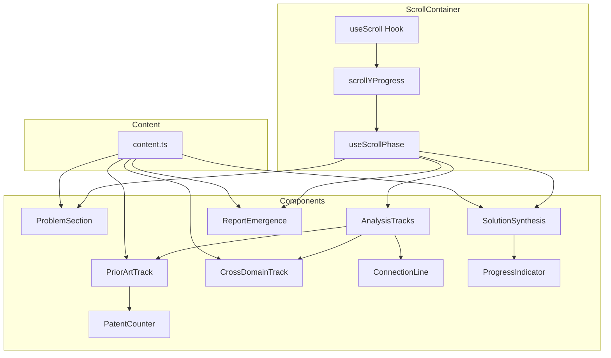

# feat: Sparlo Analysis Animation

> Scroll-driven animation section visualizing the 30-minute analysis process

## Overview

A scroll-driven animation section positioned between the hero section and methodology section on the marketing landing page. The user scrolls through a compressed visualization of Sparlo's analysis process: problem statement, reframe, parallel analysis tracks, and report emergence.

**Duration**: ~150vh scroll distance (120vh on mobile)
**Feeling**: Mission control meets research terminal. Refined density. Serious work, beautifully presented.

---

## Problem Statement / Motivation

The current marketing page transitions directly from the hero section to the methodology section. Users don't get a visceral understanding of *what* happens during the 30-minute analysis. This animation creates that understanding through an engaging scroll-driven narrative that demonstrates:

1. **Depth of analysis** - Visualizing 3,310+ patents scanned
2. **Cross-domain innovation** - Showing how insights connect across domains
3. **Rigorous synthesis** - Demonstrating concept elimination and validation
4. **Tangible output** - Previewing the deliverable report

---

## Technical Architecture

### Stack

| Technology | Version | Purpose |
|------------|---------|---------|
| Next.js | 16+ | App Router, React 19 |
| Framer Motion | 12.23+ | Scroll-linked animations |
| Tailwind CSS | 4.x | Styling with design system |
| TypeScript | 5.9+ | Type safety |

### Key Patterns from Codebase

**Existing animation infrastructure** (to reuse):
- `apps/web/app/app/_lib/animation-constants.ts:1-37` - EASING, DURATION, STAGGER constants
- `packages/ui/src/hooks/use-prefers-reduced-motion.ts` - Accessibility hook
- `apps/web/styles/sparlo-animations.css:145-163` - Reduced motion support patterns

**Component structure** (follow existing pattern):
- `apps/web/app/app/reports/[id]/_components/brand-system/` - Multi-file component organization
- `apps/web/app/app/reports/[id]/_components/brand-system/primitives.tsx` - Reusable primitives pattern

**Design tokens** (use existing):
- `apps/web/styles/sparlo-tokens.css` - CSS custom properties
- `docs/SPARLO-DESIGN-SYSTEM.md` - Design system reference

---

## Proposed Solution

### Component Structure

```
apps/web/app/(marketing)/_components/analysis-animation/
├── index.ts                      # Barrel export
├── AnalysisAnimation.tsx         # Main container (client component)
├── ScrollContainer.tsx           # useScroll/useTransform logic
├── GridBackground.tsx            # Dot grid background
├── ProblemSection.tsx            # Problem + reframe (Phases 1-2)
├── AnalysisTracks.tsx            # Track container (Phase 3)
├── PriorArtTrack.tsx             # Patent scanning (Phase 4)
├── CrossDomainTrack.tsx          # Domain insights (Phase 5)
├── ConnectionLine.tsx            # SVG animated line (Phase 6)
├── SolutionSynthesis.tsx         # Concept filtering (Phase 7)
├── ReportEmergence.tsx           # Final preview (Phase 8)
├── PatentCounter.tsx             # Animated 0 → 3,310 counter
├── ProgressIndicator.tsx         # Dot progress visualization
├── content.ts                    # Content configuration
├── animations.ts                 # Shared animation variants
└── hooks/
    └── useScrollPhase.ts         # Phase-aware scroll hook
```

### Landing Page Integration

```tsx
// apps/web/app/(marketing)/page.tsx
import { AnalysisAnimation } from './_components/analysis-animation';

function Home() {
  return (
    <>
      <EngineeringHero />
      <AnalysisAnimation />          {/* NEW - Insert here */}
      <ModeTabs mode={mode} onModeChange={handleModeChange} />
      {/* ... rest of page */}
    </>
  );
}
```

---

## Technical Approach

### Phase 1: Scroll Container Setup

```tsx
// ScrollContainer.tsx
'use client';

import { useRef } from 'react';
import { useScroll, useTransform, motion } from 'framer-motion';
import { usePrefersReducedMotion } from '@kit/ui/hooks';

export function ScrollContainer({ children }: { children: React.ReactNode }) {
  const containerRef = useRef<HTMLDivElement>(null);
  const prefersReducedMotion = usePrefersReducedMotion();

  const { scrollYProgress } = useScroll({
    target: containerRef,
    offset: ["start start", "end end"]
  });

  if (prefersReducedMotion) {
    return <StaticFallback />;
  }

  return (
    <div ref={containerRef} className="relative h-[150vh] lg:h-[150vh] md:h-[140vh] h-[120vh]">
      <div className="sticky top-0 h-screen overflow-hidden">
        <ScrollContext.Provider value={{ scrollYProgress }}>
          {children}
        </ScrollContext.Provider>
      </div>
    </div>
  );
}
```

### Phase 2: Animation Phase Mapping

```tsx
// hooks/useScrollPhase.ts
import { useTransform, MotionValue } from 'framer-motion';

interface PhaseConfig {
  problem: [number, number];      // [0, 0.15]
  reframe: [number, number];      // [0.15, 0.25]
  tracksAppear: [number, number]; // [0.25, 0.40]
  priorArt: [number, number];     // [0.40, 0.60]
  crossDomain: [number, number];  // [0.45, 0.65]
  connection: [number, number];   // [0.60, 0.70]
  synthesis: [number, number];    // [0.65, 0.85]
  emergence: [number, number];    // [0.85, 1.00]
}

const PHASES: PhaseConfig = {
  problem: [0, 0.15],
  reframe: [0.15, 0.25],
  tracksAppear: [0.25, 0.40],
  priorArt: [0.40, 0.60],
  crossDomain: [0.45, 0.65],
  connection: [0.60, 0.70],
  synthesis: [0.65, 0.85],
  emergence: [0.85, 1.00],
};

export function usePhaseProgress(
  scrollYProgress: MotionValue<number>,
  phase: keyof PhaseConfig
) {
  const [start, end] = PHASES[phase];
  return useTransform(scrollYProgress, [start, end], [0, 1]);
}
```

### Phase 3: Animated Counter Component

```tsx
// PatentCounter.tsx
'use client';

import { useTransform, motion, MotionValue } from 'framer-motion';

interface PatentCounterProps {
  progress: MotionValue<number>;
  targetValue: number;
}

export function PatentCounter({ progress, targetValue }: PatentCounterProps) {
  const count = useTransform(progress, [0, 1], [0, targetValue], {
    clamp: true
  });

  return (
    <motion.span
      className="font-mono text-[32px] font-medium tabular-nums text-white"
      style={{
        // GPU-accelerated
        willChange: 'transform'
      }}
    >
      <motion.span>
        {useTransform(count, (v) => Math.floor(v).toLocaleString())}
      </motion.span>
    </motion.span>
  );
}
```

### Phase 4: SVG Connection Line

```tsx
// ConnectionLine.tsx
'use client';

import { motion, MotionValue, useTransform } from 'framer-motion';

interface ConnectionLineProps {
  progress: MotionValue<number>;
  startPoint: { x: number; y: number };
  endPoint: { x: number; y: number };
}

export function ConnectionLine({ progress, startPoint, endPoint }: ConnectionLineProps) {
  const pathLength = useTransform(progress, [0, 0.7], [0, 1]);
  const glowOpacity = useTransform(progress, [0.7, 0.85, 1], [0, 0.6, 0.3]);

  // Calculate bezier control points for organic curve
  const midY = (startPoint.y + endPoint.y) / 2;
  const pathD = `M ${startPoint.x} ${startPoint.y}
                 Q ${startPoint.x + 50} ${midY}, ${endPoint.x} ${endPoint.y}`;

  return (
    <svg className="absolute inset-0 pointer-events-none">
      {/* Glow filter */}
      <defs>
        <filter id="glow" x="-50%" y="-50%" width="200%" height="200%">
          <feGaussianBlur stdDeviation="4" result="coloredBlur"/>
          <feMerge>
            <feMergeNode in="coloredBlur"/>
            <feMergeNode in="SourceGraphic"/>
          </feMerge>
        </filter>
      </defs>

      {/* Connection line */}
      <motion.path
        d={pathD}
        fill="none"
        stroke="rgba(59, 130, 246, 0.6)"
        strokeWidth={1}
        style={{ pathLength }}
        filter="url(#glow)"
      />

      {/* Glow pulse */}
      <motion.circle
        cx={endPoint.x}
        cy={endPoint.y}
        r={8}
        fill="none"
        stroke="rgba(59, 130, 246, 0.3)"
        strokeWidth={2}
        style={{ opacity: glowOpacity }}
      />
    </svg>
  );
}
```

### Phase 5: Content Configuration

```tsx
// content.ts
export const ANALYSIS_CONTENT = {
  problem: {
    text: "Electrochemical ocean alkalinity enhancement produces NaOH at sea to absorb atmospheric CO2. But marine electrolysis faces severe corrosion, biofouling, and membrane fouling. Need electrolyzer architecture that survives 5+ years in marine environment at <$80/ton CO2 equivalent alkalinity cost."
  },
  reframe: {
    prefix: "Reframed:",
    text: "Instead of asking \"how do we make components survive 5 years in seawater,\" we asked \"how do we make replacement so cheap that survival doesn't matter.\""
  },
  priorArt: {
    patentCount: 3310,
    paperCount: 47,
    citations: [
      "Mikhaylin & Bazinet, 2016",
      "Kuang et al., 2019",
      "US9,073,003",
      "US10,892,401"
    ]
  },
  crossDomain: {
    domains: [
      { name: "Desalination", subItems: [] },
      { name: "Geothermal", subItems: [] },
      { name: "Marine Biology", subItems: ["Antifouling surfaces"] },
      { name: "Semiconductor Processing", subItems: ["Polarity reversal"], isConnection: true },
      { name: "Aerospace", subItems: [] },
      { name: "Nuclear", subItems: [] }
    ],
    transferCount: 8
  },
  solutions: {
    concepts: [
      { title: "Polarity Reversal + Modular Cartridge Architecture", status: "active", isConnected: true },
      { title: "Sacrificial Magnesium Anode", status: "active" },
      { title: "Downstream Mineral Neutralization", status: "active" },
      { title: "Electrode Hardening", status: "eliminated" },
      { title: "High-Temp Ceramic Membrane", status: "eliminated" }
    ],
    totalCount: 12,
    survivingCount: 6
  },
  report: {
    pageCount: 20,
    citationCount: 14,
    protocolCount: 3
  }
} as const;
```

---

## Styling Approach

### Color System (Dark Theme for Animation)

```css
/* Add to apps/web/styles/sparlo-tokens.css or inline */
.analysis-animation {
  --bg-primary: #09090B;
  --bg-surface: rgba(255, 255, 255, 0.03);
  --bg-surface-hover: rgba(255, 255, 255, 0.05);

  --text-primary: #FAFAFA;
  --text-secondary: #A1A1AA;
  --text-tertiary: #52525B;
  --text-muted: #3F3F46;

  --accent: #3B82F6;
  --accent-glow: rgba(59, 130, 246, 0.3);

  --line: rgba(255, 255, 255, 0.1);
  --line-active: rgba(255, 255, 255, 0.25);
}
```

### Grid Background

```tsx
// GridBackground.tsx
export function GridBackground() {
  return (
    <div
      className="absolute inset-0 pointer-events-none"
      style={{
        backgroundImage: 'radial-gradient(circle, rgba(63,63,70,0.5) 1px, transparent 1px)',
        backgroundSize: '48px 48px',
        opacity: 0.05
      }}
    />
  );
}
```

### Typography Classes

```tsx
// Following design system from docs/SPARLO-DESIGN-SYSTEM.md
const typography = {
  trackLabel: "font-sans text-[11px] font-medium tracking-[0.1em] uppercase text-[--text-secondary]",
  counter: "font-mono text-[32px] font-medium tabular-nums text-[--text-primary]",
  problemStatement: "font-sans text-[18px] font-normal leading-[1.6] text-[--text-primary] max-w-[720px]",
  reframe: "font-sans text-[16px] font-medium leading-[1.5] text-[--text-primary]",
  citation: "font-sans text-[13px] font-normal italic text-[--text-secondary]",
  concept: "font-sans text-[15px] font-medium text-[--text-primary]",
  conceptEliminated: "line-through text-[--text-tertiary]",
};
```

---

## Responsive Behavior

### Breakpoints (Tailwind 4 defaults)

| Breakpoint | Width | Layout | Scroll Distance |
|------------|-------|--------|-----------------|
| Mobile | <768px | Stacked vertical | 120vh |
| Tablet | 768-1023px | Stacked, wider | 140vh |
| Desktop | >=1024px | Side-by-side tracks | 150vh |

### Mobile Simplifications

1. **Reduced scroll distance**: 120vh instead of 150vh
2. **Counter simplification**: Show final value with single fade-in (no tick animation)
3. **Connection line**: Vertical line or omitted entirely
4. **Progress indicator**: Text "12 → 6 concepts" instead of dots

```tsx
// Mobile detection hook
function useMobileSimplification() {
  const [isMobile, setIsMobile] = useState(false);

  useEffect(() => {
    const check = () => setIsMobile(window.innerWidth < 768);
    check();
    window.addEventListener('resize', check);
    return () => window.removeEventListener('resize', check);
  }, []);

  return isMobile;
}
```

---

## Accessibility

### Reduced Motion Support

```tsx
// All animation components should check this
import { usePrefersReducedMotion } from '@kit/ui/hooks';

function AnimatedComponent() {
  const prefersReducedMotion = usePrefersReducedMotion();

  if (prefersReducedMotion) {
    // Instant state transitions, no animations
    return <StaticVersion />;
  }

  return <AnimatedVersion />;
}
```

### Screen Reader Support

```tsx
// Add to main container
<section
  aria-label="Sparlo Analysis Process Visualization"
  aria-describedby="analysis-description"
>
  <p id="analysis-description" className="sr-only">
    This section visualizes Sparlo's 30-minute analysis process through
    scroll-driven animations showing problem analysis, cross-domain research,
    and solution synthesis.
  </p>
  {/* Content */}
</section>
```

### WCAG Compliance

- All text: 4.5:1 contrast ratio against #09090B background
- Interactive elements: Focus visible states
- Decorative elements: aria-hidden="true"

---

## Performance Optimization

### GPU Acceleration

```tsx
// Use transform and opacity only for animations
const animatedStyle = {
  willChange: 'transform, opacity',
  transform: 'translateZ(0)', // Force GPU layer
};
```

### Intersection Observer for Lazy Loading

```tsx
// Only activate animations when section is in viewport
function useInViewAnimation(ref: RefObject<HTMLElement>) {
  const [isInView, setIsInView] = useState(false);

  useEffect(() => {
    const observer = new IntersectionObserver(
      ([entry]) => setIsInView(entry.isIntersecting),
      { threshold: 0.1 }
    );

    if (ref.current) observer.observe(ref.current);
    return () => observer.disconnect();
  }, [ref]);

  return isInView;
}
```

### Counter Optimization

Use `useTransform` with `Math.floor` instead of `useState` + re-renders:

```tsx
// Good - no re-renders
const displayCount = useTransform(count, (v) => Math.floor(v).toLocaleString());

// Bad - causes re-renders
const [displayCount, setDisplayCount] = useState(0);
useMotionValueEvent(count, "change", (v) => setDisplayCount(Math.floor(v)));
```

---

## Implementation Phases

### Phase 1: Foundation

**Tasks:**
- [ ] Create component directory structure
- [ ] Set up ScrollContainer with useScroll
- [ ] Implement useScrollPhase hook
- [ ] Add GridBackground component
- [ ] Create content.ts with all text content
- [ ] Add animation constants to animations.ts

**Files:**
- `analysis-animation/index.ts`
- `analysis-animation/AnalysisAnimation.tsx`
- `analysis-animation/ScrollContainer.tsx`
- `analysis-animation/GridBackground.tsx`
- `analysis-animation/hooks/useScrollPhase.ts`
- `analysis-animation/content.ts`
- `analysis-animation/animations.ts`

### Phase 2: Core Components

**Tasks:**
- [ ] Implement ProblemSection (Phases 1-2)
- [ ] Implement AnalysisTracks container
- [ ] Implement PriorArtTrack with PatentCounter
- [ ] Implement CrossDomainTrack with domain list

**Files:**
- `analysis-animation/ProblemSection.tsx`
- `analysis-animation/AnalysisTracks.tsx`
- `analysis-animation/PriorArtTrack.tsx`
- `analysis-animation/CrossDomainTrack.tsx`
- `analysis-animation/PatentCounter.tsx`

### Phase 3: Connection & Synthesis

**Tasks:**
- [ ] Implement ConnectionLine SVG animation
- [ ] Implement SolutionSynthesis with concept list
- [ ] Implement ProgressIndicator dots
- [ ] Add strikethrough animations for eliminated concepts

**Files:**
- `analysis-animation/ConnectionLine.tsx`
- `analysis-animation/SolutionSynthesis.tsx`
- `analysis-animation/ProgressIndicator.tsx`

### Phase 4: Emergence & Polish

**Tasks:**
- [ ] Implement ReportEmergence preview
- [ ] Add compression animations for Phase 8
- [ ] Integrate into marketing page
- [ ] Add responsive breakpoint handling
- [ ] Implement mobile simplifications

**Files:**
- `analysis-animation/ReportEmergence.tsx`
- `apps/web/app/(marketing)/page.tsx` (modify)

### Phase 5: Accessibility & Testing

**Tasks:**
- [ ] Add reduced motion fallback
- [ ] Add ARIA labels and descriptions
- [ ] Test screen reader experience
- [ ] Performance audit (60fps target)
- [ ] Cross-browser testing

---

## Acceptance Criteria

### Functional Requirements

- [ ] Animation section renders between hero and methodology sections
- [ ] 8 animation phases trigger at correct scroll percentages
- [ ] Counter animates from 0 to 3,310 smoothly
- [ ] SVG connection line draws with glow effect
- [ ] Eliminated concepts show strikethrough animation
- [ ] Report preview emerges in Phase 8
- [ ] Responsive layouts work at all breakpoints

### Non-Functional Requirements

- [ ] 60fps animation performance on desktop
- [ ] 30fps+ on mobile devices
- [ ] Reduced motion fallback shows static content
- [ ] WCAG AA contrast compliance
- [ ] No layout shift on load

### Quality Gates

- [ ] `pnpm typecheck` passes
- [ ] `pnpm lint:fix` clean
- [ ] `pnpm format:fix` applied
- [ ] Manual testing on Chrome, Safari, Firefox
- [ ] Mobile testing on iOS Safari, Android Chrome

---

## Dependencies & Prerequisites

### Required (Already Installed)

- `framer-motion: ^12.23.26` (in apps/web/package.json)
- `@kit/ui/hooks` (usePrefersReducedMotion)
- Suisse Intl fonts (already configured)

### No Additional Dependencies Required

The existing stack fully supports this feature.

---

## Risk Analysis & Mitigation

| Risk | Likelihood | Impact | Mitigation |
|------|------------|--------|------------|
| Animation jank on mobile | Medium | High | Use GPU-accelerated properties only; simplify on mobile |
| Scroll position conflicts with other page elements | Low | Medium | Use isolated scroll context with target ref |
| Font loading delay affects counter | Low | Low | Use tabular-nums and fallback fonts |
| Framer Motion bundle size | Low | Medium | Already using FM elsewhere; tree-shaking |
| Phase timing feels wrong | Medium | Medium | Test with real users; adjust percentages |

---

## Future Considerations

1. **A/B Testing**: Could test animation presence vs static fallback for conversion impact
2. **Dynamic Content**: Content could be fetched from CMS for easier updates
3. **Interactive Mode**: Could add hover states to explore individual concepts
4. **Video Alternative**: Could record animation as video for social media sharing

---

## References & Research

### Internal References

- Design system: `docs/SPARLO-DESIGN-SYSTEM.md`
- Animation constants: `apps/web/app/app/_lib/animation-constants.ts`
- Existing animations: `apps/web/styles/sparlo-animations.css`
- Primitives pattern: `apps/web/app/app/reports/[id]/_components/brand-system/primitives.tsx`
- Marketing page: `apps/web/app/(marketing)/page.tsx`
- Hero component: `apps/web/app/(marketing)/_components/engineering-hero.tsx`

### External References

- [Framer Motion Scroll Animations](https://motion.dev/docs/scroll-animations)
- [useScroll Hook Documentation](https://motion.dev/docs/use-scroll)
- [pathLength SVG Animation](https://motion.dev/docs/svg-motion)
- [WCAG 2.1 Motion Requirements](https://www.w3.org/WAI/WCAG21/Understanding/animation-from-interactions.html)

---

## Questions for Clarification

Based on spec-flow analysis, these items should be clarified before implementation:

1. **Phase Overlap**: Phases 4-7 have overlapping scroll ranges. Is this intentional parallelism?
2. **Mobile Simplification**: Which specific animations should be removed/simplified on mobile?
3. **Reverse Scroll**: Should animations play in reverse when scrolling up?
4. **Complete Content**: Are the citations, domains, and concepts in content.ts final?
5. **Reduced Motion**: Should reduced motion show all content instantly or simplified fades?

---

## ERD / Architecture Diagram



---

*Plan created: 2026-01-05*
*Detail level: A LOT (Comprehensive)*
