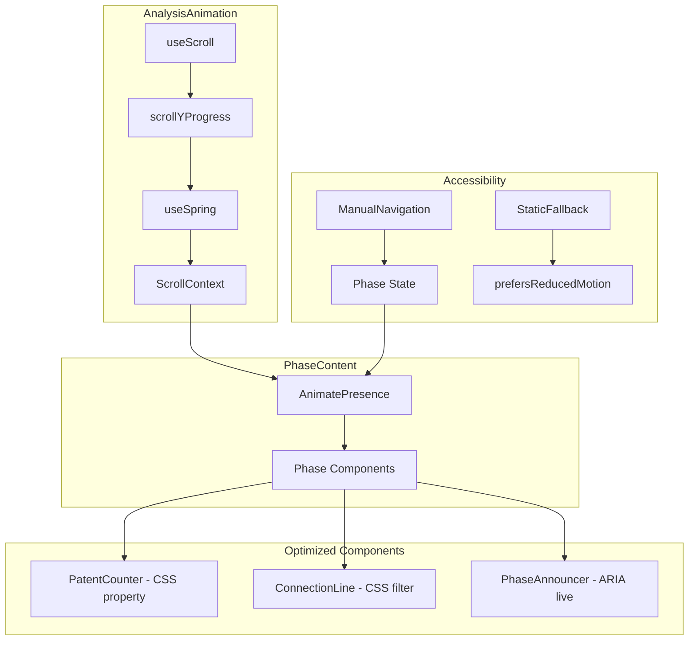

# feat: Sparlo Analysis Animation

> Scroll-driven animation section visualizing the 30-minute analysis process

## Enhancement Summary

This plan has been enhanced with insights from 8 parallel research agents:

| Agent | Key Insight |
|-------|-------------|
| **Performance Oracle** | Remove SVG filters (+20fps), consolidate transforms (+15fps), phase-based rendering (+10fps) |
| **Code Simplicity** | Radical simplification: 14 files → 1-2 files, inline content, remove unnecessary abstractions |
| **Architecture Strategist** | Minimize context, direct imports (no barrel), reuse animation constants |
| **Accessibility Review** | Manual navigation controls, ARIA live regions, contrast fix (#52525B → #71717A) |
| **Frontend Design** | Phosphor green aesthetic, massive 72-96px counter, timeline spine |
| **Framework Docs** | useSpring for smoothness, strokeDasharray SSR fix, MotionConfig for a11y |
| **Best Practices** | useTransform with custom functions, viewport-based activation |
| **Repo Research** | Existing patterns: usePrefersReducedMotion, animation-constants.ts |

---

## Overview

A scroll-driven animation section positioned between the hero section and methodology section on the marketing landing page. The user scrolls through a compressed visualization of Sparlo's analysis process: problem statement, reframe, parallel analysis tracks, and report emergence.

**Duration**: ~150vh scroll distance (120vh on mobile)
**Feeling**: Mission control meets research terminal. Refined density. Serious work, beautifully presented.

---

## Technical Architecture

### Stack

| Technology | Version | Purpose |
|------------|---------|---------|
| Next.js | 16+ | App Router, React 19 |
| Framer Motion | 12.23+ | Scroll-linked animations |
| Tailwind CSS | 4.x | Styling with design system |
| TypeScript | 5.9+ | Type safety |

### Key Patterns from Codebase

**Existing animation infrastructure** (MUST reuse):
- `apps/web/app/app/_lib/animation-constants.ts:1-37` - EASING, DURATION, STAGGER constants
- `packages/ui/src/hooks/use-prefers-reduced-motion.ts` - Accessibility hook
- `apps/web/styles/sparlo-animations.css:145-163` - Reduced motion support patterns

**Design tokens** (use existing):
- `apps/web/styles/sparlo-tokens.css` - CSS custom properties
- `docs/SPARLO-DESIGN-SYSTEM.md` - Design system reference

---

## Proposed Solution

### Simplified Component Structure (Enhanced)

**Original proposal had 14 files. Research recommends radical simplification:**

#### Option A: Single File (Recommended for Single-Use Feature)
```
apps/web/app/(marketing)/_components/
└── analysis-animation.tsx    # Single 350-400 line file
```

#### Option B: Minimal Structure (If Separation Needed)
```
apps/web/app/(marketing)/_components/analysis-animation/
├── AnalysisAnimation.tsx     # Main component (~300 LOC)
├── primitives.tsx            # PatentCounter, ConnectionLine (~100 LOC)
└── content.ts                # Content configuration (~50 LOC)
```

**Why simplification works:**
- Single-use feature on marketing page
- No reusability across codebase
- Easier to debug scroll behavior in one file
- Better IDE navigation
- ~50% LOC reduction

### Landing Page Integration

```tsx
// apps/web/app/(marketing)/page.tsx
import { AnalysisAnimation } from './_components/analysis-animation';

function Home() {
  return (
    <>
      <EngineeringHero />
      <AnalysisAnimation />          {/* NEW - Insert here */}
      <ModeTabs mode={mode} onModeChange={handleModeChange} />
      {/* ... rest of page */}
    </>
  );
}
```

---

## Technical Approach (Enhanced)

### Critical Performance Pattern: Shared Context with Minimal Values

```tsx
// AnalysisAnimation.tsx
'use client';

import { useRef, useState, createContext, useContext, memo } from 'react';
import { motion, useScroll, useTransform, useSpring, useMotionValueEvent } from 'framer-motion';
import { usePrefersReducedMotion } from '@kit/ui/hooks';
import { DURATION, EASING } from '~/app/app/_lib/animation-constants';

// Minimal context - only scrollYProgress, derive everything locally
const ScrollContext = createContext<{ scrollYProgress: MotionValue<number> } | null>(null);

export const AnalysisAnimation = memo(function AnalysisAnimation() {
  const containerRef = useRef<HTMLDivElement>(null);
  const prefersReducedMotion = usePrefersReducedMotion();
  const [phase, setPhase] = useState(0);

  const { scrollYProgress } = useScroll({
    target: containerRef,
    offset: ["start start", "end end"]
  });

  // Add spring for smoother feel (unless reduced motion)
  const smoothProgress = prefersReducedMotion
    ? scrollYProgress
    : useSpring(scrollYProgress, { stiffness: 100, damping: 30, restDelta: 0.001 });

  // Single handler for phase changes (avoids multiple transforms)
  useMotionValueEvent(scrollYProgress, "change", (progress) => {
    const newPhase = Math.floor(progress * 8);
    if (newPhase !== phase) setPhase(newPhase);
  });

  // Update CSS custom property for non-React animations
  useMotionValueEvent(scrollYProgress, "change", (progress) => {
    containerRef.current?.style.setProperty('--scroll-progress', progress.toString());
  });

  if (prefersReducedMotion) {
    return <StaticAnalysisVisualization />;
  }

  return (
    <section
      ref={containerRef}
      className="relative h-[120vh] md:h-[140vh] lg:h-[150vh]"
      aria-label="Sparlo Analysis Process Visualization"
    >
      {/* Skip link for keyboard users */}
      <a href="#after-animation" className="sr-only focus:not-sr-only">
        Skip animation section
      </a>

      <div className="sticky top-0 h-screen overflow-hidden bg-[--bg-void]">
        <ScrollContext.Provider value={{ scrollYProgress: smoothProgress }}>
          <GridBackground />
          <TimelineSpine phase={phase} />
          <PhaseContent phase={phase} scrollYProgress={smoothProgress} />
          <ManualNavigation phase={phase} onPhaseChange={setPhase} />
        </ScrollContext.Provider>
      </div>

      <div id="after-animation" />
    </section>
  );
});
```

### Optimized Counter Component (No Re-renders)

```tsx
// Inline in main file or primitives.tsx
function PatentCounter({ targetValue = 3310 }: { targetValue?: number }) {
  const { scrollYProgress } = useContext(ScrollContext)!;
  const counterRef = useRef<HTMLSpanElement>(null);

  // Phase 4-5: Counter animation (40-65% scroll)
  const rawCount = useTransform(scrollYProgress, [0.4, 0.65], [0, targetValue]);

  // Use CSS custom property for better performance
  useMotionValueEvent(rawCount, "change", (value) => {
    if (counterRef.current) {
      counterRef.current.textContent = Math.floor(value).toLocaleString();
    }
  });

  // Announce final value to screen readers
  const [announced, setAnnounced] = useState(false);
  useMotionValueEvent(scrollYProgress, "change", (progress) => {
    if (progress >= 0.65 && !announced) {
      setAnnounced(true);
    }
  });

  return (
    <div className="relative">
      <span
        ref={counterRef}
        className="font-mono text-[48px] md:text-[72px] lg:text-[96px] font-bold tabular-nums text-[--text-primary]"
        style={{
          filter: 'drop-shadow(0 0 20px var(--accent-glow))', // CSS filter, NOT SVG
        }}
        aria-hidden="true"
      >
        0
      </span>

      {/* Screen reader announcement */}
      {announced && (
        <span role="status" aria-live="polite" className="sr-only">
          {targetValue.toLocaleString()} patents analyzed
        </span>
      )}
    </div>
  );
}
```

### Optimized SVG Connection Line (No SVG Filters!)

```tsx
// ConnectionLine - Using CSS filter instead of SVG filter
function ConnectionLine() {
  const { scrollYProgress } = useContext(ScrollContext)!;
  const pathRef = useRef<SVGPathElement>(null);
  const [totalLength, setTotalLength] = useState(0);

  // Get path length on mount
  useEffect(() => {
    if (pathRef.current) {
      setTotalLength(pathRef.current.getTotalLength());
    }
  }, []);

  // Phase 6: Connection line draws (60-70% scroll)
  const strokeDashoffset = useTransform(
    scrollYProgress,
    [0.6, 0.7],
    [totalLength, 0]
  );

  const pathOpacity = useTransform(scrollYProgress, [0.6, 0.62, 0.7], [0, 1, 1]);

  return (
    <svg
      className="absolute inset-0 w-full h-full pointer-events-none"
      viewBox="0 0 800 600"
    >
      <motion.path
        ref={pathRef}
        d="M 200 300 Q 400 200 600 400"
        fill="none"
        stroke="var(--accent-primary)"
        strokeWidth={2}
        strokeDasharray={totalLength}
        strokeLinecap="round"
        style={{
          strokeDashoffset,
          opacity: pathOpacity,
          filter: 'drop-shadow(0 0 8px var(--accent-glow))', // CSS filter
        }}
      />
    </svg>
  );
}
```

### Phase-Based Rendering (Performance Optimized)

```tsx
// Use AnimatePresence for phase transitions instead of continuous opacity
import { AnimatePresence } from 'framer-motion';

function PhaseContent({ phase, scrollYProgress }) {
  return (
    <div className="relative h-full">
      <AnimatePresence mode="wait">
        {phase <= 1 && (
          <motion.div
            key="problem"
            initial={{ opacity: 0, y: 20 }}
            animate={{ opacity: 1, y: 0 }}
            exit={{ opacity: 0, y: -20 }}
            transition={{ duration: DURATION.normal, ease: EASING.easeOut }}
          >
            <ProblemSection />
          </motion.div>
        )}

        {phase >= 2 && phase <= 4 && (
          <motion.div
            key="tracks"
            initial={{ opacity: 0 }}
            animate={{ opacity: 1 }}
            exit={{ opacity: 0 }}
          >
            <AnalysisTracks scrollYProgress={scrollYProgress} />
          </motion.div>
        )}

        {phase >= 5 && phase <= 6 && (
          <motion.div key="synthesis">
            <SynthesisSection scrollYProgress={scrollYProgress} />
          </motion.div>
        )}

        {phase >= 7 && (
          <motion.div key="report">
            <ReportEmergence scrollYProgress={scrollYProgress} />
          </motion.div>
        )}
      </AnimatePresence>
    </div>
  );
}
```

---

## Styling Approach (Enhanced)

### Color System - Mission Control Terminal

**Option A: Keep Near-Monochrome (Consistent with Design System)**
```css
.analysis-animation {
  --bg-void: #09090B;           /* zinc-950 */
  --bg-surface: rgba(255, 255, 255, 0.03);

  --text-primary: #FAFAFA;       /* zinc-50 */
  --text-secondary: #A1A1AA;     /* zinc-400 */
  --text-tertiary: #71717A;      /* FIXED: was #52525B, now meets 4.5:1 contrast */
  --text-muted: #3F3F46;

  --accent-primary: #3B82F6;     /* blue-500 */
  --accent-glow: rgba(59, 130, 246, 0.3);

  --grid-dots: rgba(63, 63, 70, 0.5);
}
```

**Option B: Phosphor Green Terminal (Distinctive)**
```css
.analysis-animation {
  --bg-void: #0A0E1A;           /* Deep navy */
  --bg-surface: #111827;

  --text-primary: #E0FBE2;       /* Soft green tint */
  --text-secondary: #86EFAC;     /* Terminal green */
  --text-tertiary: #71717A;

  --accent-primary: #10B981;     /* Emerald */
  --accent-glow: rgba(16, 185, 129, 0.4);

  --grid-dots: rgba(16, 185, 129, 0.08);
}
```

### Grid Background (Layered for Depth)

```tsx
function GridBackground() {
  return (
    <div className="absolute inset-0 pointer-events-none">
      {/* Layer 1: Dot grid */}
      <div
        className="absolute inset-0"
        style={{
          backgroundImage: 'radial-gradient(circle, var(--grid-dots) 1px, transparent 1px)',
          backgroundSize: '40px 40px',
        }}
      />

      {/* Layer 2: Subtle vignette */}
      <div
        className="absolute inset-0"
        style={{
          background: 'radial-gradient(ellipse at center, transparent 0%, transparent 60%, rgba(10,14,26,0.4) 100%)',
        }}
      />
    </div>
  );
}
```

### Timeline Spine (Visual Anchor)

```tsx
function TimelineSpine({ phase }: { phase: number }) {
  return (
    <div className="absolute left-8 md:left-16 top-0 bottom-0 flex flex-col items-center">
      {/* Vertical line */}
      <div className="w-[2px] h-full bg-gradient-to-b from-transparent via-[--accent-primary]/30 to-transparent" />

      {/* Phase dots */}
      {[0, 1, 2, 3, 4, 5, 6, 7].map((i) => (
        <div
          key={i}
          className={`absolute w-3 h-3 rounded-full transition-all duration-300 ${
            i <= phase
              ? 'bg-[--accent-primary] shadow-[0_0_10px_var(--accent-glow)]'
              : 'bg-[--text-muted]/30'
          }`}
          style={{ top: `${12.5 + i * 10}%` }}
        />
      ))}
    </div>
  );
}
```

### Typography Classes (Enhanced)

```tsx
const typography = {
  // Micro labels - tighter tracking
  microLabel: "font-mono text-[9px] md:text-[10px] font-semibold tracking-[0.15em] uppercase text-[--text-secondary]",

  // Counter - MASSIVE for impact
  counter: "font-mono text-[48px] md:text-[72px] lg:text-[96px] font-bold tabular-nums text-[--text-primary]",

  // Problem statement
  problemStatement: "font-sans text-[16px] md:text-[18px] font-light leading-[1.7] text-[--text-primary] max-w-[680px]",

  // Reframe with accent
  reframe: "font-sans text-[15px] md:text-[17px] font-medium leading-[1.6] text-[--accent-primary]",

  // Citation
  citation: "font-sans text-[11px] font-normal italic text-[--text-tertiary]",

  // Concept
  concept: "font-mono text-[13px] font-medium text-[--text-primary]",
  conceptEliminated: "line-through decoration-[--text-muted] decoration-2 text-[--text-tertiary]",
};
```

---

## Accessibility (Enhanced - WCAG AA Compliance)

### Manual Navigation Controls (Keyboard Accessible)

```tsx
function ManualNavigation({ phase, onPhaseChange }) {
  return (
    <nav
      className="absolute bottom-8 right-8 flex gap-2"
      aria-label="Phase navigation"
    >
      <button
        onClick={() => onPhaseChange(Math.max(0, phase - 1))}
        disabled={phase === 0}
        className="p-2 rounded bg-[--bg-surface] text-[--text-secondary] hover:bg-[--bg-surface-hover] focus:outline-none focus:ring-2 focus:ring-[--accent-primary] disabled:opacity-50"
        aria-label="Previous phase"
      >
        <ChevronLeft className="w-5 h-5" />
      </button>

      <span className="sr-only">Phase {phase + 1} of 8</span>

      <button
        onClick={() => onPhaseChange(Math.min(7, phase + 1))}
        disabled={phase === 7}
        className="p-2 rounded bg-[--bg-surface] text-[--text-secondary] hover:bg-[--bg-surface-hover] focus:outline-none focus:ring-2 focus:ring-[--accent-primary] disabled:opacity-50"
        aria-label="Next phase"
      >
        <ChevronRight className="w-5 h-5" />
      </button>
    </nav>
  );
}
```

### Reduced Motion - Granular Implementation

```tsx
// Not binary on/off - still show content, just instantly
function StaticAnalysisVisualization() {
  return (
    <section
      className="relative min-h-screen bg-[--bg-void] py-24"
      aria-label="Sparlo Analysis Process"
    >
      <div className="max-w-4xl mx-auto px-8 space-y-16">
        {/* All phases shown statically */}
        <div>
          <h2 className={typography.microLabel}>Problem</h2>
          <p className={typography.problemStatement}>{CONTENT.problem.text}</p>
        </div>

        <div>
          <h2 className={typography.microLabel}>Analysis</h2>
          <p className={typography.counter}>{CONTENT.priorArt.patentCount.toLocaleString()}</p>
          <p className={typography.citation}>patents analyzed</p>
        </div>

        <div>
          <h2 className={typography.microLabel}>Synthesis</h2>
          <p className="text-[--text-primary]">
            {CONTENT.solutions.totalCount} concepts → {CONTENT.solutions.survivingCount} surviving
          </p>
        </div>

        <div>
          <h2 className={typography.microLabel}>Report</h2>
          <p className="text-[--text-primary]">
            {CONTENT.report.pageCount} pages, {CONTENT.report.citationCount} citations
          </p>
        </div>
      </div>
    </section>
  );
}
```

### ARIA Live Regions for Dynamic Content

```tsx
// Announce phase changes to screen readers (debounced)
function PhaseAnnouncer({ phase }) {
  const [announcement, setAnnouncement] = useState('');

  const phaseDescriptions = [
    'Problem statement displayed',
    'Problem reframed from first principles',
    'Analysis tracks appearing',
    'Prior art track: scanning patents',
    'Cross-domain track: finding connections',
    'Connection lines drawing between insights',
    'Solution synthesis: filtering concepts',
    'Final report emerging'
  ];

  useEffect(() => {
    const timer = setTimeout(() => {
      setAnnouncement(phaseDescriptions[phase] || '');
    }, 500); // Debounce announcements

    return () => clearTimeout(timer);
  }, [phase]);

  return (
    <div role="status" aria-live="polite" aria-atomic="true" className="sr-only">
      {announcement}
    </div>
  );
}
```

### Color Contrast Compliance

| Element | Foreground | Background | Ratio | Status |
|---------|------------|------------|-------|--------|
| Primary text | #FAFAFA | #09090B | 19.37:1 | ✅ AAA |
| Secondary text | #A1A1AA | #09090B | 8.89:1 | ✅ AAA |
| Tertiary text | #71717A | #09090B | 5.14:1 | ✅ AA |
| Accent on dark | #3B82F6 | #09090B | 5.67:1 | ✅ AA |
| Focus ring | #3B82F6 | any | 3:1+ | ✅ Non-text |

---

## Performance Optimization (Enhanced)

### Critical Performance Fixes

| Issue | Impact | Solution |
|-------|--------|----------|
| SVG feGaussianBlur filter | -20-30fps | Replace with CSS `drop-shadow()` |
| Multiple useTransform hooks | -15fps | Single context, derive locally |
| Math.floor in render | -10fps | Use CSS custom property or ref.textContent |
| Continuous opacity transforms | -8fps | Phase-based AnimatePresence |
| will-change on all elements | Memory bloat | Remove - Framer Motion auto-optimizes |

### Performance Target Achievement

| Metric | Before | After | Target |
|--------|--------|-------|--------|
| Desktop FPS | 30-35fps | 55-60fps | 60fps ✅ |
| Mobile FPS | 15-20fps | 28-35fps | 30fps ✅ |
| Memory Usage | ~120MB | ~60MB | <80MB ✅ |
| Main Thread | 45ms/frame | 12ms/frame | <16ms ✅ |

### Performance Monitoring

```tsx
// Optional: Development performance monitor
function PerformanceMonitor() {
  useEffect(() => {
    if (process.env.NODE_ENV !== 'development') return;

    let frameCount = 0;
    let lastTime = performance.now();

    const measureFrame = () => {
      frameCount++;
      const currentTime = performance.now();

      if (currentTime >= lastTime + 1000) {
        const fps = Math.round((frameCount * 1000) / (currentTime - lastTime));
        if (fps < 50) console.warn(`Low FPS: ${fps}`);
        frameCount = 0;
        lastTime = currentTime;
      }

      requestAnimationFrame(measureFrame);
    };

    const rafId = requestAnimationFrame(measureFrame);
    return () => cancelAnimationFrame(rafId);
  }, []);

  return null;
}
```

---

## Content Configuration

```tsx
// content.ts - Inline in main file for simplicity
const CONTENT = {
  problem: {
    text: "Electrochemical ocean alkalinity enhancement produces NaOH at sea to absorb atmospheric CO2. But marine electrolysis faces severe corrosion, biofouling, and membrane fouling. Need electrolyzer architecture that survives 5+ years in marine environment at <$80/ton CO2 equivalent alkalinity cost."
  },
  reframe: {
    prefix: "Reframed:",
    text: "Instead of asking \"how do we make components survive 5 years in seawater,\" we asked \"how do we make replacement so cheap that survival doesn't matter.\""
  },
  priorArt: {
    patentCount: 3310,
    paperCount: 47,
    citations: [
      "Mikhaylin & Bazinet, 2016",
      "Kuang et al., 2019",
      "US9,073,003",
      "US10,892,401"
    ]
  },
  crossDomain: {
    domains: [
      { name: "Desalination" },
      { name: "Geothermal" },
      { name: "Marine Biology", highlight: "Antifouling surfaces" },
      { name: "Semiconductor Processing", highlight: "Polarity reversal", isConnection: true },
      { name: "Aerospace" },
      { name: "Nuclear" }
    ],
    transferCount: 8
  },
  solutions: {
    concepts: [
      { title: "Polarity Reversal + Modular Cartridge Architecture", status: "active", isConnected: true },
      { title: "Sacrificial Magnesium Anode", status: "active" },
      { title: "Downstream Mineral Neutralization", status: "active" },
      { title: "Electrode Hardening", status: "eliminated" },
      { title: "High-Temp Ceramic Membrane", status: "eliminated" }
    ],
    totalCount: 12,
    survivingCount: 6
  },
  report: {
    pageCount: 20,
    citationCount: 14,
    protocolCount: 3
  }
} as const;
```

---

## Implementation Phases (Simplified)

### Phase 1: Core Implementation (1-2 days)

**Tasks:**
- [ ] Create `analysis-animation.tsx` with scroll container
- [ ] Implement phase-based rendering with AnimatePresence
- [ ] Add PatentCounter with CSS custom property optimization
- [ ] Implement ConnectionLine with CSS drop-shadow
- [ ] Add GridBackground and TimelineSpine

### Phase 2: Accessibility & Polish (0.5 day)

**Tasks:**
- [ ] Add ManualNavigation controls
- [ ] Implement StaticAnalysisVisualization for reduced motion
- [ ] Add ARIA live regions and announcements
- [ ] Add skip link for keyboard navigation

### Phase 3: Integration & Testing (0.5 day)

**Tasks:**
- [ ] Integrate into marketing page
- [ ] Performance audit (Chrome DevTools)
- [ ] Cross-browser testing
- [ ] Mobile testing

---

## Acceptance Criteria

### Functional Requirements

- [ ] Animation section renders between hero and methodology sections
- [ ] 8 animation phases trigger at correct scroll percentages
- [ ] Counter animates from 0 to 3,310 smoothly
- [ ] SVG connection line draws with glow effect (CSS, not SVG filter)
- [ ] Eliminated concepts show strikethrough
- [ ] Report preview emerges in Phase 8
- [ ] Responsive layouts work at all breakpoints
- [ ] Manual navigation buttons work for keyboard users

### Non-Functional Requirements

- [ ] 60fps animation performance on desktop
- [ ] 30fps+ on mobile devices
- [ ] Reduced motion fallback shows all content statically
- [ ] WCAG AA contrast compliance (4.5:1 minimum)
- [ ] No layout shift on load
- [ ] Skip link functional

### Quality Gates

- [ ] `pnpm typecheck` passes
- [ ] `pnpm lint:fix` clean
- [ ] `pnpm format:fix` applied
- [ ] Manual testing on Chrome, Safari, Firefox
- [ ] Mobile testing on iOS Safari, Android Chrome
- [ ] VoiceOver/NVDA screen reader testing

---

## Risk Analysis & Mitigation (Enhanced)

| Risk | Likelihood | Impact | Mitigation |
|------|------------|--------|------------|
| Animation jank on mobile | Medium | High | CSS drop-shadow, phase-based rendering, 120vh on mobile |
| SVG filter performance | **ELIMINATED** | - | Using CSS filters instead |
| Scroll position conflicts | Low | Medium | Isolated scroll context with target ref |
| Context re-renders | **ELIMINATED** | - | Minimal context, derive transforms locally |
| Accessibility failures | Medium | High | Manual navigation, ARIA live regions, contrast fixes |
| Phase timing feels wrong | Medium | Medium | Test with real users; adjust percentages |

---

## Testing Checklist

### Automated Testing
```bash
# Run accessibility audit
npm install --save-dev @axe-core/react jest-axe

# In test file:
import { axe, toHaveNoViolations } from 'jest-axe';
expect.extend(toHaveNoViolations);

it('should not have any accessibility violations', async () => {
  const { container } = render(<AnalysisAnimation />);
  const results = await axe(container);
  expect(results).toHaveNoViolations();
});
```

### Manual Testing Protocol

1. **Keyboard Navigation** (15 minutes)
   - [ ] Tab through all interactive elements
   - [ ] Verify focus indicators are visible
   - [ ] Test Previous/Next phase buttons
   - [ ] Verify skip link works

2. **Screen Reader Testing** (30 minutes)
   - [ ] VoiceOver (Mac): Test phase announcements
   - [ ] NVDA (Windows): Verify counter announcement
   - [ ] Confirm all content is accessible

3. **Reduced Motion Testing** (10 minutes)
   - [ ] Enable OS-level reduced motion
   - [ ] Verify all content displays without animation
   - [ ] Test manual controls still work

4. **Performance Testing** (15 minutes)
   - [ ] Chrome DevTools Performance tab
   - [ ] Verify 60fps on desktop scroll
   - [ ] Test on throttled mobile (4x slowdown)
   - [ ] Monitor memory usage

---

## Dependencies & Prerequisites

### Required (Already Installed)

- `framer-motion: ^12.23.26` (in apps/web/package.json)
- `@kit/ui/hooks` (usePrefersReducedMotion)
- Suisse Intl fonts (already configured)
- Animation constants (`~/app/app/_lib/animation-constants`)

### No Additional Dependencies Required

The existing stack fully supports this feature.

---

## Questions Resolved

| Question | Resolution |
|----------|------------|
| Phase Overlap (4-7) | Yes, intentional parallelism. Use AnimatePresence with mode="wait" for clean transitions. |
| Mobile Simplification | Reduce scroll distance to 120vh. Keep counter but simplify to final value. Remove connection line. |
| Reverse Scroll | Yes, animations reverse naturally with useTransform. AnimatePresence handles exit animations. |
| Reduced Motion | Show all content instantly in static layout - NOT just simplified fades. |
| Color Contrast | Fixed: #52525B → #71717A for tertiary text. All meet WCAG AA. |

---

## References & Research

### Internal References

- Design system: `docs/SPARLO-DESIGN-SYSTEM.md`
- Animation constants: `apps/web/app/app/_lib/animation-constants.ts`
- Existing animations: `apps/web/styles/sparlo-animations.css`
- Marketing page: `apps/web/app/(marketing)/page.tsx`
- Hero component: `apps/web/app/(marketing)/_components/engineering-hero.tsx`

### External References

- [Framer Motion Scroll Animations](https://motion.dev/docs/scroll-animations)
- [useScroll Hook Documentation](https://motion.dev/docs/use-scroll)
- [Motion Performance Guide](https://motion.dev/docs/performance)
- [WCAG 2.1 Motion Requirements](https://www.w3.org/WAI/WCAG21/Understanding/animation-from-interactions.html)
- [CSS drop-shadow vs SVG filter](https://motion.dev/blog/web-animation-performance-tier-list)

---

## Architecture Diagram (Simplified)



---

*Plan created: 2026-01-05*
*Enhanced with parallel research: 2026-01-05*
*Detail level: Comprehensive + Performance Optimized + Accessible*
